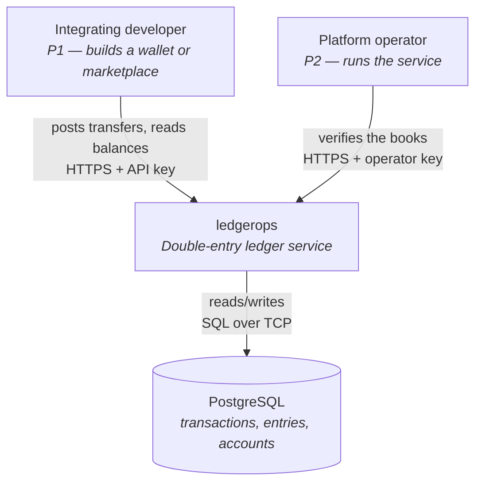
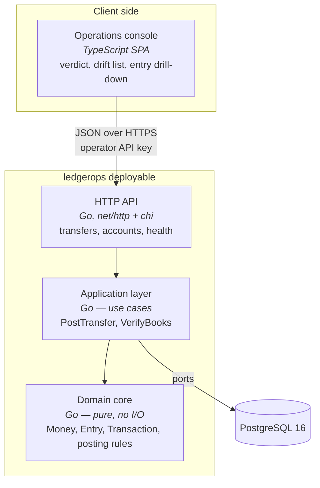

# Architecture Brief — ledgerops

SSOT for architecture. Each architect owns its section. Bootstrapped during the
DESIGN wave for `ledger-core`, 2026-08-18.

**Pattern**: modular monolith with ports-and-adapters
**Paradigm**: OOP (agent routing) — Go idiom is procedural-with-interfaces
**Stack**: Go · PostgreSQL · TypeScript SPA
**Quality attributes, ranked**: correctness · auditability · testability

---

## System Architecture

*Owner: nw-system-designer*

### Scope note

This is deliberately a thin section. `ledger-core` is a single service with one
database, no queues, no caches, and no distributed state. Checkpointed
verification was explicitly deferred (D9). There is no sharding, replication, or
partitioning to design at this stage. Designing for scale now would be
speculative — the KPIs measure correctness, not throughput.

### C4 — System Context

### C4 — Container

### Deployment shape

Single Go binary plus a static asset bundle for the SPA, plus one PostgreSQL
instance. `docker-compose` for local development so `make demo-01` runs on a
clean clone. Deployment target is deferred to the DEVOPS wave.

### Scaling escape hatches (documented, not built)

D7 append-only entries keep three future options open without rework:
checkpointed verification, period closing, and hash-chain tamper evidence. None
are built. `GET /health/trial-balance` reports `entry_count` and `elapsed_ms` so
degradation is measured rather than guessed.

---

## Domain Model

*Owner: nw-ddd-architect*

### Bounded context

One context: **Ledger**. No context mapping is required at this stage — tenancy
was deferred (D8), and there is no second context to integrate with.

### Ubiquitous language

| Term | Meaning |
|---|---|
| Account | A named holder of value. Typed `wallet` or `system` |
| Entry | One side of a movement: an account and a signed amount. Also called a *leg* |
| Transaction | An indivisible set of entries that sum to zero |
| Posting | The act of writing a transaction and updating balances |
| Trial balance | The sum of all entries across the ledger; must be zero |
| Drift | A stored balance that disagrees with the sum of its entries |
| Wallet account | May never go negative (I4) |
| System account | The counterparty value enters from. May go negative by design |

### Aggregates

**Transaction** *(aggregate root)* — owns its Entries. Enforces I1: entries sum
to zero per currency. Immutable once written (D7). Entries have no identity
outside their transaction.

**Account** *(aggregate root)* — owns `balance` and `type`. Enforces I4 for
wallet accounts: balance may not go negative.

### Deliberate deviation: one unit of work spans two aggregates

Classical DDD says one transaction should modify one aggregate. Posting
necessarily modifies a Transaction *and* the balances of the Accounts it touches,
atomically — that is the definition of double-entry bookkeeping.

Rejected alternatives:

- **Ledger-as-aggregate-root** — a single root owning all accounts would make
  every posting serialize against the whole ledger. Correct, and unusable.
- **Eventual consistency between Transaction and Account** — balances would lag
  entries, and I3 would be *expected* to be violated transiently. This destroys
  the slice-04 demo, whose whole value is that drift means something is wrong.

**Decision**: a `PostTransfer` domain service coordinates the Transaction and the
affected Accounts inside one database transaction, with row locks acquired in
deterministic account-id order (DDD-6). The consistency boundary is the posting,
not the individual aggregate. This is standard practice in ledger systems and is
recorded here so it reads as a decision rather than an oversight.

### Invariants and where they are enforced

| Invariant | Statement | Enforced |
|---|---|---|
| I1 | Entries of a transaction sum to zero, per currency | Domain core (pure), plus a database check |
| I3 | Stored balance equals the sum of its entries | Not enforced — *verified* by slice 04. Deliberate: it is the cross-check |
| I4 | No wallet account balance is negative | Domain core, under row locks held by the application layer |
| I7 | The same request applied twice changes state once | Application layer, via a unique constraint on the idempotency key |
| D7 | Entries are never updated or deleted | Database: revoked privileges plus a rule/trigger |

Note on I3: it is the only invariant deliberately left unenforced. Enforcing it
would mean deriving balances, which removes the independent check that makes
slice 04 meaningful. Two representations that can disagree are the point.

### Event modeling

Not applied. Event sourcing was considered and rejected — see
`adr-003-stored-balances.md`. The entry table is already an append-only log of
facts, which delivers most of the auditability benefit without the projection
machinery.

---

## Application Architecture

*Owner: nw-solution-architect*

### Pattern

Modular monolith, ports-and-adapters, with a **pure domain core and all I/O at
the edges**. This follows directly from testability ranking second: invariant
tests and property-based tests run against the domain core with no database, and
only the adapter tests need PostgreSQL.

### Component decomposition

| Component | Path | Responsibility | Change |
|---|---|---|---|
| Domain core | `internal/domain/` | Money, Account, Entry, Transaction, posting rules. Pure — no I/O, no clock, no randomness | CREATE NEW |
| Application | `internal/app/` | Use cases: PostTransfer, CreateAccount, GetBalance, GetEntries, VerifyBooks | CREATE NEW |
| Ports | `internal/app/ports/` | Interfaces the application depends on | CREATE NEW |
| Postgres adapter | `internal/adapters/postgres/` | Repository implementations, migrations, row locking | CREATE NEW |
| HTTP adapter | `internal/adapters/http/` | Handlers, routing, API-key auth, JSON encoding | CREATE NEW |
| Entrypoint | `cmd/api/` | Wiring and configuration | CREATE NEW |
| Console SPA | `web/console/` | TypeScript SPA: verdict, drift list, entry drill-down | CREATE NEW |

### Driving ports (inbound)

| Port | Surface | Slice |
|---|---|---|
| `POST /accounts` | HTTP | 01 |
| `POST /transfers` | HTTP | 01, 02, 03 |
| `GET /accounts/{id}` | HTTP | 01 |
| `GET /accounts/{id}/entries` | HTTP | 05 |
| `GET /health/trial-balance` | HTTP | 04 |
| Console SPA | Browser | 04, 05 |

### Driven ports (outbound) and adapters

| Port | Adapter | Notes |
|---|---|---|
| `TransactionRepository` | `postgres` | Writes transaction + entries + balance updates in one SQL transaction |
| `AccountRepository` | `postgres` | `SELECT … FOR UPDATE` in deterministic id order |
| `IdempotencyStore` | `postgres` | Unique constraint on key; stores request fingerprint + transaction_id |
| `Clock` | `system` / `fake` | Injected so entry timestamps are deterministic in tests |
| `IDGenerator` | `uuid` / `fake` | Injected for the same reason |

`Clock` and `IDGenerator` are ports purely for testability. That is the second
quality attribute doing visible work.

### Technology choices

| Choice | Pin | Rationale |
|---|---|---|
| Go | 1.23+ | Concurrency primitives make the I4/I7 race tests natural to write |
| PostgreSQL | 16 | Row locking, constraint triggers for D7, real transactional guarantees |
| `pgx` | v5 | Direct driver, no ORM — SQL stays visible, which matters for locking |
| HTTP router | `chi` v5 | Thin over `net/http`; no framework lock-in |
| Migrations | `golang-migrate` | Plain SQL migrations, reviewable |
| Property testing | `rapid` | Go's mature PBT library; invariant tests need generators |
| TypeScript | 5.x | Console SPA |
| SPA framework | *deferred to DELIVER* | Not architecturally significant; one page with a verdict |

### Reuse Analysis

| Existing Component | File | Overlap | Decision | Justification |
|---|---|---|---|---|
| *(none)* | — | — | CREATE NEW | Greenfield. `src/`, `lib/`, `app/` absent; no code exists to extend. Verified by filesystem search during Prior Wave Consultation |

This table is trivially satisfied for slice 01 and stops being trivial from
slice 02 onward, when the posting path already exists and must be extended
rather than duplicated.

### Test strategy (testability as ranked driver)

| Layer | Depends on | Speed |
|---|---|---|
| Domain core | nothing | microseconds — property tests live here |
| Application | fake ports | milliseconds |
| Adapters | real PostgreSQL | seconds — WS strategy C, per DISTILL Mandate 5 |

The concurrency tests for I4 and I7 must run against real PostgreSQL. A fake
would model the very behaviour under test, which is why WS strategy C was
selected in DISCUSS.
