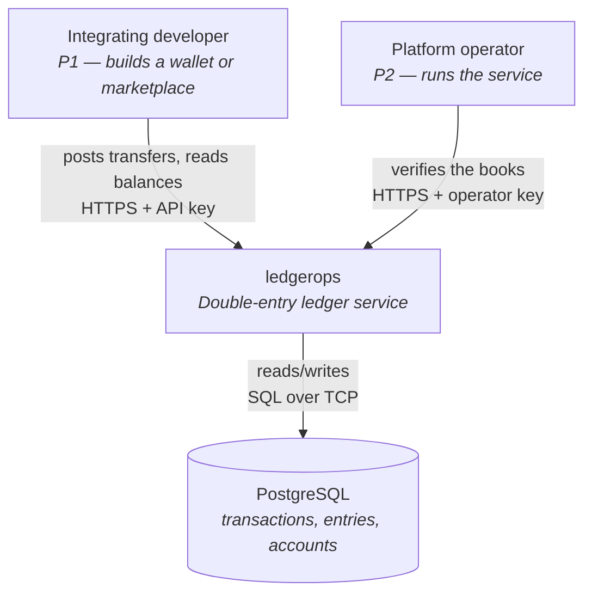
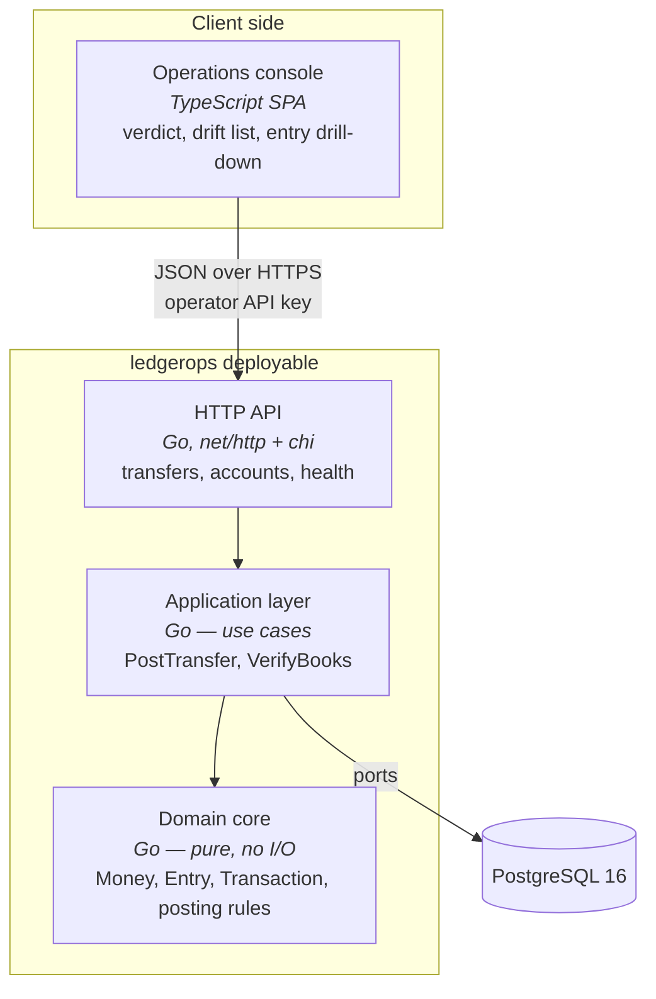
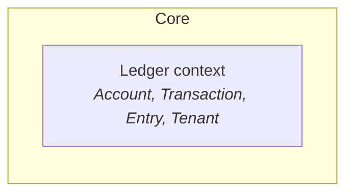
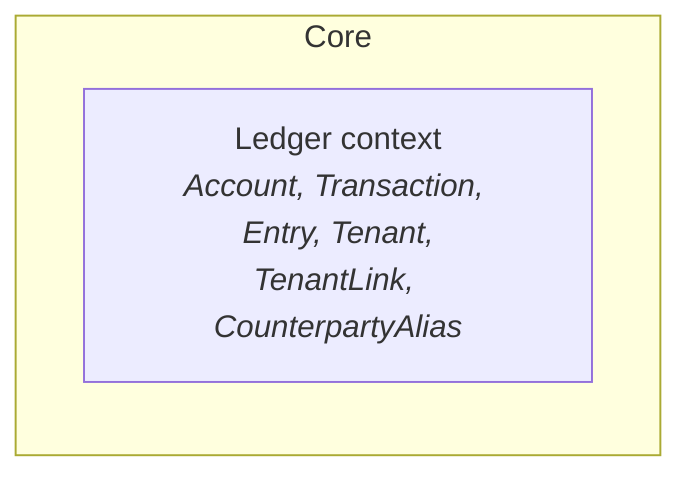
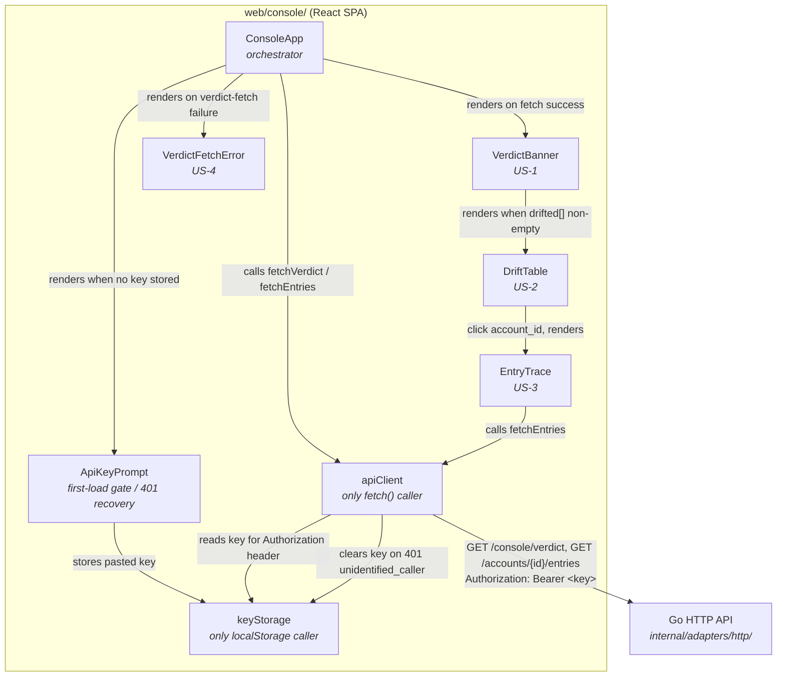
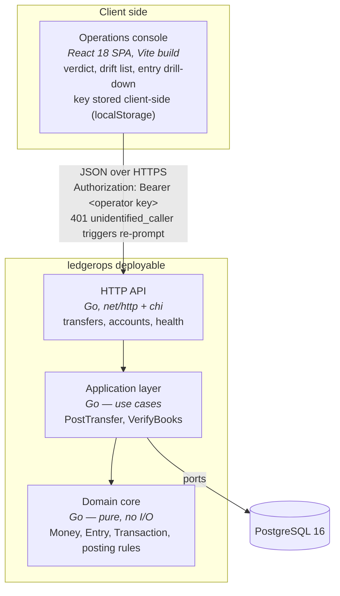
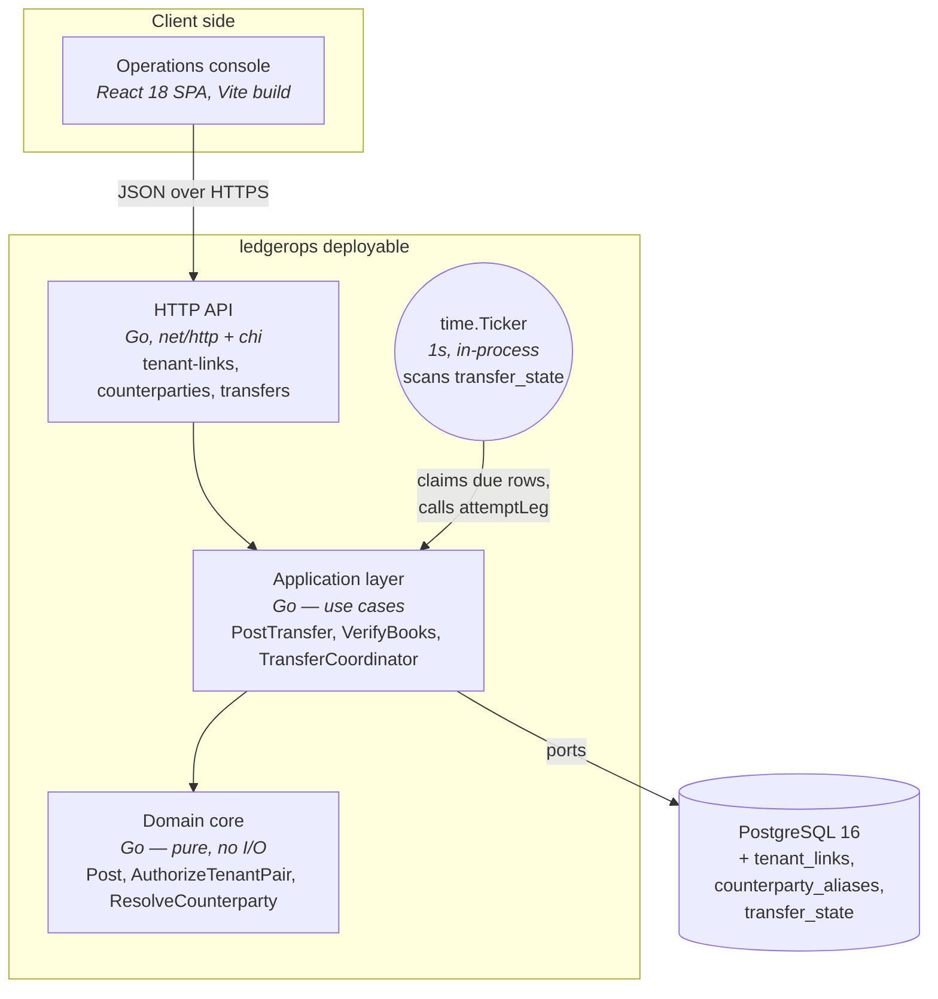

# Architecture Brief — ledgerops

SSOT for architecture. Each architect owns its section. Bootstrapped during the
DESIGN wave for `ledger-core`, 2026-08-18.

**Pattern**: modular monolith with ports-and-adapters
**Paradigm**: functional — pure core, effect shell, immutable domain types
**Stack**: Go · PostgreSQL · TypeScript SPA
**Quality attributes, ranked**: correctness · auditability · testability

---

## System Architecture

*Owner: nw-system-designer*

### Scope note

This is deliberately a thin section. `ledger-core` is a single service with one
database, no queues, no caches, and no distributed state. Checkpointed
verification was explicitly deferred (D9). There is no sharding, replication, or
partitioning to design at this stage. Designing for scale now would be
speculative — the KPIs measure correctness, not throughput.

### C4 — System Context



### C4 — Container



### Deployment shape

Single Go binary plus a static asset bundle for the SPA, plus one PostgreSQL
instance. `docker-compose` for local development so `make demo-01` runs on a
clean clone.

Deployment target, settled by DEVOPS (OPS-1): **there is no hosted environment**.
`clean` (developer machine) and `ci` (GitHub Actions, PostgreSQL 16 via
Testcontainers) are the entire environment matrix until one is needed. All
six outcome KPIs are CI assertions rather than production telemetry, so nothing
is currently learned by running the service anywhere else. When a hosted
environment appears, the recorded strategy is Recreate, with rollback by
redeploying the previous image tag.

Two database roles (OPS-10), not one:

| Role | Privileges | Used by |
|---|---|---|
| `ledgerops_app` | `SELECT`, `INSERT` on entries; `UPDATE`/`DELETE` **revoked** | The running service, and every test |
| `ledgerops_migrate` | DDL | `golang-migrate`, and the `corrupt-04` harness |

The service never connects as the migrate role. This is what makes D7
enforcement structural: a role that can `ALTER TABLE … DISABLE TRIGGER` can
rewrite history, so the application must not be that role.

Migrations are **expand-only**. No migration may `DELETE` from or drop the entry
table, and every schema change must leave the previous binary able to run
against the new schema — new columns nullable or defaulted, renames done as
add-backfill-retire across two releases. Rolling back code is therefore always
safe and never requires rolling back schema, which is the only rollback story
compatible with a ledger that cannot forget.

Infrastructure detail: `docs/feature/ledger-core/feature-delta.md` § Wave: DEVOPS.
Environment matrix: `docs/feature/ledger-core/devops/environments.yaml`.
KPI instrumentation: `docs/product/kpi-contracts.yaml`.

### Scaling escape hatches (documented, not built)

D7 append-only entries keep three future options open without rework:
checkpointed verification, period closing, and hash-chain tamper evidence. None
are built. `GET /health/trial-balance` reports `entry_count` and `elapsed_ms` so
degradation is measured rather than guessed.

### Console SPA (`ledger-core-console`, confirmed 2026-08-25)

Verified during `ledger-core-console`'s DESIGN wave, not assumed: the console
SPA introduces no new system-level architecture concern. It is one more client
of the existing single-service backend, already anticipated by the deployment
shape above ("a static asset bundle for the SPA") and the Container diagram's
`SPA` box — no new deployable, host, cache, queue, or scaling-ladder rung is
added. The one real system-adjacent item ADR-006 flags — a dev-time CORS/proxy
between the SPA dev server and the Go API — is build tooling, not
infrastructure, and stays with DELIVER. Full verification:
`docs/feature/ledger-core-console/feature-delta.md` § Wave: DESIGN /
System-Level Scope Confirmation.

### Multitenancy (`multitenancy`, confirmed 2026-09-03)

Verified during `multitenancy`'s DESIGN wave, not assumed: this feature
introduces no new system-level architecture concern. Checked against the
feature's own artifacts (`docs/feature/multitenancy/feature-delta.md`, its
three slice briefs, `onboard-and-isolate-a-tenant.yaml`) and the brownfield
code (`internal/adapters/postgres/migrations/`,
`internal/adapters/http/router.go`), not taken on the coordinator's word.

**Back-of-envelope (why this stays infra-neutral)**: tenant provisioning is
operator-driven only, no self-service (D7) — tenant count is bounded by
manual operator action, order of magnitude tens to low hundreds, not
thousands. At even 100 tenants x 100 accounts each, that is 10,000 account
rows and a proportionate entries volume — trivial for one PostgreSQL
instance. The existing k6 capacity profile (`tests/load/transfers.js`)
validated a 300 rps ceiling against this same schema shape on a single
instance (2026-09-02); multitenancy adds a `tenant_id` filter/key to the
same query shapes (`POST /transfers`, `GET /accounts/{id}`, entries,
trial-balance) without raising aggregate throughput — DISCUSS's own
Requirements Completeness section states performance/scale NFRs are "not
newly introduced" by this feature. No headroom concern at this scale.

**What stays unchanged**:
- **Deployment topology**: one Go binary, one PostgreSQL 16 instance, no
  hosted environment (`clean`/`ci` remain the entire matrix). `POST
  /tenants` is a new HTTP port on the existing service, not a new
  deployable.
- **Single-database assumption**: tenancy is a data-partitioning dimension
  (`tenant_id` as a scoping key within the existing schema), not sharding
  across databases or instances. The row-count estimate above is well
  short of where `tenant_id`-as-shard-key would become relevant.
- **OPS-10's two-role model**: the new `tenants` table and any `tenant_id`
  column/constraint get the same `GRANT` treatment already established —
  DDL stays `ledgerops_migrate`-only, the service connects as
  `ledgerops_app` with the same least-privilege shape. No third role is
  introduced by this feature. (The future platform-mediated settlement
  feature, `jobs.yaml` J8, is the one place a third, settlement-scoped
  credential is anticipated — explicitly deferred to that feature's own
  DESIGN, per this feature's § Changed Assumptions.)
- **Backup/restore boundary**: remains whole-instance, covering every
  tenant uniformly. No per-tenant backup/restore requirement was raised by
  any story (tenant offboarding and credential rotation are both
  out-of-scope).
- **Connection pooling / noisy-neighbor isolation**: not addressed by this
  feature, and correctly so — DISCUSS's Requirements Completeness section
  scopes I8 as a security/data-isolation property, not a
  performance-isolation (bulkhead) property. No per-tenant pool or bulkhead
  is introduced. Revisit only if a future feature adds a per-tenant
  throughput SLA.
- **Startup substrate probe**: the composition root's existing
  wire-then-probe sequence (`cmd/api/`, OPS-10 — refuses to start unless the
  app-role connection opens a transaction and `UPDATE` on entries is
  refused) already covers the substrate this feature's new table and
  tenant-scoped queries also depend on. No new substrate is introduced, so
  no new startup probe is required.

**Left to the next architects, not decided here**: whether `accounts`' bare
`PRIMARY KEY` becomes a composite `(tenant_id, account_id)` key, how
`entries` carries or derives `tenant_id`, and the expand-only migration
shape for both — these are schema/domain decisions for `nw-ddd-architect`
and `nw-solution-architect` (DDD-18 rescoping, feature-delta.md §
Pre-requisites #1 and #6). Flagged as an interface point, not designed
here.

**Escape hatch (documented, not built)**, consistent with the posture
above: if tenant count or per-tenant account/entry volume grows past the
low-hundreds/thousands range assumed above, a composite index on
`(tenant_id, account_id)` — on top of whatever primary-key shape
`nw-ddd-architect` chooses — is the first lever. Not needed now.

Full verification: `docs/feature/multitenancy/feature-delta.md` § Wave:
DESIGN / System Architecture.

### Inter-tenant transfer (`inter-tenant-transfer`, confirmed 2026-09-07)

Verified during `inter-tenant-transfer`'s DESIGN wave, not assumed: this
feature introduces no new deployable, no new host, and no distributed-systems
primitive (queue, scheduler service, cache) — but it does introduce the
codebase's first background/asynchronous execution concern, which earned real
scrutiny rather than a copy-paste of the `ledger-core-console`/`multitenancy`
"obviously no" conclusion. Checked against `docs/feature/inter-tenant-transfer/feature-delta.md`
(§ Locked decisions D7/D8, § Pre-requisites #2/#5) and all five slice briefs
(`docs/feature/inter-tenant-transfer/slices/slice-01..05-*.md`), not taken on
the feature-delta's word alone.

**(a) Saga coordinator (D8, orchestration-style, per-transfer).** Stays
in-process. D8 is explicit that this is a per-transfer coordinator, not a
shared/global one, and slice 02's own learning hypothesis frames the whole
walking skeleton as "three ordinary intra-tenant `Post` calls, correlated
only by an application-layer `transfer_id`." Nothing in any slice brief asks
the coordinator to run outside the request-handling process — it is an
application-layer component (`internal/app/`), not a new service. The one
open question (in-process vs. persisted-state-row for coordinator state,
Pre-requisites #2) is a durability/resumption mechanism, not a deployment
topology question — either shape lives inside the existing single Go binary
and PostgreSQL instance. **Left to `nw-solution-architect`, as already
flagged.**

**(b) Retry-until-settled (US-3) — the concern that actually differs
structurally from prior features, given real scrutiny.** Every feature this
service has shipped to date is synchronous request/response: a `Post` call
either resolves within the HTTP request or refuses. US-3's own UAT is
different in kind — it describes a client polling `GET /transfers/{id}` and
observing `retrying` *while a previously-returned response is already in the
caller's hands*, then `settled` later. That is retry activity continuing
**after** the triggering `POST /transfers` request has completed. Pre-requisites
#5 names this ambiguity explicitly ("DESIGN confirms whether this is
achievable [synchronously] ... or whether `POST /transfers` should always
return `pending`") and leaves it open. Read together with US-3's UAT (which
already assumes a fast path *and* an observable in-flight `retrying` window),
the answer that satisfies both is: legs 2/3 attempt inline on the first try,
and only a *failed* first attempt hands off to a background retry loop —
the fast path never touches it.

That handoff is a genuinely new "kind" of runtime concern for this codebase:
work that outlives the request that started it. It is not, however, a new
system-level component.

**Concurrency estimate — corrected 2026-09-07 by `nw-solution-architect`
(cross-section edit, annotated per this brief's own established convention:
an architect may correct a false or under-derived claim in another
architect's section with the correction stated in the open, without
deciding domain/system-level work there). Original text below was
tenant-count-derived ("order of 1-10... not thousands"), which is the wrong
methodology for a queueing question — a second, scale-focused review pass
(`nw-system-designer-reviewer`) correctly flagged this. Replaced with a
Little's Law derivation (L = λ × W), and the "at that volume" sizing
conclusion this paragraph reaches is re-derived from it, not asserted.**

The relevant population, post-Amendment (`brief.md` § Inter-tenant transfer
/ Application Architecture, "Crash recovery"), is every `transfer_state` row
in `status IN ('pending', 'retrying')` — every in-flight cross-tenant
transfer, not only ones that have already recorded a failure — since that
is what `processDueTransfers` now actually scans.

**λ (arrival rate into that population)**: no dedicated cross-tenant load
test exists yet (§ Open risk below) — this is genuinely unmeasured, not a
number this DESIGN pass can produce. Bounded above, without inventing new
data, by this service's own already-measured whole-system ceiling: **276.5
rps**, the throughput actually observed (0% error rate) in the `capacity`
k6 profile's most recent end-to-end run (`docs/feature/ledger-core/feature-delta.md`
§ OPS-12 amendment 2). Cross-tenant transfers are necessarily a *subset* of
total `POST /transfers` traffic, so this is a legitimate, if extreme, upper
bound on λ — not a claim that cross-tenant traffic will actually reach it.

**W (residence time per transfer in the non-terminal population)**: two
regimes, using the same measured `p(95)=923ms` figure from that same run as
a conservative single-leg-latency proxy (§ same reference): (a) the happy
path (no failure) — roughly two Post calls, Leg 2 and Leg 3, ≈ 2 × 923ms ≈
**1.85 seconds**; (b) the worst-case pathological path (full retry-and-
reversal exhaustion) — **≈204 seconds**, per the worst-case time-to-terminal
figure now computed in § Inter-tenant transfer / Application Architecture,
"Retry and reversal mechanics."

**L, both bounds stated, neither asserted as the expected case**:
- Extreme upper bound (λ at the full measured system ceiling, W at the
  happy-path figure): 276.5 rps × 1.85s ≈ **512** concurrently non-terminal
  transfers. This assumes the *entire* service's already-measured throughput
  ceiling is cross-tenant traffic, sustained continuously — almost certainly
  far above reality for a feature whose actual adoption rate is unmeasured,
  but a legitimate mathematical ceiling given only currently-available data,
  not invented.
- If a failure/retry fraction of the traffic experiences the 204s worst-case
  residence time instead of the 1.85s happy-path one, L for *that* fraction
  alone scales up proportionally — meaning population composition (how many
  rows are actually retrying versus freshly pending) matters as much as raw
  arrival rate for sizing the ticker's own batch of work per tick (§ below).

**What this replaces "order of 1-10... not thousands" with**: not a single
corrected number — the honest state of this estimate is "unmeasured, bounded
above by 512 under an extreme, almost-certainly-unrealistic assumption,"
which is materially different from the original text's implied precision.
This is exactly the estimate the § Open risk item below exists to eventually
replace with a real measurement, not a paper-derived one.

At any volume within the bound above, a per-transfer goroutine plus a single
scheduler goroutine scanning a persisted per-transfer state table on a
`time.Ticker` (both already-chosen mechanisms, § Application Architecture)
remains sufficient — memory and scheduling cost is negligible even at the
512-row extreme, and no message broker, cron daemon, or worker process is
warranted at this scale (unchanged conclusion, now on a corrected basis).
`ClaimDue`'s own batch limit (§ Application Architecture) is sized against
this re-derived estimate, not the original one. Process-restart resumption
(re-discovering every non-terminal transfer on startup, not only ones
already `retrying`) is satisfied by scanning the same persisted per-transfer
state row already under discussion for (a) — again an in-process concern,
not a distributed one.

**Named, not glossed over**: if this service ever moves to a
horizontally-scaled, multi-instance deployment (explicitly not the case
today — "there is no hosted environment," § Deployment shape above), an
in-process goroutine-per-retry design would need a leader/ownership
mechanism so two instances don't retry the same transfer concurrently. That
is out of scope for the same reason the rest of this brief's scaling
discussion is out of scope: this system runs as one instance, always, until
a future feature's DESIGN wave says otherwise. Recorded here as an escape
hatch, not a gap.

**(c) Platform-as-hub account model (D7, 2N accounts) — row-count headroom
only; lock-contention headroom is a named, unresolved open risk (added
2026-09-07 by `nw-solution-architect`, cross-section edit, per this brief's
own convention).** The paragraph below (row count) was already correct and
is unchanged; a second, scale-focused review pass (`nw-system-designer-reviewer`,
commissioned specifically to check whether this feature's own throughput
claim holds up) found that "row count is fine" is not the same claim as "no
new performance risk," and that this section previously implied the latter
without having checked it.

Row-count headroom: no new implication beyond § Multitenancy's existing
back-of-envelope. That analysis already estimated up to ~10,000 account rows
at 100 tenants x 100 accounts each; D7's 2N shape (one settlement + one
platform account per tenant) is a small constant-factor addition on top of
whatever per-tenant account count multitenancy already assumed; it does not
change the order of magnitude, and D7 itself was chosen specifically to stay
O(N) rather than the rejected O(N^2) per-pair alternative. No new index,
partitioning, or sharding consideration beyond the composite-key escape
hatch multitenancy already documented.

**Lock-contention headroom — open risk, explicitly not resolved here, not
DESIGN's to resolve on paper.** `feature-delta.md`'s own Requirements
Completeness section states "no new performance/scale NFR... rides
multitenancy's inherited 300 rps headroom." That claim does not hold, and
should not be read as settled: the 300 rps figure comes from the `capacity`
k6 profile's most recent run, which itself **breached its own 500ms p95
latency gate** (`p(95)=923ms`, throughput and error-rate both passing) —
root-caused, in the same investigation, to row-level lock contention on
"hot" accounts under `SELECT ... FOR UPDATE` (DDD-6's ascending-id lock
order), not to hardware headroom (`docs/feature/ledger-core/feature-delta.md`
§ OPS-12 amendment 2, dated 2026-09-02 — read directly, not taken on the
reviewer's word). This feature's own account model *concentrates* exactly
this kind of contention further: every cross-tenant transfer takes row locks
across **3 transactions / 6 accounts** (Leg 1: sender wallet + sender
settlement; Leg 2: the shared `tnt_platform`-scoped mirror accounts for
*both* business tenants; Leg 3: receiver settlement + receiver wallet)
against today's 1 transaction / 2 accounts for an intra-tenant transfer —
and Leg 2 in particular funnels every cross-tenant transfer, regardless of
which two business tenants are involved, through the same small
`tnt_platform`-scoped account set, which is structurally a *smaller*, more
concentrated hot set than the load test's own already-contention-limited
one. Whether this fits within real headroom is genuinely unknown — it
requires a dedicated cross-tenant load test that does not exist yet
(explicitly DEVOPS-scoped follow-up work, not built or estimated here; no
number is invented in its place). **Recorded as an open, unquantified risk
requiring measurement before "no new performance NFR" can be called settled
— not resolved by this DESIGN pass, and not silently implied as settled by
the row-count paragraph above.**

**What stays unchanged**:
- **Deployment topology**: one Go binary, one PostgreSQL 16 instance, no
  hosted environment. The three new HTTP routes (`POST /tenant-links`,
  `DELETE /tenant-links/{link_id}`, `POST /counterparties`, extended `POST
  /transfers`, new `GET /transfers/{transfer_id}`) are new ports on the
  existing service, not new deployables.
- **Single-database assumption**: two small new tables (tenant-link,
  counterparty alias) plus whatever coordinator-state shape (a) settles on —
  all within the existing PostgreSQL instance, per the Elephant Carpaccio
  gate's own count (feature-delta.md § Scope Assessment: storage is 2 new
  small tables, not a new store).
- **OPS-10's two-role model**: no new credential or role beyond the
  platform-admin / tenant-key pair already established. Feature-delta.md
  names no new credential; the third, settlement-scoped credential
  `multitenancy`'s own brief anticipated for "the future platform-mediated
  settlement feature, J8" turns out not to be needed at the *system* level
  (no new database role, no new HTTP-facing auth class) — settlement legs
  are posted by the application-layer coordinator itself, using the
  existing `tenant_key` for legs 1/3 (intra-tenant) and whatever
  application-owned mechanism `nw-solution-architect` settles on for leg 2
  (the internal platform-ledger movement, which is coordinator-driven, not
  a separately-authenticated externally-facing call). Confirmed here only
  that this needs no new system-level credential or role; the exact leg-2
  mechanism is `nw-solution-architect`'s to finalize per Pre-requisites.
- **Backup/restore boundary**: remains whole-instance. No per-transfer or
  per-link backup/restore requirement is raised by any story.
- **Startup substrate probe**: the existing wire-then-probe sequence
  (`cmd/api/`, OPS-10) already covers the PostgreSQL substrate the new
  tables and the coordinator's state-scan-on-startup also depend on. If the
  coordinator's resumption path depends on a *new* substrate guarantee not
  already probed (e.g., relying on `time.Ticker` firing reliably, or on a
  specific transaction-isolation behavior for the state-row scan), that
  probe is the implementing crafter's obligation under the same
  wire-then-probe discipline — no new substrate class is introduced at the
  system level, so no new probe is designed here.

**Left to the next architects, not decided here**: the coordinator's exact
state-persistence shape and whether it is a goroutine-per-transfer or a
single poller (Pre-requisites #2, `nw-solution-architect`); the exact fixed
retry count and backoff shape (application-layer tuning, not a system
concern); the tenant-link and counterparty-alias aggregate shapes
(Pre-requisites #1, `nw-ddd-architect`); whether legs 2/3 attempt inline on
the first try before falling back to the background loop, exactly as
sketched in (b) above (Pre-requisites #5, confirmed here only at the
system-topology level — the request/response contract itself is
`nw-solution-architect`'s to finalize).

Full verification: `docs/feature/inter-tenant-transfer/feature-delta.md` §
Wave: DESIGN / System Architecture (once that section is written by the
orchestrating DESIGN wave).

---

## Domain Model

*Owner: nw-ddd-architect*

### Bounded context

One context: **Ledger**. No context mapping is required at this stage —
tenancy was originally deferred (`ledger-core` D8), and now that it is being
built (`multitenancy`, confirmed 2026-09-03), it remains a partition
dimension *within* this context, not a second context to integrate with —
see § Multitenancy below for the full confirmation.

### Ubiquitous language

| Term | Meaning |
|---|---|
| Account | A named holder of value. Typed `wallet` or `system` |
| Entry | One side of a movement: an account and a signed amount. Also called a *leg* |
| Transaction | An indivisible set of entries that sum to zero |
| Posting | The act of writing a transaction and updating balances |
| Trial balance | The sum of all entries across the ledger; must be zero |
| Drift | A stored balance that disagrees with the sum of its entries |
| Wallet account | May never go negative (I4) |
| System account | The counterparty value enters from. May go negative by design |
| Verdict | The YES/NO statement of whether the ledger balances: "Books balance: YES" when no account has drifted, "NO" when at least one has. Not a new concept — already load-bearing in `ledger-core`'s own domain modelling (DDD-21, "the verdict withholds; it never accuses") and its HTTP contract (`GET /console/verdict`), but never previously entered into this table. Added here, backfilling a glossary gap `ledger-core-console`'s DESIGN surfaced, not introducing a new domain concept |
| Tenant | An organization using ledgerops through its own scoped credential; owns a namespace of Accounts, Transactions, and Entries invisible to every other tenant (I8). Not ledgerops' own end-customer-facing concept — `vision.md` rules that out — a tenant is who an integrating developer represents, not a new persona (`multitenancy`, confirmed 2026-09-03) |
| Tenant key | The credential scoped to exactly one tenant, minted at provisioning; distinct from the platform-admin credential (`OperatorKey`), which continues to act unscoped (`multitenancy`, confirmed 2026-09-03) |
| Tenant link | A standing, operator-granted authorization between an unordered pair of tenants — "these two may transact." Active until explicitly revoked (D9); revocation is terminal for that link's own identity, a fresh authorization mints a new one (`inter-tenant-transfer`, confirmed 2026-09-07) |
| Counterparty alias | A name a tenant registers, scoped to its own namespace, that resolves to another tenant's `(tenant_id, account_id)` — the only way one tenant addresses another's account; never a raw tenant id on the wire (D11). Registerable only against an active tenant link (`inter-tenant-transfer`, confirmed 2026-09-07) |
| Transfer | **Not a domain aggregate** — the caller-facing correlation of three ordinary, independently-posted `Transaction`s sharing one application-layer `transfer_id`. Its lifecycle state (pending/settled/retrying/reversed, D10; plus `reversal_failed`, Amendment 3 — a compensating reversal that itself exhausted its own retry budget) lives in coordinator state, not in the domain core. Named here precisely to prevent a future reader from assuming otherwise (`inter-tenant-transfer`, confirmed 2026-09-07 — see § rejected alternatives below) |
| Leg | One of the three `Post` calls that make up a Transfer. Leg 1 and leg 3 are ordinary intra-tenant postings (sender's and receiver's own books); leg 2 is the internal platform-ledger movement, also intra-tenant with respect to the platform's own account scope — no leg is ever a single `Post` call spanning two business tenants (I8, unchanged) (`inter-tenant-transfer`, confirmed 2026-09-07) |

### Aggregates

Aggregates are consistency boundaries, not objects with behaviour. Each is an
immutable value type; the rules that govern it are pure functions in the same
module, not methods that mutate it.

**Transaction** *(aggregate root)* — owns its Entries. I1 (entries sum to zero
per currency) is a predicate over the entry list, checked before the value is
constructed. Immutable once written (D7), and immutable in memory besides.
Entries have no identity outside their transaction. Gains an implicit
`tenant_id` (`multitenancy`, confirmed 2026-09-03), equal to every touched
account's own `tenant_id` — checked alongside I1, before construction, not
after. See § Multitenancy below.

**Account** *(aggregate root)* — owns `balance` and `type`. Applying a debit
yields a *new* Account value; the I4 check for wallet accounts happens on the way
to constructing it, so an Account holding an illegal balance is never produced.
Gains a `tenant_id` field (`multitenancy`, confirmed 2026-09-03), immutable
once set — no tenant reassignment is possible or in scope. See § Multitenancy
below for the full rescoping.

### Functional modeling decisions

**Immutability is strict** (DDD-15). Domain types keep their fields unexported
and are built through smart constructors that validate on the way in. There are
no mutating methods and no value receivers that pretend to mutate — applying a
change returns a new value. The practical consequence: a zero-value Money or a
negative wallet Account cannot be constructed outside the domain package, so
invariants hold by construction rather than by discipline. The extra allocation
is irrelevant at this scale, where postings are bounded by database round-trips.

**Invariant violations are a sealed taxonomy** (DDD-12). Go has no sum types, so
the closed set is built by hand: a single domain violation type carrying a kind
discriminant — unbalanced (I1), insufficient funds (I4), unknown account — whose
interface can only be satisfied inside the domain package. Callers switch over
the kind. This keeps the idiomatic Go `(value, error)` shape, so violations
travel through `errors.As` and map cleanly onto HTTP 422, while the closed set
keeps the HTTP adapter from inventing its own error vocabulary. The cost is that
exhaustiveness is not compiler-checked — a linter over the switch sites is the
compensating control, and belongs to DEVOPS.

**Status: DISCHARGED, verified 2026-08-22.** This sentence twice read
"OUTSTANDING, not discharged" and, before that, a false "Discharged" claim
corrected on 2026-08-19 when neither `.github/workflows/` nor `.golangci.*`
existed. Both now exist and were built in DELIVER: `.golangci.yml` (step
05-02) enables `exhaustive` over both named surfaces, and
`.github/workflows/ci.yml` (step 05-03) runs `golangci-lint` in the `lint`
job, required on every push per trunk-based branch protection. The
compensating control DDD-12 depends on is in place, not merely designed.

**The obligation, stated so DEVOPS inherits a requirement rather than a
discovery.** `golangci-lint` must run the `exhaustive` linter over **two**
semantically distinct switch surfaces, and covering one does not cover the
other:

1. `switch` over `domain.ViolationKind` in `internal/domain/` — keeps the core's
   sealed set closed.
2. The **wire-mapping** `switch` in `internal/adapters/http/` that turns a
   violation into a status and an error name — keeps
   `feature-delta.md` § Refusal taxonomy and status mapping honest. DDD-17
   created this surface; before it, there was only one.

Surface 2 is the one that will be missed, because it is a mapping rather than a
rulebook and reads like adapter plumbing. A member added to the core with no
mapping added at the wire is precisely the defect the sealed set exists to make
impossible, and only surface 2 catches it. Owner: DEVOPS. Until both are wired
and required on every push, DDD-12 and DDD-17 rest on review discipline alone.

**The posting rulebook is one pure function** (DDD-14). `Post` takes the transfer
command, the already-locked account snapshots, the current time, and a
pre-generated transaction id, and returns the complete intended change: the
transaction, its entries, and the balance deltas to apply. It performs no I/O,
reads no clock, and generates no identifiers — every non-determinism is passed
in as a value. I1 and I4 are therefore decided in a single pure unit, which is
the natural target for the property-based tests that testability-ranked-second
demands. The application layer's remaining job is to lock, call it once, and
persist what it returns.

### Effect boundary

The Read → Decide → Write sandwich is the hexagonal boundary in this design:

| Step | Purity | Responsibility |
|---|---|---|
| Read | impure | Open the database transaction, lock the touched accounts in ascending id order (DDD-6), read the clock, generate the id |
| Decide | **pure** | `Post` — validate the command, check I1 and I4, produce the transaction, entries, and balance deltas |
| Write | impure | Persist the transaction, entries, balance deltas, and idempotency record; commit |

The dependency rule: the shell may call the core, the core never calls the
shell, and the core does not know the shell exists. Row locks are acquired
before the pure step, not inside it — locking is an effect, and the ordering
rule that makes it safe is the shell's responsibility.

### Deliberate deviation: one unit of work spans two aggregates

Classical DDD says one transaction should modify one aggregate. Posting
necessarily modifies a Transaction *and* the balances of the Accounts it touches,
atomically — that is the definition of double-entry bookkeeping.

Rejected alternatives:

- **Ledger-as-aggregate-root** — a single root owning all accounts would make
  every posting serialize against the whole ledger. Correct, and unusable.
- **Eventual consistency between Transaction and Account** — balances would lag
  entries, and I3 would be *expected* to be violated transiently. This destroys
  the slice-04 demo, whose whole value is that drift means something is wrong.

**Decision**: a `PostTransfer` domain service coordinates the Transaction and the
affected Accounts inside one database transaction, with row locks acquired in
deterministic account-id order (DDD-6). The consistency boundary is the posting,
not the individual aggregate. This is standard practice in ledger systems and is
recorded here so it reads as a decision rather than an oversight.

### Invariants and where they are enforced

| Invariant | Statement | Enforced |
|---|---|---|
| I1 | Entries of a transaction sum to zero, per currency | Domain core (pure), plus a database check |
| I3 | Stored balance equals the sum of its entries | Not enforced — *verified* by slice 04. Deliberate: it is the cross-check |
| I4 | No wallet account balance is negative | Domain core, under row locks held by the application layer |
| I7 | The same request applied twice changes state once | Application layer, via a unique constraint on the idempotency key |
| I8 | A tenant's credential can never read, write, or affect another tenant's account, transaction, or entry | Domain core, **by construction** (`multitenancy`, confirmed 2026-09-03) — see § Multitenancy below |
| D7 | Entries are never updated or deleted | Database: `UPDATE`/`DELETE` revoked from `ledgerops_app` (OPS-10), plus a rule/trigger. CI asserts the composite refusal |
| I9 (renumbered from DDD-18, 2026-09-03) | An account identifier identifies exactly one account **within a tenant** — rescoped from global uniqueness | Domain core (pure `OpenAccount` over the tenant-scoped read snapshot), plus a `(tenant_id, account_id)` composite unique constraint — physical migration shape is `nw-solution-architect`'s to design, expand-only discipline applies |
| I10 | A tenant name identifies exactly one tenant | Domain core (pure `ProvisionTenant` over the read snapshot of existing tenant names), plus a unique constraint on tenant name — structurally identical to I9's pattern, one aggregate level up |
| I11 (new, 2026-09-07) | At most one *active* TenantLink exists per unordered tenant pair at any time; and a cross-tenant transfer may only be initiated (alias registered, alias resolved) between a pair currently holding an active link | Domain core, **by construction**, at two separate pre-construction gates — `AuthorizeTenantPair` (TenantLink's own uniqueness-of-active check) and `RegisterCounterpartyAlias`/`ResolveCounterparty` (CounterpartyAlias's read-then-refuse check against the referenced TenantLink's current status) — see § Inter-tenant transfer below |

The DDD-18 row was added 2026-08-19 by `nw-solution-architect`, a cross-section
edit into `nw-ddd-architect`'s territory. It records a decision already taken in
`adr-008-refusal-taxonomy-boundary.md` rather than making a new domain-modelling
one, and it is the enforcement half of a refusal that would otherwise have no
declared enforcement site. The narrower rule DESIGN is holding itself to: an
architect may record its own decisions and correct false claims in another's
section, with the edit annotated; it may not decide domain model there.

**Renumbered 2026-09-03 by `nw-ddd-architect`**, per `multitenancy`'s own DESIGN
pre-requisite (`feature-delta.md` § Pre-requisites #1) and the explicit
invitation left in § For Acceptance Designer above. DDD-18 is now **I9**: every
other occupant of this table is either a numbered invariant (I1/I3/I4/I7) or a
locked decision that reads like one (D7); DDD-18 was neither — it was a
decision-ID borrowed to label an invariant row, exactly the friction the
paragraph above already flags. Two siblings were added at the same time: **I8**
(tenant isolation — new, not a rescoping) and **I10** (tenant-name uniqueness —
new, at the Tenant aggregate, structurally identical to I9's pattern one level
up). Full rationale for all three: § Multitenancy below and
`adr-011-tenant-partition-not-context.md`.

Note on I3: it is the only invariant deliberately left unenforced. Enforcing it
would mean deriving balances, which removes the independent check that makes
slice 04 meaningful. Two representations that can disagree are the point.

### Event modeling

Not applied. Event sourcing was considered and rejected — see
`adr-003-stored-balances.md`. The entry table is already an append-only log of
facts, which delivers most of the auditability benefit without the projection
machinery.

### Console SPA (`ledger-core-console`, confirmed 2026-08-25)

Verified during `ledger-core-console`'s DESIGN wave, not rubber-stamped: the
console introduces no new bounded context, aggregate, or invariant. It is a
pure client of Account, Entry, Transaction, Trial balance, Drift, and Verdict
as already modelled above. Two console-only notions were checked explicitly
and found to be presentation state, not domain concepts:

- **`${fetched_at}`** — the client-observed browser-clock timestamp labelling
  verdict freshness (`discuss/shared-artifacts-registry.md`). Stays
  presentation state: it names no invariant, is never persisted or compared
  by the domain core, and is explicitly *not* a server field — the registry
  entry itself instructs that if a future backend timestamp appears, this
  artifact must be re-pointed there, not dual-sourced. Nothing to model.
- **The drift table row** (`account_id`, `stored`, `computed`, `delta`) — this
  is a rendering of the existing Drift concept and the `GET /console/verdict`
  `drifted` array field-for-field, not a new shape. No aggregate or value
  object is introduced by displaying it in a table.

No new invariant is introduced: the console never recomputes a balance
client-side (US-3 AC, "no client-side recomputation of balance"), so there is
nothing for the domain core to guard on the client. I3 stays the only
deliberately-unenforced invariant, and stays enforced (by not being enforced)
in exactly one place — the domain core / slice-04 verification — as before.

One glossary gap was found and closed, not introduced: **Verdict** was
already a load-bearing backend concept (DDD-21,
`docs/feature/ledger-core/feature-delta.md`) before this feature existed, but
had never been entered into the Ubiquitous language table above. Added as a
backfill, not a new domain-modelling decision — see table above.

**Conclusion: the user's answer is confirmed, not overridden.** No new
bounded context, aggregate, or invariant. Full verification:
`docs/feature/ledger-core-console/feature-delta.md` § Wave: DESIGN / Domain
Model Scope Confirmation.

### Multitenancy (`multitenancy`, confirmed 2026-09-03)

Domain-level leg of `multitenancy`'s DESIGN wave (system -> **domain** ->
application). System-level scope was already confirmed a no-op (§ System
Architecture above); this subsection is the real domain-modelling work that
confirmation unblocked. Full narrative:
`docs/feature/multitenancy/feature-delta.md` § Wave: DESIGN / Domain Model.

**Bounded context: confirmed, not asserted.** DISCUSS's own Scope Assessment
flagged "1 bounded context... tenant is a partition dimension within it, not
a new context" as tentative, for this review. Confirmed correct by the
primary discovery heuristic (language divergence): every existing term in
§ Ubiquitous language above — Account, Entry, Transaction, Posting, Trial
balance, Drift, Verdict — means exactly the same thing to every tenant's
integrating developer and to the platform operator. Nothing about *tenant*
introduces a second vocabulary or a second team boundary; it introduces a
scoping *dimension* orthogonal to what those words already mean. One
context, **Ledger**, unchanged.

**Tenant is a new aggregate root, not a value object, and not a new
context.** It has an identity (`tenant_id`) that persists across the one
lifecycle event this feature grants it (provisioning) — that is what makes
it an entity/aggregate root rather than a value type (identity assigned
once, tracked, never re-derived from attributes). It owns exactly two other
fields, both value-typed: `name` and `credential` (the `tenant_key`, opaque
to the domain beyond "exists, is distinct per tenant" — verification/hashing
mechanics belong to `nw-solution-architect`, per `feature-delta.md`
§ Pre-requisites #3). Root-only, value-typed properties — Vernon's rule 2
(small aggregates) is satisfied by inspection; there is no second entity to
promote or flatten.

Vernon's rule 1 (true invariants) draws Tenant's boundary at exactly "name
uniqueness" (I10, below) — nothing else about a tenant needs transactional
consistency with anything else in this feature, since renaming, rotation,
and offboarding are all out of scope. Rule 3 (reference by identity): Account
and Transaction hold a `tenant_id` value, never a `Tenant` object graph — this
is what keeps posting from becoming a three-aggregate unit of work. Rule 4
(eventual consistency across the boundary): not exercised — Tenant's own
lifecycle (provision-only) never needs to coordinate with Account/Transaction
in the same transaction; `ProvisionTenant` writes only the new Tenant record.

**Aggregate boundary = bounded-change contract, per aggregate touched by this
feature:**

*Tenant (new)*
- **Full observable state**: `{tenant_id, name, credential}`. No child
  entities, no event log (this context stays state-based — see ES/CQRS
  assessment below).
- **`ProvisionTenant(name)` declared delta**: exactly one new
  `{tenant_id, name, credential}` triple comes into existence. Nothing else
  in the Tenant collection changes.
- **Complement equality (the crafter-facing contract)**:
  `after.tenants.without(new_tenant_id) == before.tenants.without(new_tenant_id)`
  — this is US-1's own edge case ("the first tenant's calls are unaffected")
  made assertable. Additionally: no Account, Transaction, or Entry belonging
  to any existing tenant changes — `ProvisionTenant`'s declared delta touches
  only the Tenant collection, full stop.

*Account (existing, rescoped)*
- **Full observable state**: `{tenant_id (new field), id, kind, balance}`.
  `tenant_id` is set once at construction and immutable thereafter — mirrors
  `id` and `kind`'s existing immutability in `Apply`
  (`internal/domain/account.go:52-61` already reconstructs `id`/`kind`
  unchanged; `tenant_id` joins that set).
- **`NewAccount(tenant_id, id, kind, balance)` declared delta**: one new
  Account row-equivalent, scoped to `tenant_id`. **`Apply(delta)` declared
  delta**: `balance` only; `tenant_id`, `id`, `kind` are the complement.
- **Complement equality (I8, expressed at Account level)**: for a command
  scoped to `tenant_id = T`,
  `after.accounts.without(touched_ids) == before.accounts.without(touched_ids)`,
  **and** `touched_ids` is provably a same-tenant set *before* the command
  can be expressed at all — not merely checked against a wider candidate set
  after the fact. That "provably before" clause is the entire content of
  "construction-time," decided below.

*Transaction (existing, gains an implicit tenant scope)*
- **Full observable state**: `{id, recorded_at, tenant_id (new — equal to
  every touched account's tenant_id), entries[]}`.
- **`Post(...)` declared delta**: one new Transaction plus its Entries;
  append-only, so the declared delta is pure addition, never mutation of an
  existing row (mirrors D7's existing entries discipline).
- **Complement equality**: no existing Transaction or Entry, in this tenant
  or any other, changes. I1 already checks "entries sum to zero" as a
  predicate before construction; the tenant check below is a second
  predicate in the same pre-construction gate, not a separate later pass.

**I8 enforcement mechanism: construction-time, agreeing with D9's
recommendation.** D9 named the two options and recommended construction-time
without deciding it; evaluated here rather than rubber-stamped, because
"carries a tenant_id" needs a concrete meaning for `Post`'s signature to
actually be construction-time and not a repository query that merely happens
to filter correctly today. Concretely:

1. `tenant_id` becomes a required field on the `Account` value type (§
   above) — there is no smart-constructor path that produces an `Account`
   without one, exactly as there is no path that produces a
   negative-balance `Wallet` (DDD-15's own pattern, transplanted).
2. `AccountRepository`'s query and lock-acquisition ports
   (`internal/app/ports`) take `tenant_id` as a required parameter, not an
   optional filter — a call site cannot compile a query that omits it. This
   is the "impossible to express" half.
3. `Post` — already the single pure decide-function taking the transfer
   command and the *already-locked* account snapshots — cross-checks that
   every touched snapshot's `tenant_id` equals the command's own
   `tenant_id`, refusing **before** constructing the `Transaction` value,
   exactly where I1 checks the sum and I4 checks the balance floor. This is
   the "checked, not merely queried-around" half — even if a repository
   query were ever miswired to return a cross-tenant row (a bug, not a
   designed path), `Post` still refuses to build a `Transaction` out of it.

Rejected alternative — **verification-time (I3-style drift scan)**: I3 is
deliberately the *one* invariant this codebase leaves unenforced-by-
construction, precisely because deriving balances would remove the
independent cross-check that makes slice 04 meaningful (§ Invariants note on
I3, above). I8 has no such reason to stay soft — there is no independent
value in occasionally *discovering* that tenant B's data leaked into tenant
A's read, the way there is independent value in occasionally discovering a
stored balance drifted. A security property with a known, cheap
by-construction fix should not be given I3's treatment; that would be
borrowing I3's shape without inheriting its rationale.

**Refusal kind for a cross-tenant reference — a domain-modelling position,
not a punt.** `feature-delta.md` § Pre-requisites #4 frames "404 vs 403" as
an open DESIGN question. At the domain layer this collapses to a smaller
question DDD-12/DDD-17 already force to be explicit: which sealed
`ViolationKind` fires? Recommendation: **reuse `account_not_found`,
introduce no new taxonomy member.** From a `tenant_key` scoped to tenant A,
an account belonging to tenant B is not merely forbidden — it is not in A's
observable universe at all, which is exactly what `account_not_found`
already means (DDD-17: 404, minimal-information-leak posture, consistent
with `adr-009-unavailability-is-not-a-refusal.md`'s own restraint about not
over-claiming what the caller is told). Inventing a distinguishable
`cross_tenant_forbidden` kind would grow both `exhaustive`-linted switch
surfaces for zero behavioral gain, and would hand a tenant-existence oracle
to any caller willing to compare 403 against 404 — the opposite of what I8
exists to guarantee. This resolves the domain half of Pre-requisites #4
outright: reusing the sealed kind *forces* 404 as a matter of already-
committed taxonomy discipline, not a fresh wire-level style choice. Handed
to `nw-solution-architect` to confirm at the HTTP-adapter mapping layer (no
new work there — `account_not_found -> 404` is already the existing DDD-17
table row) and to close the loop on the credential-verification mechanism
itself (Pre-requisites #3), which is genuinely an application-layer concern
this architect does not own.

**Unscoped `GET /health/trial-balance` / `GET /console/verdict` semantics —
also a domain-modelling position.** Pre-requisites #5 asks whether the
unscoped call means "platform-wide aggregate" or "a designated default
tenant" now that Tenant exists. "Designated default tenant" is rejected
outright at the domain level: it would require inventing a distinguished
Tenant value with no provisioning story (D7 makes provisioning
operator-driven only; nothing provisions a "default" one), and it would make
an already-shipped, uninvolved concept (Trial balance) implicitly *about*
whichever tenant got the designation — a modelling accident, not a decision.
"Platform-wide aggregate" is the coherent reading: Trial balance was always
defined as "the sum of all entries across the ledger" (§ Ubiquitous
language, unchanged by this feature); scoping it to one tenant (US-3, new)
and leaving it unscoped (existing, unchanged) are the *same* computation
over two different entry sets — all entries, or entries filtered to one
`tenant_id` — not two different domain concepts requiring two definitions.
No new aggregate, no new invariant, one optional `tenant_id` scope parameter
on the existing verification computation. This satisfies the
console-compatibility hard constraint (`feature-delta.md` § Driving ports)
for free, since "all entries" is exactly what the unscoped call already
computes today. Wire-level mechanics (how an absent query parameter maps to
"all entries" at the HTTP boundary) are `nw-solution-architect`'s to finish.

**ES/CQRS: not warranted, reconfirmed rather than assumed.** Running the
four-question heuristic against Tenant specifically, not just re-citing
`adr-003-stored-balances.md`: audit trail — no new requirement beyond what
Account/Transaction already carry (entries stay the append-only log);
temporal queries — none named by any story; multiple views — none,
`ProvisionTenant` has exactly one shape and one consumer (the operator);
complex state transitions — Tenant's entire lifecycle in this feature is
"created," strictly simpler than Account's own (open -> apply -> apply ->
...). All four answers are "no," more decisively than they were for
Account/Transaction, which already didn't clear the bar. State-based
storage, unchanged.

**Context map**: still degenerate — one node, no edges, C4-compatible for
completeness:



**Handed to `nw-solution-architect`, not decided here**: credential
mechanism / `tenant_key` verification and its relationship to
`requireOperatorKey` (Pre-requisites #3); the HTTP-adapter wire mapping
confirming `account_not_found -> 404` for cross-tenant reads (mechanical,
given the domain position above); the query-parameter mechanics of unscoped
trial-balance meaning "all entries" (mechanical, given the domain position
above); the physical `(tenant_id, account_id)` migration shape and whether
`accounts.id` stays a bare column or becomes composite (schema/expand-only
mechanics, `feature-delta.md` § Pre-requisites #6, `slice-02`'s own
recommended pre-slice SPIKE).

Full rationale: `adr-011-tenant-partition-not-context.md`. DoD item 7
(`feature-delta.md`) — "DDD-18's rescoping explicitly confirmed by
`nw-ddd-architect`" — is satisfied by this subsection and the renumbered I9
row above.

### Inter-tenant transfer (`inter-tenant-transfer`, confirmed 2026-09-07)

Domain-level leg of `inter-tenant-transfer`'s DESIGN wave (system ->
**domain** -> application). System-level scope was already confirmed —
in-process coordinator, no new deployable (§ System Architecture above); this
subsection is the domain-modelling work that confirmation unblocked. Full
narrative: `docs/feature/inter-tenant-transfer/feature-delta.md` § Wave:
DESIGN / Domain Model. Checked directly against `internal/domain/post.go`
(the I8 refusal, `TransferCommand` shape) and all five slice briefs, not
taken on feature-delta's word alone.

**Bounded context: confirmed, not re-litigated — checked against this
feature's own aggregate design, not rubber-stamped.** DISCUSS's own Scope
Assessment asserted "1 bounded context... adds two small aggregates within
it, not a new context." Re-run against the primary discovery heuristic
(language divergence): do TenantLink or CounterpartyAlias introduce a second
vocabulary or a second team boundary? No — Account, Transaction, Entry,
Tenant all keep exactly their existing meaning; "link" and "alias" are new
nouns describing a standing authorization and an addressing indirection, not
a competing model of anything already in § Ubiquitous language. The one
candidate that could have forced a second context — a `Transfer` aggregate
with its own cross-tenant lifecycle vocabulary — is precisely the
alternative rejected below (Transfer stays coordinator/application state,
never a domain aggregate), which removes the only structural reason a second
context would have been warranted here. One context, **Ledger**, unchanged.

**Two new aggregate roots: TenantLink and CounterpartyAlias — not value
objects, not children of Tenant, not children of each other.** Both have
identity that persists across a lifecycle (grant/revoke; register), which is
the same entity-vs-value-type test ADR-011 already applied to Tenant.

**Aggregate boundary = bounded-change contract:**

*TenantLink (new)*
- **Full observable state**: `{link_id, tenant_a, tenant_b (unordered pair,
  canonicalized — e.g. sorted — so the pair is stored once), status:
  active|revoked}`. No child entities. Canonicalization is load-bearing, not
  cosmetic: `AuthorizeTenantPair(B, A)` must check the *same* snapshot slot
  as an existing `AuthorizeTenantPair(A, B)` — the smart constructor sorts
  the pair before ever comparing against the snapshot, so a caller cannot
  evade `tenant_link_already_exists` by reversing argument order. This is
  the concrete answer to "what does canonicalized mean for a crafter to
  implement," not a detail left open.
- **`AuthorizeTenantPair(tenant_a, tenant_b, existing_links_snapshot,
  tenant_existence_snapshot)` declared delta**: exactly one new
  `{link_id, tenant_a, tenant_b, status: active}` triple comes into
  existence. Refuses `tenant_not_found` (existing member, reused — mirrors
  I9/I10's own reuse discipline) if either named tenant is absent from the
  snapshot; refuses `tenant_link_already_exists` (new, below) if an *active*
  link already exists for that unordered pair in the snapshot — this is I11's
  first half, checked before construction, exactly where I10 checks
  tenant-name uniqueness.
- **`RevokeTenantLink(link_id)` declared delta**: `status` on exactly that
  `link_id` transitions `active -> revoked`. Terminal: nothing re-activates a
  revoked link; a fresh `AuthorizeTenantPair` call for the same pair mints a
  new `link_id` (slice-01's own AC: "revokes `lnk_1`, then re-authorizes ...
  succeeds with a new `link_id`" — confirms revocation is not a mutable
  toggle back to active).
- **Complement equality (the crafter-facing contract)**:
  `after.links.without(touched_link_id) == before.links.without(touched_link_id)`.
  Additionally — and this is the AC that makes the boundary decision
  legible, not just the state shape — no Account, Transaction, Entry, or
  CounterpartyAlias changes as a result of either operation:
  `AuthorizeTenantPair`/`RevokeTenantLink`'s declared delta touches only the
  TenantLink collection, full stop. Revoking a link does not touch any
  already-settled transfer (slice-01 AC) — history is immutable by the same
  D7 discipline that governs entries, applied here to "a link's past
  authorization was real and stays real."

*Vernon's-rules justification (mirroring Tenant's own, ADR-011):*
1. **True invariants**: the boundary is drawn at exactly "at most one active
   link per unordered pair" (I11, first half) — nothing else about a link
   needs transactional consistency with anything else in this feature.
2. **Small aggregates**: root-only, three value-typed fields (the pair,
   canonicalized, plus status) — satisfied by inspection, same shape as
   Tenant.
3. **Reference by identity**: TenantLink holds two `tenant_id` values, never
   `Tenant` object graphs — CounterpartyAlias below holds a `tenant_link_id`
   value, never a `TenantLink` object graph.
4. **Eventual consistency outside the boundary**: revocation does not
   synchronously cascade into the CounterpartyAlias collection — an alias
   registered against a since-revoked link is not deleted or updated by
   `RevokeTenantLink`; it simply fails to resolve the next time it is used
   (I11's second half, below). This is the eventual-consistency posture at
   work, not an oversight: it is exactly what keeps revocation a
   single-aggregate operation.

*CounterpartyAlias (new)*
- **Full observable state**: `{tenant_id (owning/registering tenant), alias,
  tenant_link_id, target_tenant_id, target_account_id}`. Identity is the
  composite `(tenant_id, alias)` — alias uniqueness is scoped to the *owning*
  tenant's own namespace, never global (US-5's own adversarial proof: two
  different tenants may register the identical alias string with zero
  collision, because they are two different aggregate instances under two
  different identities).
- **`RegisterCounterpartyAlias(tenant_id, alias, tenant_link_snapshot,
  target_account)` declared delta**: exactly one new
  `{tenant_id, alias, tenant_link_id, target_tenant_id, target_account_id}`
  record. Refuses `tenant_link_not_found` (new, below) if the referenced
  `tenant_link_snapshot` is absent or not `active` — this is I11's second
  half, first enforcement point, a read-then-refuse pre-construction gate
  exactly like `OpenAccount`'s `alreadyOpen` courtesy check
  (`internal/domain/post.go:109-123`), not a joint transaction with
  TenantLink itself. The `(tenant_id, alias)` composite-identity check
  (alias-name uniqueness within the owning tenant's namespace) is the same
  shape, one field wider: the smart constructor takes an `alreadyRegistered
  bool` computed by the application layer's read over `(tenant_id, alias)`
  — identical division of labor to `OpenAccount`'s `alreadyOpen` parameter,
  not a second, differently-shaped check invented for this aggregate.
- **`ResolveCounterparty(tenant_id, alias, alias_snapshot,
  tenant_link_snapshot)`** — a pure decision function, not a mutating
  command; it produces `(target_tenant_id, target_account_id)` for the
  coordinator to hand to leg 1's `Post` call, or refuses. Refuses
  `counterparty_not_found` (existing member from the driving ports, reused
  here deliberately) if the alias is absent from the snapshot **or** if the
  tenant-link snapshot it names is no longer `active` — I11's second half,
  second enforcement point. Reusing `counterparty_not_found` rather than
  surfacing `tenant_link_not_found` at resolution time is a deliberate
  info-leak decision, not an oversight: distinguishing "alias exists but its
  link died" from "alias never existed" would hand a caller a link-existence
  oracle, the same class of leak I8/ADR-011 already closed by reusing
  `account_not_found` instead of inventing `cross_tenant_forbidden`. US-2's
  own domain example 3 ("attempts to send ... after the operator revoked the
  link -> refused `404 counterparty_not_found`") is exactly this reuse,
  named by DISCUSS without DISCUSS knowing it was reuse — confirmed correct
  here, not merely followed.
- **Complement equality**: `RegisterCounterpartyAlias`'s declared delta
  touches only the alias collection —
  `after.aliases.without((tenant_id,alias)) == before.aliases.without((tenant_id,alias))`
  — no TenantLink, Account, or Transaction changes. `ResolveCounterparty`
  mutates nothing; its complement is the entire state (a pure read).

*Vernon's-rules justification, and why CounterpartyAlias is its own
aggregate rather than a child of TenantLink or of Tenant:*
1. **True invariants**: CounterpartyAlias's own true invariant (alias-name
   uniqueness within the *owning* tenant's namespace) shares nothing with
   TenantLink's own invariant (active-uniqueness per pair) — they are
   consistency requirements over two different collections, keyed
   differently, with no story requiring them to change together atomically.
2. **Small aggregates**: root-only, five value-typed fields — satisfied by
   inspection.
3. **Reference by identity**: holds `tenant_link_id`, `target_tenant_id`,
   `target_account_id` as values, never embeds the referenced aggregates.
4. **Eventual consistency**: the TenantLink-active check at registration is
   a snapshot read at one instant, not a standing subscription — a link
   revoked *after* an alias is registered against it does not retroactively
   touch the alias record; the alias simply fails to resolve on its next
   use (point 4 of TenantLink's own analysis, mirrored back).

**Rejected — CounterpartyAlias as a child entity of TenantLink.** A single
link can accumulate one alias per *direction* per registering tenant, and
nothing bounds how many transfers-worth of re-registration or how many
tenants eventually share one link's authorization envelope over time; making
aliases a child collection under TenantLink would force every alias
registration to lock and reload the entire link record, serializing
unrelated registrations against each other and against revocation, when
none of them actually share an invariant that needs it (tactical DDD's own
"God Aggregate" smell: unbounded child collection under one root). Rejected
for the same reason ADR-011 rejected "Tenant owning Accounts as child
entities."

**Rejected — CounterpartyAlias (or TenantLink) as a child entity of
Tenant.** ADR-011 deliberately kept Tenant to `{tenant_id, name, credential}`
specifically so posting never becomes a three-aggregate-type unit of work.
Growing Tenant with an unbounded alias or link collection repeats exactly
the mistake already rejected there, for the same reason: Tenant's own
invariant (I10, name uniqueness) has nothing to do with alias-name or
link-pair uniqueness, so nothing is gained by co-locating them, and every
future Tenant read would carry along a growing, irrelevant collection.

**Rejected — a `Transfer` aggregate.** The candidate design most likely to
look tempting: model `Transfer{transfer_id, status, legs[]}` as a third new
aggregate, owning the three legs and their lifecycle (pending -> settled /
retrying / reversed, D10). Rejected, for three compounding reasons:
1. **No true invariant lives there.** Each leg is already a fully-formed,
   independently-valid `Transaction` the instant its own `Post` call
   succeeds (I1 and I4, unchanged, decided entirely inside that call). A
   `Transfer` aggregate would not be *deciding* anything Post doesn't
   already decide — it would only be *tracking* which legs have run, which
   is process state, not a consistency boundary over domain facts (tactical
   skill's own distinction: "Domain logic vs. Orchestration").
2. **It would force cross-aggregate-type transactions I8 exists to forbid.**
   A `Transfer` aggregate spanning two tenants' own Transactions would need
   to be constructed or updated in the same unit of work as postings
   belonging to two different tenants — precisely the shape I8 refuses at
   `Post`'s own construction gate (`post.go:42-53`). Modelling it as a
   domain aggregate would either duplicate I8's check pointlessly one layer
   up, or quietly create the two-tenant consistency boundary I8 was written
   to prevent from ever existing. Neither is acceptable.
3. **D8 already named this a saga/coordinator, not an aggregate.** "Per-
   transfer coordinator" (D8) and "coordinator state persistence shape...
   `nw-solution-architect`'s to design" (feature-delta.md § Pre-requisites
   #2) are the DISCUSS/DESIGN vocabulary for exactly this concept — a
   process manager tracking which step of a saga has completed (tactical
   skill's own "Sagas and Process Managers": react to events, issue
   commands, maintain process state — no business logic in the saga
   itself). Naming it `Transfer` and modelling it as a domain aggregate
   would silently promote application-layer orchestration state into the
   sealed domain core, which is exactly the boundary the effect-boundary
   table above (§ Effect boundary) exists to keep clean.

**Consequence, stated so it does not read as a gap**: `transfer_not_found`
(US-5, `GET /transfers/{transfer_id}`) is therefore **not** a new
`domain.ViolationKind` member. There is no domain aggregate named Transfer
for it to be a violation *of* — it is a lookup miss against coordinator/
read-model state, the application layer's own concern, structurally
adjacent to how `adr-009-unavailability-is-not-a-refusal.md` already draws a
line between "the domain refused this" and "this isn't a domain-core
question at all." `nw-solution-architect` owns producing a consistent 404 at
the wire for it (and for the US-5 authorization-boundary check layered on
top, "either party or no signal") — through whatever error vocabulary the
coordinator/read-model uses, not through the sealed domain taxonomy, so
DDD-12's `exhaustive` linter obligation does not grow for this member.

**New `ViolationKind` members — three, not four, and where each is
decided.**

| Member | Wire (existing DDD-17 mapping style) | Decided at | Why |
|---|---|---|---|
| `tenant_link_already_exists` | 409 | Domain core — `AuthorizeTenantPair`'s pre-construction gate (I11, first half) | A genuine new domain fact: an active link for this pair already exists. No existing member means this — `AccountAlreadyExists`/`TenantAlreadyExists` name different collections entirely |
| `tenant_link_not_found` | 404 | Domain core — `RegisterCounterpartyAlias`'s pre-construction gate (I11, second half, first enforcement point) | The link named at *registration* time is either never-authorized or already-revoked; the caller supplied the link reference directly (`POST /counterparties {tenant_link_id,...}`), so naming it precisely reveals nothing the caller didn't already know it was asking about |
| `counterparty_not_found` | 404 | Domain core — `ResolveCounterparty`'s pre-construction gate (I11, second half, second enforcement point) — **reused**, not new in behavior, only newly load-bearing for this second refusal reason | Deliberately collapses "alias never existed" and "alias existed but its link died" into one wire shape — the info-leak discipline explained above |
| `transfer_not_found` | 404 | **Not domain core** — application-layer coordinator/read-model lookup | No `Transfer` domain aggregate exists (see rejected alternative above); `nw-solution-architect` owns the mechanism, this architect owns confirming it needs no sealed-taxonomy member |

`tenant_not_found` (slice-01, naming an unknown tenant during
`AuthorizeTenantPair`) and `insufficient_funds` (slice-02, unaffected — leg 1
is an ordinary `Post` call) are both **existing members, reused**, not new —
named here only to close the loop on feature-delta.md § Pre-requisites #3's
full candidate list.

**Compensating-transaction mechanics under D7 (append-only) — a domain
position, not a punt.** "Reverse a leg" is **a specific use of `Post`,
not a new domain operation.** A reversal is a fresh `TransferCommand` with
`From`/`To` swapped relative to the original leg (or, equivalently, the
same accounts with the amount negated — either formulation produces the
mirror-image entries), run through the unmodified `Post` function. This
follows directly from `Post`'s own contract: it already guarantees I1
(entries sum to zero) and I4 (no wallet goes negative) for *any* legal
movement between two known, same-tenant accounts; a compensating movement is
not a different kind of fact than an original movement, it is the same kind
of fact run in the opposite direction. Inventing a distinct `Reverse`
domain function would duplicate I1/I4's own checking logic for zero
behavioral gain — exactly the reasoning already applied to reject a
`cross_tenant_forbidden` `ViolationKind` in ADR-011. This also satisfies D7
by construction, not by discipline: `Post` never edits or deletes an
existing `Entry` (`internal/domain/post.go`'s own `NewEntry` calls are
strictly additive), so a reversal expressed as a `Post` call is
append-only for free — slice-04's AC ("reversal adds compensating entries;
no existing entry is edited or deleted") is a restatement of D7, not a new
rule.

**What guarantees a reversal cannot double-apply — an application-layer
guarantee, not a new domain invariant.** `Post` itself has no notion of
"this leg was already reversed" — it only ever sees one command and the
current locked snapshots. The guarantee slice-04 needs ("reversing a leg
that never posted, or reversing twice") is structurally identical to I7 ("the
same request applied twice changes state once") one level up: instead of a
caller-supplied idempotency key, the key is `(transfer_id, leg_number,
direction)`, and instead of a wire-facing unique constraint, it is a
precondition on the coordinator's own per-transfer state (leg status must
read `posted` before a compensating `Post` for that leg is ever issued, and
transitions to `reversed` atomically with that call succeeding — the same
read-decide-write shape as I7's `IdempotencyStore`, applied to coordinator
state instead of a caller key). **No new invariant number is warranted for
this** — it is I7's own principle, re-applied one layer up, at a layer
(coordinator state persistence) this architect does not own designing
(feature-delta.md § Pre-requisites #2, `nw-solution-architect`'s). Recorded
here so the guarantee has a named domain-level anchor (I7's reasoning)
rather than appearing to `nw-solution-architect` as an unowned new rule to
invent from nothing.

**ES/CQRS: not warranted for TenantLink or CounterpartyAlias, run
separately from Account/Transaction/Tenant's own reconfirmed "no."** Audit
trail: no new requirement — TenantLink/CounterpartyAlias changes are already
visible via `GET /transfers/{id}` and the entries they gate, nothing asks
for a history of *link* state itself. Temporal queries: none named by any
story. Multiple views: none — each aggregate has exactly one shape and one
consumer class (the operator for TenantLink, the registering tenant for
CounterpartyAlias). Complex state transitions: TenantLink's is
`unauthorized -> active -> revoked` (strictly simpler than Account's
open-then-apply-repeatedly), CounterpartyAlias's is single-shot
registration. All four answers "no," same conclusion class as Tenant's own.
State-based storage, unchanged.

**Context map**: still degenerate — one node, no edges, unchanged in shape
from § Multitenancy above, now carrying two more concepts:



**Handed to `nw-solution-architect`, not decided here**: the coordinator's
exact state-persistence shape and the `(transfer_id, leg_number, direction)`
double-application guard's physical mechanism (Pre-requisites #2, and the
compensating-mechanics guarantee above); the wire-adapter mapping confirming
the three new `tenant_link_*`/`counterparty_not_found` members' status codes
(mechanical, given the table above — same division of labor as I8's
`account_not_found -> 404` resolution); `transfer_not_found`'s own mechanism
and the US-5 authorization-boundary check it composes with (this architect
confirms only that neither needs a sealed domain taxonomy member); whether
legs 2/3 attempt inline before falling back to the background retry loop
(Pre-requisites #5, application-layer/request-lifecycle concern, not a
domain-modelling one).

Full rationale: `adr-014-tenant-link-and-counterparty-alias.md`.

---

## Application Architecture

*Owner: nw-solution-architect*

### Pattern

Modular monolith, ports-and-adapters, with a **pure domain core and all I/O at
the edges**. This follows directly from testability ranking second: invariant
tests and property-based tests run against the domain core with no database, and
only the adapter tests need PostgreSQL.

Under the functional paradigm the ports-and-adapters boundary and the
purity boundary are the same line — a port is the type of an effect the core
refuses to perform. The application layer is the effect shell: it sequences
read, decide, and write, and holds every ordering rule that the pure core cannot
express (lock acquisition order, transaction demarcation, idempotency-key
insertion).

### Component decomposition

| Component | Path | Responsibility | Change |
|---|---|---|---|
| Domain core | `internal/domain/` | Money, Account, Entry, Transaction, the `Post` decide function, violation taxonomy. Pure — no I/O, no clock, no randomness. Immutable types with unexported fields | CREATE NEW |
| Application | `internal/app/` | Effect shell. Use cases: PostTransfer, CreateAccount, GetBalance, GetEntries, VerifyBooks. Sequences read → decide → write | CREATE NEW |
| Ports | `internal/app/ports/` | Effect types the shell depends on: function types for single-operation ports, interfaces for transaction-scoped repositories | CREATE NEW |
| Postgres adapter | `internal/adapters/postgres/` | Repository implementations, migrations, row locking | CREATE NEW |
| HTTP adapter | `internal/adapters/http/` | Handlers, routing, API-key auth, JSON encoding | CREATE NEW |
| Entrypoint | `cmd/api/` | Wiring and configuration | CREATE NEW |
| Console SPA | `web/console/` | TypeScript SPA: verdict, drift list, entry drill-down | CREATE NEW |

**`multitenancy` (confirmed 2026-09-03)**: no new top-level component. Domain
core, Application, Ports, Postgres adapter, and HTTP adapter are each
**EXTEND**ed in place (new `ViolationKind` members and `Post` cross-check in
Domain core; `ProvisionTenant` use case in Application; `TenantRepository`/
`TenantKeyResolver`/`TenantScope` in Ports; a `tenants` table, migration, and
tenant-scoped queries in the Postgres adapter; three new/reused auth
middlewares and a new route in the HTTP adapter). Full detail: § Multitenancy
below.

**`inter-tenant-transfer` (confirmed 2026-09-07)**: no new top-level
component either, same reasoning as `multitenancy` — a per-transfer
coordinator is new *behavior*, not a new deployable or a new architectural
layer. Domain core, Application, Ports, and Postgres adapter are each
**EXTEND**ed; a new `TransferCoordinator` type lives inside the existing
`internal/app/` component alongside `Ledger`, not as a sibling top-level
component (mirrors how `ProvisionTenant` joined `Ledger` rather than
spawning a new package). Full detail: § Inter-tenant transfer below.

### Driving ports (inbound)

| Port | Surface | Slice |
|---|---|---|
| `POST /accounts` | HTTP | 01 |
| `POST /transfers` | HTTP | 01, 02, 03 |
| `GET /accounts/{id}` | HTTP | 01 |
| `GET /accounts/{id}/entries` | HTTP | 05 |
| `GET /health/trial-balance` | HTTP | 04 |
| `GET /console`, `GET /console/*` | HTTP, static (unauthenticated) | `ledger-core-console` DEVOPS |
| Console SPA | Browser | 04, 05 |
| `POST /tenants` | HTTP (new) | `multitenancy` slice 01 |

**`multitenancy` (confirmed 2026-09-03)**: `POST /accounts`, `POST /transfers`,
`GET /accounts/{id}`, `GET /accounts/{id}/entries`, and `GET
/health/trial-balance` are all extended by `multitenancy` slices 02–03 —
tenant-scoped in addition to (not instead of) their behavior above. Full
credential-to-port mapping, the dual-mode design, and the new `POST /tenants`
port: § Multitenancy below.

**`inter-tenant-transfer` (confirmed 2026-09-07)**: `POST /tenant-links`,
`DELETE /tenant-links/{link_id}`, `POST /counterparties`, and `GET
/transfers/{transfer_id}` are new routes; `POST /transfers` grows a
discriminated request body (unchanged for the existing `{to, amount}` shape,
new for `{counterparty_alias, amount}`) rather than a sibling route — no
existing caller's request shape or response shape changes. Full
credential-to-port mapping and the sync/async contract: § Inter-tenant
transfer below.

`GET /console` and `GET /console/*` serve the built SPA shell and its assets
from `web/console/dist` (Vite's `build.outDir`), added by
`ledger-core-console`'s DEVOPS wave (`internal/adapters/http/console_static.go`,
feature-delta.md § Wave: DEVOPS / Build-output wiring). Deliberately outside
the operator-API-key middleware group — the shell has to load before any key
can be presented. `GET /console/verdict` (below) is unaffected: it stays a
separate, authenticated JSON port the SPA calls after the shell has loaded.

### Driven ports (outbound) and adapters

Ports are expressed **hybrid by arity** (DDD-13): a port with one operation is a
function type; a port whose operations must share a transaction handle stays an
interface.

| Port | Form | Adapter | Notes |
|---|---|---|---|
| `TransactionRepository` | interface | `postgres` | Writes transaction + entries + balance updates in one SQL transaction |
| `AccountRepository` | interface | `postgres` | `SELECT … FOR UPDATE` in deterministic id order; applies balance deltas |
| `IdempotencyStore` | interface | `postgres` | Unique constraint on key; stores request fingerprint + transaction_id |
| `Clock` | function type | `system` / `fake` | Injected so entry timestamps are deterministic in tests |
| `IDGenerator` | function type | `uuid` / `fake` | Injected for the same reason |
| `TenantRepository` | interface (`UnitOfWork`-scoped) | `postgres` | `multitenancy` — reads a tenant by name/id, creates a tenant row inside the same unit of work as the I10 courtesy check, mirroring `AccountRepository`'s existing read+write shape |
| `TenantKeyResolver` | function type | `postgres` / `fake` | `multitenancy` — the one-operation lookup from a presented bearer token's hash to a `tenant_id`, called directly by the HTTP auth middleware ahead of any `Ledger` use case. Hybrid-by-arity (DDD-13): single operation, so a function type, exactly like `Clock`/`IDGenerator` |
| `TenantLinkRepository` | interface (`UnitOfWork`-scoped) | `postgres` | `inter-tenant-transfer` — `Create`/`ActiveByPair`/`ByID`/`Revoke` for TenantLink (I11 first half); mirrors `TenantRepository`'s read-then-decide-then-write shape one aggregate over |
| `CounterpartyAliasRepository` | interface (`UnitOfWork`-scoped) | `postgres` | `inter-tenant-transfer` — `Create`/`ByTenantAndAlias` for CounterpartyAlias (I11 second half); identity is `(tenant_id, alias)`, mirroring the account-name pattern one level up |
| `TransferStateRepository` | interface (`UnitOfWork`-scoped) | `postgres` | `inter-tenant-transfer` — the coordinator's own read-model/progress-tracker (§ Inter-tenant transfer below). NOT a domain repository — `Transfer` is not a domain aggregate (ADR-014) — so this port persists an application-layer `app.TransferState` type, never a `domain.Transfer` |

The split is not a compromise between paradigms — it follows the effect
structure. `Clock` and `IDGenerator` are single, independent effects, so as
function types their fakes are one-line literals and no test needs a stub type.
The three repositories each expose several operations that must run inside the
*same* database transaction; expressing them as loose function types would let a
caller wire two of them to different transactions, and nothing in the type
system would object. The interface keeps that cohesion visible.

`Clock` and `IDGenerator` exist as ports purely for testability. That is the
second quality attribute doing visible work.

### Refusal taxonomy: three decision sites, one wire vocabulary

DDD-12 sealed the set of ways the ledger says no. It sealed it at one site — the
pure core — and read as though it sealed all three: `unidentified_caller`,
`missing_idempotency_key` and `idempotency_key_conflict` were always decided
outside the core. DDD-17 states the whole set and names each member's site, so a
question landing between sites has somewhere to be answered. Rationale and
rejected alternatives: `adr-008-refusal-taxonomy-boundary.md`.

| Member | Decided at | Status |
|---|---|---|
| `malformed_request` | HTTP adapter | 400 |
| `missing_idempotency_key` | HTTP adapter | 400 |
| `unidentified_caller` | HTTP adapter (auth middleware) | 401 |
| `account_not_found` | Domain core — `Post` | 404 |
| `tenant_not_found` | Domain core — `VerifyBooks` tenant-scoped lookup (`multitenancy`, DDD-25) | 404 |
| `account_already_exists` | Domain core — `OpenAccount` | 409 |
| `tenant_already_exists` | Domain core — `ProvisionTenant` (`multitenancy`, DDD-25) | 409 |
| `idempotency_key_conflict` | Application shell | 409 |
| `invalid_amount` | Domain core — `NewMoney` / `Post` | 422 |
| `insufficient_funds` | Domain core — `Post` | 422 |
| `currency_mismatch` | Domain core — `Post` | 422 |
| `tenant_link_already_exists` | Domain core — `AuthorizeTenantPair` (`inter-tenant-transfer`, I11 first gate) | 409 |
| `tenant_link_not_found` | Domain core — `RegisterCounterpartyAlias` (`inter-tenant-transfer`, I11 second gate, registration) | 404 |
| `counterparty_not_found` | Domain core — `ResolveCounterparty` (`inter-tenant-transfer`, I11 second gate, resolution — reused member, newly load-bearing) | 404 |
| `transfer_not_found` | **Application layer** — `TransferCoordinator`/`TransferStateRepository` lookup miss, and the `requireTransferParty` authorization refusal (`inter-tenant-transfer`, § below) | 404 |

**Status follows the decision site**: 400 the request was not a command · 401
the caller was not identified · 404 the command named something absent · 409 the
identifier is already bound to something else · 422 the rules refuse it.

**`multitenancy` (confirmed 2026-09-03) — two new sealed members, one reused
member confirmed at the wire, `unidentified_caller` grows a second and third
decision site.** Full rationale: § Multitenancy below, DDD-25.

- `tenant_not_found` and `tenant_already_exists` are **new** `domain.ViolationKind`
  members — this is a distinct addition from ADR-011's own statement that "the
  sealed `ViolationKind` taxonomy does not grow a new member for cross-tenant
  access." That statement was scoped narrowly to the I8 cross-tenant-*read*
  case (resolved by reusing `account_not_found`, below); I10 (tenant identity
  uniqueness) needs its own pair, symmetric to how `account_not_found` /
  `account_already_exists` already exist for I9 one aggregate level down. Both
  grow the `exhaustive`-linted switch surfaces DDD-12's obligation already
  names (owner: DEVOPS).
- **Cross-tenant account reference (I8) reuses `account_not_found` at the wire,
  confirmed, not merely inherited**: a tenant-scoped query (`AccountRepository.Get`,
  `.LockForUpdate`) that cannot see another tenant's row returns nothing, which
  is exactly the shape `Post` and the existing handlers already treat as
  `account_not_found` → 404. No new HTTP-adapter mapping code path is added —
  this is the existing DDD-17 table row, unchanged, now also reached by a
  tenant-scoped query returning zero rows instead of only by a truly-unknown id.
- `unidentified_caller` (401) now has **three** decision sites instead of one:
  `requireOperatorKey` (unchanged), a new `requireTenantKey`, and a new
  dual-mode `requireTenantKeyOrOperatorKey` — all three answer the identical
  wire shape (`401 {"error":"unidentified_caller"}`), so the sealed member does
  not grow, only the number of places deciding it does. § Multitenancy below.

`unbalanced` stays a `domain.ViolationKind` member and is not a wire member — it
guards the Transaction smart constructor against a defect in the rulebook, and
no caller input reaches it. If it escapes, that is a bug, answered 500.

Two consequences for the boundary. `malformed_request` must **not** enter
`domain.ViolationKind`: a pure function over a typed command cannot represent
"the bytes were not JSON", and admitting it would put a transport concern inside
the purity boundary. And the `exhaustive` linter now covers two switch surfaces
rather than one — the core's kinds, and the adapter's wire mapping. The
adapter's switch is what keeps the status table honest.

`currency_mismatch` is a domain refusal because I1 is per-currency: two legs in
different currencies cannot sum to zero per currency for any amount. It is
declared and currently unreachable through the driving ports, since every
account is opened in the ledger's single configured currency — and that
unreachability is how "multi-currency transactions, out of scope" is enforced
rather than asserted.

**`inter-tenant-transfer` (confirmed 2026-09-07) — three new sealed
`domain.ViolationKind` members, one reused member newly load-bearing, and
one deliberately non-taxonomy member.** Full domain-modelling rationale:
`adr-014-tenant-link-and-counterparty-alias.md`. `tenant_link_already_exists`,
`tenant_link_not_found` are new — no existing member names either fact (a
duplicate active link; a link reference that is absent or revoked).
`counterparty_not_found` is **reused**, not new — it already exists as a
wire member and now has a second domain-core decision site
(`ResolveCounterparty`), deliberately collapsing "alias never existed" and
"alias's link died" into one shape (the same info-leak discipline that made
ADR-011 reuse `account_not_found` instead of inventing
`cross_tenant_forbidden`). `transfer_not_found` is **not** a
`domain.ViolationKind` member — there is no `Transfer` domain aggregate for
it to violate (ADR-014, point 3) — so it does not grow the
`exhaustive`-linted domain-core switch surface (DDD-12). It still needs a
wire mapping, decided by an ordinary `errors.Is` check against an
application-layer sentinel error (`app.ErrTransferNotFound`) in the HTTP
adapter, alongside — not inside — the `exhaustive`-linted
`domain.ViolationKind` switch. This is a second, ordinary (non-exhaustive,
non-compiler-checked) decision point at the wire layer, named explicitly so
it is not mistaken for taxonomy coverage: DISTILL should author a scenario
asserting this specific mapping (nonexistent `transfer_id` → 404
`transfer_not_found`), since no linter catches a missed or wrong mapping
here the way DDD-12/DDD-17 catch a missed sealed-taxonomy member.

### Unavailability is outside the sealed set

A refusal is a decision, and every refusal here carries the implicit assertion
that nothing moved. A connection lost after `COMMIT` was sent and before the
acknowledgement arrived may have mutated everything, so an unreachable store
cannot be a refusal without attaching a guarantee the system cannot make. It
answers **503 `service_unavailable`** with `Retry-After`, in the same error
envelope but in neither sealed set. Pool exhaustion answers 503 rather than 429 —
capacity is a property of the service, not the caller's rate.

`GET /health/trial-balance` against an unreachable store answers 503, never
`Books balance: NO`. `NO` means "I looked, and the books do not balance"; saying
it because the database is down is a false accusation of corruption and destroys
the KPI-4 signal slice 04 exists to produce. The 503 body is exactly
`{"error":"service_unavailable"}` — the `verdict` field is **omitted, not
`null`**, and so is the rest of the verdict envelope. On 200 `verdict` is always
present and never null, so its absence proves the ledger was not read; the
console branches on the status code, never on the field. Rationale:
`adr-009-unavailability-is-not-a-refusal.md`.

The composition root wires, then **probes**, then serves: `cmd/api/` refuses to
start unless the app-role connection can open a transaction *and* `UPDATE` on
the entry table is refused (OPS-10). CI job 6 proves the migration set is right;
it proves nothing about the database this binary is pointed at.

### Technology choices

| Choice | Pin | Rationale |
|---|---|---|
| Go | 1.23+ | Concurrency primitives make the I4/I7 race tests natural to write |
| PostgreSQL | 16 | Row locking, constraint triggers for D7, real transactional guarantees |
| `pgx` | v5 | Direct driver, no ORM — SQL stays visible, which matters for locking |
| HTTP router | `chi` v5 | Thin over `net/http`; no framework lock-in |
| Migrations | `golang-migrate` | Plain SQL migrations, reviewable |
| Property testing | `rapid` | Go's mature PBT library; invariant tests need generators |
| TypeScript | 5.x | Console SPA |
| SPA framework | **React 18** (`ledger-core-console`, confirmed 2026-08-25) | User's direct answer during `ledger-core-console` DESIGN (Guide mode). Largest OSS community/ecosystem of the multi-paradigm-TS options, no runtime license cost (MIT), team already has TypeScript+JSX familiarity from the domain-type work. No architectural weight beyond ADR-006's original framing — still one page with a verdict and two tables; framework choice does not change component boundaries |
| Build toolchain | **Vite 5** + `@vitejs/plugin-react` | CRA is deprecated (no longer maintained as of 2025) and was explicitly not defaulted to. Vite (OSS, MIT) is the de facto 2026 default for new React SPAs: native ESM dev server, sub-second HMR, minimal config, first-class React plugin. Rejected alternatives: **Next.js** — brings SSR/file-based routing/server runtime the console has no use for (DDR-2: zero backend changes, single client-rendered page — Next's server machinery would be unused complexity, violating simplest-solution-first); **Parcel** — viable OSS alternative but smaller React-specific plugin ecosystem and less battle-tested `proxy` config for the dev-server-to-Go-API use case this feature specifically needs (see § Console SPA below) |

### Reuse Analysis

| Existing Component | File | Overlap | Decision | Justification |
|---|---|---|---|---|
| *(none)* | — | — | CREATE NEW | Greenfield. `src/`, `lib/`, `app/` absent; no code exists to extend. Verified by filesystem search during Prior Wave Consultation |

This table is trivially satisfied for slice 01 and stops being trivial from
slice 02 onward, when the posting path already exists and must be extended
rather than duplicated.

**`multitenancy` reuse pass (confirmed 2026-09-03, DDD-26):**

| Existing Component | File | Overlap | Decision | Justification |
|---|---|---|---|---|
| `requireOperatorKey` middleware | `internal/adapters/http/router.go:144-158` | Exact admin-gate contract (`Authorization: Bearer <key>`, 401 `unidentified_caller`) that `POST /tenants` needs verbatim, and that `GET /console/verdict`/`GET /health/trial-balance` must keep using unchanged | **EXTEND (mount on an additional route, zero body changes)** | `POST /tenants` is admin-only per D7; mounting the existing, unmodified function onto one more route is the cleanest possible reuse — no new code, no new risk to the console-facing routes' byte-identical behavior |
| Bearer-token parsing (`presented := r.Header.Get("Authorization")`, `"Bearer "+expected` comparison) inside `requireOperatorKey` | `internal/adapters/http/router.go:146-148` | Identical header-parsing/compare primitive needed by the two new middlewares below | **EXTEND — factor out as a shared helper** (e.g. `bearerToken(r)`, `isOperatorKey(presented, expected)`), called by all three middlewares | Reuse at the right grain: the primitive (header parsing, constant-shape compare) is genuinely shared; the surrounding control flow is not (see next two rows). Rejected: copy-pasting the parse/compare into each new middleware — would let the three refusal shapes drift out of sync silently, the exact defect class DDD-17's "one wire vocabulary" section exists to prevent |
| `requireTenantKey` (new: verifies a `tenant_key` via `TenantKeyResolver`, injects `tenant_id` into context) | *(new file, `internal/adapters/http/` package — same component, not a new one)* | Shares the bearer-header contract with `requireOperatorKey` (above) | **CREATE NEW** | Not "the existing class has too many dependencies" (an invalid justification) — the reverse: `requireOperatorKey`'s entire value is being a zero-dependency closure over one static string; forcing it to also perform a keyed database lookup would hand it a dependency (`TenantKeyResolver`) its actual job never needs, breaking single-responsibility for both callers that still only need the static-secret check (`POST /tenants`, unscoped verdict/trial-balance). Static-secret comparison and keyed-identity resolution are different mechanisms that happen to share a header format — the header-parsing primitive is reused (row above); the mechanism is not |
| `requireTenantKeyOrOperatorKey` (new: dual-mode — tries the `requireOperatorKey` comparison first, falls back to `TenantKeyResolver`) | *(new file, same package)* | Composes the exact `isOperatorKey` primitive (row 2) plus `requireTenantKey`'s resolver call | **CREATE NEW**, composed from the two reused primitives above | The two-branch control flow (admin-check-then-tenant-check-then-refuse) exists nowhere today and is specific to `GET /accounts/{id}/entries`'s console-compatibility requirement only — DDD-23 (resolved 2026-09-03, Option C) confirmed `POST /accounts`/`POST /transfers`/`GET /accounts/{id}` stay single-mode (`requireTenantKey` only, no `OperatorKey` fallback), so this middleware is not reused a third time |
| `TenantRepository`, `ProvisionTenant` use case | *(none)* | No existing tenant persistence or provisioning code anywhere (confirmed by the DDD-architect's and system-designer's brownfield reads, and by this architect's own `Glob`/`Grep` over `internal/`) | **CREATE NEW** | Greenfield — mirrors `AccountRepository`/`CreateAccount`'s existing shape (read-then-decide-then-write inside one `UnitOfWork`, DDD-15/DDD-18 pattern) rather than inventing a new persistence idiom |
| `crypto/sha256` (credential hashing) | `internal/adapters/http/handlers.go:10` | Already imported and used in this exact package (idempotency-key fingerprinting) | **EXTEND (reuse the already-imported stdlib package, zero new dependency)** | Tenant credentials are high-entropy random tokens (below), not low-entropy user passwords — a fast cryptographic hash is the correct tool, and this package already imports it for the same class of problem (hashing a caller-presented secret for storage/lookup) |
| `IDGenerator` port (`uuid.NewString()`, `crypto/rand`-backed per `google/uuid`'s v4 implementation) | `cmd/api/main.go:58`, `internal/app/ports/ports.go` | Already a cryptographically-random, 122-bit string generator, wired as a driven port | **EXTEND (reuse for `tenant_id` and `tenant_key` generation, prefixed `tnt_`/`tk_` mirroring the existing `txn_` convention)** | No new randomness source or driven port is needed — `IDGenerator` already provides exactly the entropy a bearer credential requires (Earned Trust note: `crypto/rand`'s only failure mode is the OS CSPRNG being unavailable, which Go's own runtime treats as an unrecoverable panic rather than a silent weak fallback — this project's own fail-loud posture, e.g. the entries-append-only trigger raising rather than silently permitting, extends here without a bespoke probe) |

**`inter-tenant-transfer` reuse pass (confirmed 2026-09-07):**

| Existing Component | File | Overlap | Decision | Justification |
|---|---|---|---|---|
| `requireOperatorKey` middleware | `internal/adapters/http/router.go:278-289` | Exact admin-gate contract `POST /tenant-links`/`DELETE /tenant-links/{id}` need (US-1 AC: "only platform-admin can authorize/revoke") | **EXTEND (mount on two more routes, zero body changes)** | Identical reuse shape to `POST /tenants` in the multitenancy pass — no new code, no new risk |
| `requireTenantKey` middleware | `internal/adapters/http/router.go:298-314` | Exact tenant-scoped gate `POST /counterparties` and the extended `POST /transfers` need (US-2's own credential is the sender's `tenant_key`) | **EXTEND (mount on two more routes, zero body changes)** | `POST /transfers` is already in this group (DDD-23); `POST /counterparties` joins it — no new middleware needed for either |
| `bearerToken`/`isOperatorKey`/`hashBearerToken` primitives | `internal/adapters/http/router.go:211-235` | The new `requireTransferParty` middleware (below) needs the identical identify-the-caller step every existing middleware performs | **EXTEND (call the existing unexported functions, same package)** | These are the exact primitives DDD-22 already factored out for this purpose; a fourth middleware reusing them is the reuse discipline working as designed, not a new decision |
| `IdempotencyStore` port and its unique-constraint-backed `Claim`/`Lookup` | `internal/app/ports/ports.go:147-158`, `internal/adapters/postgres` | Leg 1's own retry-safety (existing, unmodified) plus Legs 2/3's and the compensating legs' retry-safety, needed by slice 03/04 | **EXTEND (reuse unmodified, called with synthesized keys: `{Idempotency-Key}:leg2`, `:leg3`, `:leg1:reverse`, `:leg2:reverse`)** | This is the central reuse decision of this feature's application layer (§ Inter-tenant transfer below, "Retry and reversal mechanics") — I7's own unique-constraint machinery, applied one layer up, exactly as `adr-014`'s own reasoning anticipated ("the same read-decide-write shape as I7's IdempotencyStore, applied to coordinator state instead of a caller key"). Rejected alternative: a second, bespoke dedup mechanism inside `TransferStateRepository` — would duplicate a unique-constraint-backed claim/lookup shape that already exists and is already tested, for zero behavioral gain |
| `Post` (unmodified) | `internal/domain/post.go` | Every leg (1, 2, 3) and every compensating reversal is an ordinary intra-tenant `Post` call (ADR-014, point 5) | **EXTEND (call unmodified, five times per transfer's full worst-case lifecycle: 3 legs + up to 2 reversals)** | Zero domain-core change — the entire cross-tenant/retry/reversal mechanism is an application-layer composition of an unmodified pure function, exactly as slice 02's own Learning Hypothesis set out to confirm |
| `OpenAccount`/`AccountRepository.Create` | `internal/domain/post.go:118-123`, `internal/app/ports/ports.go:104` | The settlement account (per business tenant) and the platform-mirror account (per business tenant, under `tnt_platform`) both need idempotent get-or-create bootstrap the first time a tenant pair transacts | **EXTEND (call `AccountRepository.Get` first; on not-found, call the existing `OpenAccount`/`Create` path; on found, no-op)** — not a new "ensure" port, a specific calling convention over two existing methods | `OpenAccount`'s existing `alreadyOpen`-refuses-hard behavior is for a *caller-driven* create (a second `POST /accounts` for the same id is a real conflict); this bootstrap is internal and idempotent by intent, so the coordinator checks first rather than calling `OpenAccount` and swallowing `account_already_exists` — cleaner than teaching the domain function two different meanings of "already exists" |
| `IDGenerator` port | `cmd/api/main.go:60`, `internal/app/ports/ports.go` | `transfer_id` generation (`xfr_` prefix), `link_id` generation (`lnk_` prefix) | **EXTEND** | Same reuse as multitenancy's `tnt_`/`tk_` prefixes — no new randomness source |
| `TenantRepository.ByID` | `internal/app/ports/ports.go:190` | `AuthorizeTenantPair`'s own `tenant_not_found` courtesy check needs to confirm both named tenants exist | **EXTEND (call unmodified)** | Identical read the domain position for I11 already names as reused, not new |
| `crypto/sha256` / `hashBearerToken` | `internal/adapters/http/router.go:227-235` | No new credential type is introduced by this feature (§ System Architecture above, "no new system-level credential") | **N/A — not touched** | Named here only to confirm the negative: this feature's driving ports are gated entirely by the two existing credential types |

**Console SPA reuse pass** (`ledger-core-console`, confirmed 2026-08-25):

| Existing Component | File | Overlap | Decision | Justification |
|---|---|---|---|---|
| *(none — `web/` and `web/console/` verified absent)* | — | — | CREATE NEW | Filesystem search (`Glob web/**`) returned zero matches at DESIGN time. Genuinely greenfield: no prior frontend code, no build toolchain, no dev-server config exists anywhere in the repo. The Component decomposition table already anticipated this path (`web/console/`, CREATE NEW) during `ledger-core`'s own DESIGN — this pass confirms nothing was built against it yet |
| HTTP driving-adapter auth middleware (`requireOperatorKey`) | `internal/adapters/http/router.go:60-73` | Defines the exact contract the console's key-delivery mechanism must satisfy: `Authorization: Bearer <key>` header, `401 {"error":"unidentified_caller"}` on mismatch | EXTEND (contract reuse only — zero backend code touched, per DDR-2) | The console does not reimplement or bypass this; it is designed *against* it. Read directly from source rather than assumed, so the header name/scheme (`Authorization: Bearer`) and refusal shape (`unidentified_caller`, 401) driving the ApiKeyPrompt flow below are exact, not guessed |
| `GET /console/verdict`, `GET /accounts/{id}/entries`, `GET /health/trial-balance` wire shapes | `docs/product/outcomes/registry.yaml` OUT-4, OUT-5 | Console renders these JSON shapes verbatim, no new field, no client-side derivation | EXTEND (consumption only) | Matches US-1–US-3 AC ("no client-side recomputation of balance"); no new outcome candidate introduced — see § Outcome Collision Check below |

### Console SPA (`ledger-core-console`, confirmed 2026-08-25)

*Application-level design for `web/console/`, the third and final architect in
this feature's Full-stack DESIGN sequence (system → domain → application).
System-level and domain-level scope were both confirmed "no change" upstream
(see § System Architecture and § Domain Model, both dated 2026-08-25); this
subsection is the real design work those confirmations unblocked.*

#### Component decomposition (`web/console/`)

| Component | Responsibility | Traces to | Contract shape |
|---|---|---|---|
| `ConsoleApp` | Root orchestrator. Holds page-level state (authenticated? / loading / verdict / error), decides which of the components below to render, sequences the key-gate before any data fetch | US-1–US-4 (shell) | bounded-change (owns exactly the page-level UI state it declares; no other module mutates it) |
| `ApiKeyPrompt` | The paste-in UI (see § Key delivery flow). Renders when no key is stored, or when a stored key is rejected. On submit, hands the pasted string to `keyStorage` and signals `ConsoleApp` to retry | Pre-requisite (D10), cross-cutting AC | pure-function render; the one effect (`keyStorage.set`) is delegated, not inlined |
| `VerdictBanner` | Renders "Books balance: YES/NO" as the first sentence, the "Checking the books..." loading state, and the `${fetched_at}` freshness label | US-1 | pure-function render over `{verdict, loading, fetchedAt}` props |
| `DriftTable` | Renders one row per `drifted[]` entry (`account_id`, `stored`, `computed`, `delta`); renders nothing when the array is empty; each row is clickable | US-2 | pure-function render over `drifted: DriftRow[]` |
| `EntryTrace` | Fetches and renders `GET /accounts/{id}/entries` for a clicked `account_id`. Three states, mirroring `VerdictBanner`'s S1/S1a pattern rather than inventing a second design language: **loading** ("Loading entries for {account_id}...", same neutral-non-blank shape as US-1's "Checking the books..."), **loaded** (ordered rows: amount, counterparty, `recorded_at`, running balance), **error** (bounded-time error naming the exact failed `GET /accounts/{id}/entries` URL, per `journey-console-visual.md` S3a/S4a and slice-03's added AC) | US-3 | render is pure over fetched state; the fetch itself is delegated to `apiClient`, never inlined |
| `VerdictFetchError` | Renders when `GET /console/verdict` fails or times out; names `GET /health/trial-balance` explicitly as the fallback | US-4 | pure-function render |
| `apiClient` | The **only** module that calls `fetch()`. Attaches `Authorization: Bearer <key>` (read via `keyStorage.get()`) to every request; on any `401 unidentified_caller` response, calls `keyStorage.clear()` and surfaces an "auth rejected" signal to `ConsoleApp` rather than retrying silently; exposes `fetchVerdict()`, `fetchEntries(accountId)` — both GET-only, no write methods, matching Core Principle 12's read/write port-splitting rule even though there is nothing to write | Driven port for US-1–US-4 | unbounded-preservation is N/A (no mutation target exists); classified **bounded-change**: the only side effect is the outbound HTTP GET plus a possible `keyStorage.clear()` call, both declared, no hidden writes |
| `keyStorage` | The **only** module that touches `window.localStorage`. `get()`, `set(key)`, `clear()`. No other component imports `localStorage` directly (capability injection, Core Principle 12 — a restricted `KeyStorage` capability is passed to `apiClient` and `ApiKeyPrompt`, never the ambient `window.localStorage` object) | Key delivery flow (below) | bounded-change: the declared mutation set is exactly one browser storage key, `ledgerops_console_api_key` |

No component recomputes a balance or a verdict client-side (US-3 AC), which is
why every render-layer component above is classified pure-function or
bounded-change and never unbounded-preservation — there is no "plan" being
previewed here, only a read-only rendering of an already-decided server
answer.

#### Key delivery flow (ApiKeyPrompt / `keyStorage`)

Settled per the user's direct answer (Pre-requisites, DESIGN): the operator
pastes the key client-side; it is stored in `localStorage` and sent as a
header on every fetch. Exact header contract read from
`internal/adapters/http/router.go:60-73` (`requireOperatorKey`), not assumed:
`Authorization: Bearer <key>`, refused with `401 {"error":"unidentified_caller"}`
on mismatch or missing key.

- **Storage key name**: `ledgerops_console_api_key` (namespaced to avoid
  collision with any future `localStorage` use by this or another
  same-origin app served off the same Go binary).
- **On page load**: `ConsoleApp` calls `keyStorage.get()` before any data
  fetch.
  - **Key present** → proceed straight to `VerdictBanner`'s normal US-1 flow
    (`apiClient.fetchVerdict()` with the header attached).
  - **Key absent** → render `ApiKeyPrompt` full-page, *before* any fetch is
    attempted. This is a first-load gate, not an inline prompt reacting to a
    failed request, because there is no valid request to attempt yet — an
    unauthenticated fetch would only manufacture a 401 the UI would have to
    special-case anyway. `ApiKeyPrompt` is a single text input (`type="password"`
    so the pasted key is not shoulder-surfable) plus a submit button; on submit
    it calls `keyStorage.set(value)` then signals `ConsoleApp` to retry the
    normal load flow.
- **On a 401 `unidentified_caller` from any endpoint** (verdict, entries, or
  a re-check): `apiClient` calls `keyStorage.clear()` and surfaces a
  distinct "key rejected" signal — `ConsoleApp` re-renders `ApiKeyPrompt`
  with an inline message ("Key rejected — enter a valid operator API key")
  rather than the blank first-load prompt, so the operator knows *why* they
  are seeing the form again. The stored key is never silently retried or
  left in place after a 401 — a rejected key staying in `localStorage` would
  mean every subsequent fetch fails identically with no path to recovery
  short of the operator guessing to clear it manually.
- **This is the ApiKeyPrompt/ConfigPanel decision, resolved**: a dedicated
  settings view was considered and rejected in favor of the inline first-load
  gate — a separate settings route would require routing (React Router or
  equivalent) for a single operator who sets the key once per browser and
  rarely revisits it; the 401-triggered re-prompt already covers the
  rotation case without a persistent settings surface. If a future feature
  needs key rotation as a first-class action (not just recovery-from-401),
  promote `ApiKeyPrompt` to a reachable settings view then — not speculated
  on here.

#### UX note carried forward, not a design obligation (Trigger-B skepticism)

`discuss/journey-console-visual.md` flags that a YES verdict may not fully
resolve a Trigger-B (reactive/already-suspicious) operator's anxiety — the
sentence alone may read as insufficiently reassuring when the operator
already suspects a problem. The journey doc itself frames this as "a design
note for DESIGN, not a new story," and DDR-2 keeps it out of scope for
automated testing. No component or AC is added for it here — `VerdictBanner`
already states the verdict as the first sentence with a freshness label,
which is the full extent of what US-1's AC asks for. Recorded so a future
feature (e.g. showing *when* the last drift was found, not just *that*
none exists now) has a documented starting point rather than rediscovering
this nuance from scratch.

#### Fetch timeout (concrete value — DESIGN obligation per slice-04/slice-03 AC)

Both `slice-04-console-failure-does-not-strand-the-operator.md` and
`slice-03-console-traces-a-drifted-account.md` require a "bounded-time"
error state but explicitly leave the concrete number to DESIGN
("define a concrete timeout in DESIGN — this brief does not prescribe
one"). Settled here rather than left for DELIVER to invent ad hoc:

- **`apiClient` applies an 8-second timeout (`AbortController`) to every
  request** — `fetchVerdict()`, `fetchEntries(accountId)` alike, one
  constant, not per-call tuning. On expiry, `apiClient` treats it
  identically to a network failure (surfaces the same "fetch failed"
  signal `VerdictFetchError`/`EntryTrace`'s error branch already handles),
  not as a distinct error class — the operator does not need to know
  *why* the request didn't return, only that it didn't.
- **Rationale for 8s**: System-Level Scope Confirmation already established
  this is a single local operator hitting a co-located Go binary at
  single-digit requests/minute — the expected round-trip is milliseconds.
  8 seconds is generous enough to absorb a slow cold start or a momentary
  local hiccup without a false-positive error flash, while still reading
  as "immediate" against US-4's pitch ("sees an explicit error message"
  rather than an indefinite wait) — long unresponsiveness past 8s is
  itself useful signal that something is actually wrong, not development
  jitter.
- Not configurable in this release — a fixed constant is simplest-solution-first
  for a single-operator dogfood tool; revisit only if dogfood use surfaces
  a real need to tune it.

**Earned Trust note (Core Principle 13)**: `apiClient` is a driven adapter
over two external dependencies — the network (Go API reachability) and the
browser's `localStorage` (which can be disabled, full, or cleared out from
under the app by the operator or browser privacy settings). DDR-2 forbids
adding a new automated browser-level test to probe these mechanically. The
probe that exists instead is the manual dogfood demo already required by
US-4's UAT and this feature's Definition of Done item 4: deliberately
stopping the API mid-session and confirming the named fallback appears. That
scenario **is** the fault-injection probe for the network dependency,
executed manually per release rather than in CI, which is the correct
trade-off given DDR-2's explicit constraint rather than a silent omission of
Earned Trust. `localStorage`-unavailable is not separately probed — flagged
as an accepted gap, not a discovery: if it becomes a real dogfood failure
mode, `keyStorage` should degrade to an in-memory-only fallback with a
visible warning, not fail silently. Not built now; no evidence yet that it
is needed for a single operator on one machine.

#### Dev-time proxy (build tooling only — not a system/infra change)

Confirms and makes concrete what § System Architecture already flagged as
build tooling, not infrastructure (see that section's Console SPA
subsection). Vite's dev server proxies exactly the three API path prefixes
this feature consumes to the Go binary running locally — no catch-all
proxy, so a typo'd path fails fast instead of silently reaching the wrong
target:

```ts
// web/console/vite.config.ts (illustrative shape, not implementation)
server: {
  proxy: {
    "/console/verdict": "http://localhost:8080",
    "/accounts":        "http://localhost:8080",
    "/health":          "http://localhost:8080",
  },
},
```

**This affects local dev tooling only.** There is no hosted environment
(`clean`/`ci` are the entire matrix — § Deployment shape above); "production"
for this feature means the built static bundle (`web/console/dist/`) served
by the same Go binary that exposes the API, at the same origin. Same-origin
in the built-and-served case means CORS and the dev proxy both become
inapplicable outside `vite dev` — the proxy exists solely to make the *split*
dev-server-on-one-port / Go-API-on-another-port topology look same-origin to
the browser during development. This is exactly the item ADR-006 §
Consequences flagged ("CORS or a dev proxy is now a real concern in local
development") and the item the System-Level Scope Confirmation explicitly
declined to treat as infrastructure. No CORS headers are added to the Go
API — that was the rejected option, specifically to hold DDR-2's "zero
backend changes" line.

#### C4 — Component (`web/console/` internals)



#### Updated C4 — Container (reflects concrete framework + key flow)



This supersedes the framework-neutral Container diagram above only in the
`SPA` box's label and the auth-flow arrow annotation; no box, arrow, or
topology is added or removed — confirming § System-Level Scope Confirmation's
finding that this feature adds no new deployable.

#### Enforceable architecture rule

`apiClient` and `keyStorage` are the sole modules permitted to reference
`fetch` and `window.localStorage` respectively. Recommended enforcement:
`eslint-plugin-boundaries` (OSS, MIT) or a `no-restricted-globals` /
`no-restricted-imports` ESLint rule scoped by directory, wired into the same
CI lint job DEVOPS already runs for the Go side — so a component reaching
around `apiClient` to call `fetch` directly fails CI, not review. This is
the console-side equivalent of DDD-12/DDD-17's `exhaustive` linter
obligation: a rule without enforcement erodes.

#### External integration note

No third-party/external API is introduced by this feature — the console's
only integration point is the same-org Go API it has always been designed
against, already contract-tested (`milestone-04-proof-of-balance.feature`,
`milestone-05-entry-traceability.feature`). No contract-testing annotation
is added to the DEVOPS handoff for this reason.

### Test strategy (testability as ranked driver)

| Layer | Depends on | Speed |
|---|---|---|
| Domain core | nothing | microseconds — property tests live here |
| Application | fake ports | milliseconds |
| Adapters | real PostgreSQL | seconds — WS strategy C, per DISTILL Mandate 5 |

The pure `Post` function is the primary property-based-test target: I1 (entries
sum to zero) and I4 (no negative wallet balance) are properties over generated
commands and account snapshots, provable with no database and no mocks. Because
time and identity are passed in as values, every such test is deterministic and
reproducible by seed. What remains for the concurrency suite is narrower and
sharper — not "are the rules right", which the property tests already answer,
but "does the shell acquire locks correctly", which only real PostgreSQL can
show.

The concurrency tests for I4 and I7 must run against real PostgreSQL. A fake
would model the very behaviour under test, which is why WS strategy C was
selected in DISCUSS. PostgreSQL 16 is supplied per test package by
Testcontainers (OPS-11), so local and CI runs take the same code path.

---

## Multitenancy (`multitenancy`, confirmed 2026-09-03)

*Application-level leg of `multitenancy`'s DESIGN wave (system →
`nw-system-designer`, done → domain → `nw-ddd-architect`, done →
**application, this section** → `nw-solution-architect`). Full narrative:
`docs/feature/multitenancy/feature-delta.md` § Wave: DESIGN / Application
Architecture. ADRs: `adr-012-tenant-credential-mechanism.md`,
`adr-013-multitenancy-migration-shape.md`.*

### Credential mechanism (Pre-requisite #3)

**D8's provisional recommendation — reuse `OperatorKey` as platform-admin,
add `tenant_key` as a new type — is structurally sound, evaluated rather than
rubber-stamped, with one correction.** `router.go`'s current shape applies
*one* middleware uniformly to *one* `chi.Router` group containing every
protected route. That shape does not fit once different routes require
different credential sets — the fix is `chi`'s native nested-group support,
not a rework of `requireOperatorKey` itself.

**Confirmed credential-to-port mapping** (DISCUSS's own table flagged this as
"DESIGN confirmation, not a new decision" — confirmed as originally stated,
below; DDD-23 (resolved, see § Backward compatibility subsection below)
settled the one open question this table raised, in favor of the mapping
already shown here, not against it):

| Port | Valid credential(s) | Middleware |
|---|---|---|
| `POST /tenants` | `OperatorKey` only | `requireOperatorKey` (unchanged, mounted on a new route) |
| `GET /console/verdict` | `OperatorKey` only, unscoped | `requireOperatorKey` (unchanged) |
| `GET /health/trial-balance` | `OperatorKey` only; optional `?tenant_id=` scopes the *query*, not the credential | `requireOperatorKey` (unchanged) |
| `GET /accounts/{id}/entries` | `OperatorKey` (unscoped, existing) **or** `tenant_key` (scoped, new) — dual-mode | `requireTenantKeyOrOperatorKey` (new) |
| `POST /accounts`, `POST /transfers`, `GET /accounts/{id}` | `tenant_key` only — **confirmed by DDD-23** (resolved 2026-09-03): `OperatorKey` is never accepted here | `requireTenantKey` (new) |

**New middleware, composed not duplicated (DDD-22):**

- `bearerToken(r *http.Request) (string, bool)` — extracted from
  `requireOperatorKey`'s existing header-parsing line, shared by all three
  middlewares (Reuse Analysis above).
- `requireTenantKey(resolve ports.TenantKeyResolver) func(http.Handler) http.Handler`
  — looks up the presented bearer token's SHA-256 hash via `TenantKeyResolver`;
  not found → `401 {"error":"unidentified_caller"}` (identical wire shape to
  `requireOperatorKey`'s refusal); found → injects `tenant_id` into the request
  context (a typed context key, not a bare string, so a handler cannot
  accidentally read the wrong context value).
- `requireTenantKeyOrOperatorKey(operatorKey string, resolve ports.TenantKeyResolver) func(http.Handler) http.Handler`
  — tries the exact `isOperatorKey` comparison `requireOperatorKey` already
  performs *first* (cheap, no I/O, byte-identical to today's check); on match,
  injects the "unscoped/admin" context marker and proceeds — this is what
  makes the `OperatorKey` branch of this endpoint byte-identical to today,
  not merely similar. On no match, falls back to the `TenantKeyResolver`
  lookup exactly as `requireTenantKey` does. Refuses `401 unidentified_caller`
  only if both fail.

**`TenantScope` — a closed, two-constructor type, not a nullable string
(`internal/app/ports`):**

```
type TenantScope struct { /* unexported */ }
func ScopedToTenant(tenantID string) TenantScope
func Unscoped() TenantScope
func (s TenantScope) Resolve() (tenantID string, scoped bool)
```

Used *only* where DDD-architect's domain position already establishes
"unscoped" as a legitimate, intentional state (`EntriesFor`, `TrialBalance`,
`ComputedBalances` — read-only, platform-wide-aggregate is a real answer, not
a bug). Every write-path port (`AccountRepository.LockForUpdate` /`.Create`
/`.ApplyDeltas`/`.Get`/`.All`) keeps `tenant_id` as a **plain, required
`string`** parameter — never `TenantScope` — because there is no legitimate
unscoped state for a write or a single-tenant read; construction-time
enforcement (I8, DDD-architect's decision) means the type system should make
"forgot to scope" and "deliberately unscoped" impossible to confuse, not
paper over the difference with one nullable field.

**Credential format and storage (no new dependency — Reuse Analysis above):**
`tenant_id = "tnt_" + uuid.NewString()`, `tenant_key = "tk_" + uuid.NewString()`
— both via the existing `IDGenerator` port, prefixed to match the existing
`txn_` convention (`cmd/api/main.go`). The plaintext `tenant_key` is returned
to the caller exactly once, at provisioning, and never stored: `tenants.credential_hash`
holds `sha256(tenant_key)` (hex-encoded), using the `crypto/sha256` package
already imported by `internal/adapters/http/handlers.go`. Lookup hashes the
presented bearer token and queries by the hash — the plaintext key never
reaches a `WHERE` clause or a log line.

**Contract-shape classification (Core Principle 12), per new/changed component:**

| Component | Contract shape | Declared mutation set / universe | Assertion mechanism for the crafter |
|---|---|---|---|
| `ProvisionTenant` (app + domain) | bounded-change | Exactly one new Tenant row; Tenant collection only (DDD-architect's complement-equality contract, restated) | `after.tenants.without(new_id) == before.tenants.without(new_id)` **and** `after.accounts == before.accounts` **and** `after.transactions == before.transactions` |
| `TenantKeyResolver` | pure-function (return-only) | None — must never gain a write/touch method (e.g. no "update last-used-at") | Interface exposes exactly one method returning `(tenantID string, ok bool, err error)`; a lint/review check that no second method is ever added |
| `requireTenantKey` / `requireTenantKeyOrOperatorKey` | bounded-change | Request-context annotation only (`tenant_id` or "unscoped/admin" marker); touches no store | Assert the middleware calls no driven port with a Create/Apply/Append verb — it only calls `TenantKeyResolver` (a read) |
| `AccountRepository.{LockForUpdate,Create,ApplyDeltas,Get,All}` (tenant_id now required) | bounded-change (existing pattern, extended) | Declared delta scoped to the one `tenant_id`'s own account rows | Existing complement-equality contract, with the universe narrowed from "the whole table" to "this tenant's rows" |
| `TransactionRepository.EntriesFor(scope, accountID)`, `.TrialBalance(scope)`, `.ComputedBalances(scope)` | pure-function (return-only) | None (read-only); universe = `scope`'s declared entry set (one tenant's, or all) | A regression scenario asserting the *unscoped* call's result is byte-identical before/after this feature ships (DoD item 3a) |
| `Post` (existing, gains the I8 cross-check) | pure-function (return-only), unchanged shape | None — same as today; the cross-check is a new refusal branch inside the same pure decision, not a new effect | Existing PBT harness, extended with a tenant-mismatch generator |

**Read/write driving-port split (Core Principle 12) — already satisfied, not
newly built**: `GET /accounts/{id}/entries` (dual-mode) and `GET
/health/trial-balance` are read-only driving ports and expose no write
method; `POST /tenants` is a distinct, single-purpose write port. No driving
port mixes read and write. `TenantRepository` (a **driven** port) does mix
read (`Get`) and write (`Create`) inside one `UnitOfWork` — this is the same
accepted pattern `AccountRepository`/`TransactionRepository` already use for
the identical reason (an atomic check-then-create needs a shared transaction
handle); the read/write-split mandate targets driving ports, not
transaction-scoped driven repositories.

### Migration shape (Pre-requisite #6) — the pre-slice SPIKE question, answered

**Yes, `(tenant_id, account_id)` composite uniqueness is expressible as a
single expand-only migration against the current schema — with one
structural cascade the SPIKE question's framing did not anticipate.** Full
reasoning and the exact SQL shape: `adr-013-multitenancy-migration-shape.md`.
Summary:

1. **New `tenants` table** — `tenant_id text PRIMARY KEY, name text UNIQUE NOT NULL, credential_hash text UNIQUE NOT NULL` (I10, both halves: uniqueness and lookup-by-key). `GRANT SELECT, INSERT` only to `ledgerops_app` — no `UPDATE`/`DELETE`, a free consequence of renaming/rotation/offboarding being out of scope, not a deliberate D7-style control.
2. **`accounts.id`'s bare `PRIMARY KEY` cannot stay** — US-2's own AC requires two tenants to open an account named `wallet-1` independently, which a global primary key on `id` structurally forbids. `accounts` gains `tenant_id text NOT NULL DEFAULT 'tnt_legacy_seed' REFERENCES tenants(tenant_id)` and the primary key becomes `(tenant_id, id)`. The `DEFAULT` (not merely nullable) is what keeps a hypothetical still-running pre-multitenancy binary's `INSERT` (which never mentions `tenant_id`) succeeding against the new schema.
3. **Cascade the SPIKE didn't name**: once `accounts.id` is no longer independently unique, `entries.account_id REFERENCES accounts(id)` and `entries.counterparty_id REFERENCES accounts(id)` are no longer valid foreign keys — Postgres requires an FK target to be unique. `entries` gains `tenant_id text NOT NULL REFERENCES tenants(tenant_id)`, and both foreign keys become composite: `FOREIGN KEY (tenant_id, account_id) REFERENCES accounts (tenant_id, id)` (and the same shape for `counterparty_id`). `transactions` gains a plain (non-key) `tenant_id text NOT NULL REFERENCES tenants(tenant_id)` column — transaction ids stay globally unique (UUIDs, no rescoping need), so no PK change there.
4. **One migration, one file, migration-seeded sentinel tenant** (`tnt_legacy_seed`) backfills every pre-existing `accounts` row before the composite PK is applied — Postgres DDL is transactional, and there is no hosted environment (dev/CI only), so a single-transaction backfill carries none of the production-scale-migration risk the "two releases" add-backfill-retire pattern exists to manage. This is *not* the renaming pattern that clause governs; it is a bounded, one-time structural correction with no data at risk.
5. **Expand-only discipline, checked against its actual letter**: the literal ban ("no migration may `DELETE` from or drop **the entry table**") is not violated — no table is dropped, no entry row is deleted or rewritten in content, only a column is added and two FK constraints are widened from stricter to a tenant-scoped shape. The broader "previous binary keeps running" property holds up to (not through) the point a second tenant actually opens a duplicate-named account — an inherent, reasoned consequence of the feature's own purpose, not an oversight. Rejected alternative: a surrogate UUID row-identity with `id`/`tenant_id` demoted to a plain unique constraint — rejected as unnecessary indirection (the human-facing `{account_id}` path parameter already *is* `accounts.id`; introducing a second physical identity purely to avoid a constraint change duplicates identity concepts for no behavioral gain, against simplest-solution-first).

### Backward compatibility for already-shipped, `OperatorKey`-authenticated demo/chaos/race targets (DDD-23 — resolved 2026-09-03, was open)

Verified directly against `Makefile`: `demo-01`, `demo-02`, `demo-03`, and
`chaos-01` all call `POST /accounts`, `POST /transfers`, and `GET
/accounts/{id}` using the shared `AUTH := Authorization: Bearer
demo-operator-key` variable — the *same* three routes this feature's Driving
ports mapping above scopes to `tenant_key` only. This is exactly the risk
slice-01's own Learning Hypothesis named ("if issuing and verifying a second
credential type turns out to require restructuring the existing
`requireOperatorKey` middleware in ways that touch already-shipped,
non-tenant-scoped surfaces... that is signal the interim auth decision needs
revisiting before slice 02") — confirmed as real signal, not resolved
silently. Two structurally sound options were presented, with a genuine
product/security-posture trade-off between them:

- **Option A — `OperatorKey` implicitly resolves to a seeded legacy tenant**
  (`tnt_legacy_seed`, the same sentinel the migration backfills) for
  `POST /accounts`/`POST /transfers`/`GET /accounts/{id}` too (a third
  dual-mode route family, same `requireTenantKeyOrOperatorKey` primitive).
  Zero Makefile changes — literally byte-identical. Cost: `OperatorKey` gains
  tenant-*write* authority, not just admin/read authority, which is new
  capability beyond what US-1's own elevator pitch ("platform-admin
  credential" for provisioning) suggested.
- **Option C**: seed a second fixed dev/demo
  credential (`LEDGEROPS_DEMO_TENANT_KEY`, mirroring `LEDGEROPS_OPERATOR_KEY`'s
  existing pattern) bound to the same legacy tenant, and update the
  Makefile's `AUTH` variable's *value* only — every demo/chaos/race recipe
  body stays byte-for-byte unchanged, only the shared credential the variable
  holds changes from the admin secret to a seeded tenant secret. Keeps
  `OperatorKey`'s role conceptually pure (admin actions + unscoped reads,
  never a tenant's own write authority), consistent with I8's isolation
  ethos and this project's correctness/auditability-ranked-first quality
  attributes. Cost: touches `Makefile` (a DEVOPS/DELIVER-owned file, not
  touched by this architect), and requires the composition root to seed a
  second fixed secret at startup/migration time — a small, precedented
  addition (`demo-operator-key` is already a hardcoded dev secret).

Either option was implementable without wasted work: both reuse the
identical `requireTenantKeyOrOperatorKey` primitive and the identical
`tnt_legacy_seed` tenant already required by the migration (§ above) for
schema reasons independent of this question.

**Resolved 2026-09-03 (user decision, relayed by the coordinator; additive
note, not a rewrite of the analysis above, the same convention this
project's own DISCUSS-wave "Changed Assumptions" amendments use) — Option C.**
`OperatorKey` gains no tenant-write authority; `POST /accounts`/`POST
/transfers`/`GET /accounts/{id}` stay `tenant_key`-only, exactly as the
credential-to-port mapping table above already states. `demo-01`/`02`/`03`/
`chaos-01` are kept passing by seeding a second, fixed demo tenant credential
and re-pointing the `Makefile`'s shared `AUTH` variable's value to it. User's
stated rationale: preserves the admin/tenant-credential boundary this section
already draws; accepts the named cost (a DEVOPS-owned file touched, one more
seeded dev secret). **DEVOPS/DELIVER inheritance, stated explicitly so it is
a requirement inherited rather than a discovery** — mirrors how DDD-12's
`exhaustive`-linter obligation is handed to DEVOPS elsewhere in this brief:
DESIGN's job ends at this decision record; seeding
`LEDGEROPS_DEMO_TENANT_KEY` (or equivalent) and editing the `Makefile`'s
`AUTH` value is a DEVOPS/DELIVER implementation task, not built in this wave.
Full record: `docs/feature/multitenancy/feature-delta.md` § Wave: DESIGN /
Application Architecture, `docs/feature/multitenancy/design/wave-decisions.md`.

### Open questions for the user

**None.** DDD-22, DDD-24, and DDD-25 were confirmed, evidence-grounded
decisions from this leg's first pass. DDD-23 (above) was the one genuine
product/security trade-off left open at that point; it is now resolved
(Option C) by the user's direct decision.

---

## Inter-tenant transfer (`inter-tenant-transfer`, confirmed 2026-09-07)

*Application-level leg of `inter-tenant-transfer`'s DESIGN wave (system →
`nw-system-designer`, done → domain → `nw-ddd-architect`, done →
**application, this section** → `nw-solution-architect`). Full narrative:
`docs/feature/inter-tenant-transfer/feature-delta.md` § Pre-requisites #2,
#5; all five slice briefs. ADRs: `adr-015-transfer-coordinator-persistence-and-execution.md`,
`adr-016-dual-party-transfer-authorization.md`.*

### Sync vs. async settlement — Pre-requisite #5, settled concretely

**`POST /transfers` (cross-tenant variant) always returns immediately after
Leg 1 settles, reporting `status: "pending"` — never blocking for Legs 2/3,
and never itself reporting `"settled"`.** This is not "it depends": it is
the one shape that is simultaneously (a) consistent with US-2's own UAT,
whose happy-path scenario asserts the response reports `"pending"` with only
`leg1` posted, and a *separate* `GET` is what observes `"settled"`; and (b)
consistent with the System Architecture leg's finding that Legs 2/3 "attempt
inline on the first try." Those two statements combine into one concrete
rule: Leg 1 is synchronous, part of the request/response cycle, using the
*existing*, *unmodified* single-tenant `PostTransfer` path. The instant Leg
1 commits, the handler writes the `pending` response and returns — it does
not wait for anything past that point. Separately, in a goroutine spawned by
that same handler (detached from the request's context, given its own
bounded `context.Background()` + timeout), the coordinator immediately
attempts Leg 2 then Leg 3 — "inline" meaning "attempted at once, without
waiting for the ticker," not "before the HTTP response is written." Each
individual `attemptLeg` call (whether invoked from this goroutine or from
the ticker) gets its own fresh 10-second context timeout — matching this
project's own established "generous local latency budget" convention (the
console's identical 8s rationale, § Console SPA above: a co-located Go
process's expected round trip is milliseconds, so 10s absorbs a slow cold
start without masking a genuinely stuck call past the point it stops being
useful information). This is a per-*attempt* timeout, not a per-transfer or
per-goroutine umbrella one — the goroutine itself has no timeout of its own
beyond the sum of its (at most two, this first pass) attempt timeouts. If both
succeed before the caller ever gets around to polling, the caller simply
sees `"settled"` on its first `GET` — the response still never blocked to
report it. If either fails, the retry-until-settled machinery below takes
over. One handler code path, one execution function (`attemptLeg`, below)
shared between the inline first attempt and every subsequent ticker-driven
attempt — deliberately, so "inline" and "background" are never two things
that can drift apart in behavior.

Rejected alternative — **`POST /transfers` blocks until all three legs
settle or a bounded first-attempt window elapses.** Rejected: it would make
the happy-path response's latency a function of two more `Post` calls (each
its own database round trip and lock acquisition) instead of one, buys
nothing UAT asks for (US-2's own scenario is written against the polling
shape, not a blocking one), and would need a second, *different* code path
for "what if the bounded window elapses" — reintroducing the two-code-paths
problem the "one `attemptLeg` function" design explicitly avoids.

### Component decomposition

| Component | Path | Responsibility | Contract shape |
|---|---|---|---|
| `TransferCoordinator` | `internal/app/transfer_coordinator.go` (new file, existing `internal/app/` component — EXTEND, not a new top-level component) | Per-transfer saga: `SendTransfer` (Leg 1 synchronous + spawn Legs 2/3), `attemptLeg` (the one function both the inline goroutine and the ticker's dispatch loop call — self-claims via `TransferStateRepository.ClaimOne` before running, § Crash recovery below), `GetTransfer` (read), `processDueTransfers` (ticker scan-and-dispatch entrypoint — calls the batch-limited `ClaimDue` for discovery, then `attemptLeg` per discovered row; not `retryDueTransfers`, renamed once its scope widened past "only retries") | Mixed — see per-method breakdown below |
| `Ledger.AuthorizeTenantPair` / `Ledger.RevokeTenantLink` | `internal/app/usecases.go` (EXTEND — joins `ProvisionTenant` as an ordinary use case, no saga shape needed) | Grant/revoke a standing tenant-pair link (US-1) | bounded-change |
| `Ledger.RegisterCounterpartyAlias` | `internal/app/usecases.go` (EXTEND) | Register a tenant-scoped alias against an active link (US-2) | bounded-change |

`TransferCoordinator` is deliberately a separate type from `Ledger`, not a
new method on it: it owns goroutine/ticker lifecycle (`StartRetryLoop`,
wired once at the composition root) that no other use case needs, and
folding it into `Ledger` would give every other use case an unused
dependency on a scheduler it never touches — the same single-responsibility
reasoning ADR-012 already applied to keep `requireOperatorKey` free of a
database dependency it doesn't need.

**Per-method contract-shape classification (Core Principle 12):**

| Method | Contract shape | Declared mutation set / universe | Assertion mechanism for the crafter |
|---|---|---|---|
| `TransferCoordinator.SendTransfer` | bounded-change | Exactly one new `transfer_state` row, plus Leg 1's own existing declared delta (one Transaction + two Account balance deltas, unchanged from today's `PostTransfer` contract) | `after.transfer_state.without(new_id) == before...` **and** the existing `PostTransfer` complement-equality contract, unmodified, for Leg 1 |
| `TransferCoordinator.attemptLeg(transferID, legNumber)` | bounded-change | The one named leg's Transaction/Account delta, plus that leg's own columns *and* `next_attempt_at`/`status` on that one `transfer_state` row (the self-claim, § Crash recovery below, is itself part of this method's own declared delta — not a separate untracked write); no other leg, row, or transfer touched | Column-level complement equality: `after.transfer_state.row(id).legs_other_than(legNumber) == before...`; the claim's atomicity itself is asserted by the concurrent-call and crash-simulation tests named in § Crash recovery |
| `TransferCoordinator.GetTransfer` | pure-function (return-only) | None (read-only) | Exposes no write method — split from `SendTransfer` per the read/write driving-port rule; already satisfied by `GET`/`POST` being separate HTTP routes |
| `Ledger.AuthorizeTenantPair` / `RevokeTenantLink` | bounded-change | Exactly one new/updated TenantLink row; TenantLink collection only | `after.links.without(id) == before.links.without(id)` **and** no Account/Transaction/Alias changes (ADR-014's own complement-equality contract, restated for the crafter) |
| `Ledger.RegisterCounterpartyAlias` | bounded-change | One new alias row; alias collection only | `after.aliases.without((tenant_id,alias)) == before...` |
| `ResolveCounterparty` (domain, unchanged from ADR-014) | pure-function (return-only) | None | Interface returns `(target_tenant_id, target_account_id)` or an error only — no mutating method exists to add one to |

### Coordinator state persistence — Pre-requisite #2, settled

**A new Postgres table, `transfer_state`, one row per transfer, updated
in place.** This is the concrete answer to "in-process, or a persisted
per-transfer state row": both — the coordinator's *execution* is in-process
(goroutines and a `time.Ticker`, § System Architecture above), and its
*state* is the persisted row, which is what makes execution resumable across
a process restart — **for every non-terminal transfer, not only the ones
that had already recorded a failure**. The claim below is deliberately
stated unconditionally, not "for `retrying` rows": the ticker's steady-state
query and its startup query are the same query only because the query's own
`WHERE` clause was designed to make that true (§ below) — an earlier design
pass of this section scoped it to `status = 'retrying'` only, which does
*not* make the claim true (see "Crash recovery for a transfer that never
reached `retrying`" below); this is the corrected version.

```sql
-- Illustrative shape (DELIVER's crafter owns the actual migration file).
CREATE TABLE transfer_state (
    transfer_id             text PRIMARY KEY,
    tenant_id               text NOT NULL REFERENCES tenants (tenant_id), -- sender
    counterparty_tenant_id  text NOT NULL REFERENCES tenants (tenant_id), -- receiver
    idempotency_key         text NOT NULL,
    status                  text NOT NULL CHECK (status IN ('pending','retrying','settled','reversed')),
    reason                  text,
    leg1_transaction_id     text,
    leg1_status             text NOT NULL CHECK (leg1_status IN ('pending','posted','reversed')),
    leg2_transaction_id     text,
    leg2_status             text NOT NULL CHECK (leg2_status IN ('pending','retrying','posted','reversed')),
    leg2_attempts           int NOT NULL DEFAULT 0,
    leg3_transaction_id     text,
    leg3_status             text NOT NULL CHECK (leg3_status IN ('pending','retrying','posted','reversed')),
    leg3_attempts           int NOT NULL DEFAULT 0,
    -- Set at INSERT time to the creation instant (immediately due), never
    -- left NULL -- a NULL would never satisfy "<= now()" and would silently
    -- exclude the row from every future claim, the exact class of gap this
    -- schema exists to close (see "Crash recovery" below).
    next_attempt_at         timestamptz NOT NULL,
    created_at              timestamptz NOT NULL,
    updated_at              timestamptz NOT NULL,
    UNIQUE (tenant_id, idempotency_key)
);
-- Covers every non-terminal row, not only 'retrying' ones -- a freshly
-- created 'pending' row (Leg 2 not yet attempted even once) is exactly as
-- much "due for a claim" as a 'retrying' one. See "Crash recovery" below
-- for why the narrower WHERE status = 'retrying' predicate this index
-- originally shipped with was a bug, not a simplification.
CREATE INDEX transfer_state_due_idx
    ON transfer_state (next_attempt_at) WHERE status IN ('pending', 'retrying');

GRANT SELECT, INSERT, UPDATE ON transfer_state TO ledgerops_app;
```

**`tenant_links` and `counterparty_aliases` schemas — the domain leg's
bounded-change contracts (ADR-014), made physical:**

```sql
-- Illustrative shape (DELIVER's crafter owns the actual migration file).
CREATE TABLE tenant_links (
    link_id     text PRIMARY KEY,
    tenant_a    text NOT NULL REFERENCES tenants (tenant_id),
    tenant_b    text NOT NULL REFERENCES tenants (tenant_id),
    status      text NOT NULL CHECK (status IN ('active','revoked')),
    created_at  timestamptz NOT NULL,
    updated_at  timestamptz NOT NULL,
    -- Canonicalization (ADR-014: "the smart constructor sorts the pair
    -- before ever comparing against the snapshot") is asserted here too,
    -- defense in depth rather than trusted to application code alone.
    CHECK (tenant_a < tenant_b)
);
-- I11 first half: at most one ACTIVE link per unordered pair. A plain
-- UNIQUE constraint would also block re-authorization after revoke
-- (slice-01's own AC requires a fresh link_id post-revoke) -- so
-- uniqueness is scoped to active rows only, via a partial unique index.
CREATE UNIQUE INDEX tenant_links_active_pair_uq
    ON tenant_links (tenant_a, tenant_b) WHERE status = 'active';

GRANT SELECT, INSERT, UPDATE ON tenant_links TO ledgerops_app;
-- No DELETE: a link's row, like an entry, is never removed once it exists
-- -- its history stays queryable (slice-01 AC: revocation does not affect
-- an already-settled transfer).

CREATE TABLE counterparty_aliases (
    tenant_id         text NOT NULL REFERENCES tenants (tenant_id),
    alias             text NOT NULL,
    tenant_link_id    text NOT NULL REFERENCES tenant_links (link_id),
    target_tenant_id  text NOT NULL REFERENCES tenants (tenant_id),
    target_account_id text NOT NULL,
    created_at        timestamptz NOT NULL,
    PRIMARY KEY (tenant_id, alias)
);
GRANT SELECT, INSERT ON counterparty_aliases TO ledgerops_app;
-- No UPDATE/DELETE: registration is one-shot per (tenant_id, alias) --
-- nothing in any slice re-registers or edits an existing alias, mirroring
-- tenants' own SELECT/INSERT-only shape (migration 0003).
```

**Why `UPDATE` is granted here, when OPS-10's entire posture elsewhere is to
revoke it** — stated explicitly so this does not read as a contradiction of
D7: D7's append-only discipline governs the ledger's own value-movement
history (`entries`, and by extension `transactions`) — the facts that must
never be rewritten. `transfer_state` is not ledger history; it is the
coordinator's own mutable process state (D8's "saga/process manager"
vocabulary), structurally the same kind of thing as an in-memory saga's
field, merely persisted for resumability. Every fact `transfer_state` ever
points at (a posted Transaction, its Entries) still lives in the
append-only tables, untouched by any `UPDATE` here — reversing a transfer
never edits or deletes an `Entry` (ADR-014, point 5); it only updates *this*
bookkeeping row's own `status`/`leg*_status` columns to say a compensating
`Post` has run. `tenant_links` needs the identical `UPDATE` grant for the
same reason (revocation, below).

**Crash recovery for a transfer that never reached `retrying` — a gap found
during review, corrected here, not assumed away (Earned Trust).** An
earlier version of this design scoped the ticker's claim query to `status =
'retrying'` only. That is a real gap, not a simplification: `SendTransfer`
inserts the `transfer_state` row with `status = 'pending'` (Leg 1 has
posted; Leg 2 has not been attempted even once yet), in the same
transaction as Leg 1's own commit, and only *then* spawns the detached
goroutine that makes the first attempt at Leg 2. If the process dies in the
window between that commit and the goroutine's first successful
status-write — a crash, an `os.Exit`, a container kill — the row is left at
`status = 'pending'` permanently. A ticker scoped to `status = 'retrying'`
never touches it: it is not "retrying," it never got the chance to. Leg 1's
money has moved; Legs 2/3 never will, and nothing ever looks at the row
again. This is exactly the "money moves but the transfer never completes"
failure class US-4's reversal path exists to prevent for the *retry-
exhausted* case — but this gap sits *upstream* of retry exhaustion
entirely, where no retry has even been counted yet.

**Fix: the claim mechanism is unconditional over every non-terminal row,
and the inline goroutine's first attempt goes through the identical claim
as every ticker-driven attempt — there is no longer a "pre-claim" phase
that can be skipped by a crash.** Three changes from the version reviewed
in iteration 1, all reflected in the schema above:

1. `next_attempt_at` is set to the creation instant at `INSERT` time (never
   left `NULL`) — the row is due for a claim from the moment it exists.
2. The partial index and every claim query cover `status IN ('pending',
   'retrying')`, not `'retrying'` alone — `'pending'` is exactly as much
   "has an incomplete leg" as `'retrying'` is; the two statuses differ only
   in whether a failure has been recorded yet, a caller-facing reporting
   distinction (US-3's own "the sender sees `retrying`... when a leg
   stalls" — stalling is the trigger for the *label*, not for scan
   eligibility).
3. **`attemptLeg` performs its own atomic claim internally, via
   `TransferStateRepository.ClaimOne`** — `UPDATE transfer_state SET
   next_attempt_at = now() + lease_duration WHERE transfer_id = $1 AND
   status IN ('pending', 'retrying') AND next_attempt_at <= $2 RETURNING *`
   — and this is now the *only* way a specific, already-known `transfer_id`
   is permitted to be attempted: the inline goroutine's own first attempt
   calls it directly (it already knows its own `transfer_id`), and the
   ticker calls it once per row *after* discovering which rows are due (§
   below — discovery and claiming are two separate steps for the ticker,
   not one, so that discovery can be batch-limited without the claim
   mechanism itself needing to know about batching). Either caller races
   through the identical single-row claim, and whichever wins proceeds.
   This is what closes the crash gap *and* the double-processing race with
   one mechanism instead of two: a crash at any point after the row exists
   leaves it claimable again after at most one `lease_duration`, because
   nothing — not the row's
   initial insert, not any individual attempt — was ever exempt from the
   claim.
4. **`processDueTransfers` (the ticker) discovers due rows via a separate,
   batch-limited `TransferStateRepository.ClaimDue` call — found missing a
   cap during the same second review pass that found the lease/backoff
   conflict above, corrected here.** An unbounded discovery query would
   let one tick claim the *entire* non-terminal backlog after any process
   downtime, or under ordinary load now that the Amendment broadened scope
   to `status IN ('pending', 'retrying')` (every in-flight transfer, not
   only failed ones). `ClaimDue` takes an explicit `batchLimit`, ordered
   oldest-`next_attempt_at`-first (so a genuine backlog drains fairly,
   oldest first, rather than arbitrarily); rows beyond the cap are simply
   left unclaimed — their `next_attempt_at` is untouched, so they remain
   due and are picked up by a later tick, at worst `ceil(backlog_size /
   batchLimit)` ticks later (≈1s apart) rather than never. **`batchLimit =
   100`** — sized against the re-derived concurrency estimate (§ System
   Architecture above, "Concurrency estimate — corrected"): generously
   above the realistic few-tens range implied by that estimate's own
   reasoning, while small enough that even draining the extreme 512-row
   ceiling bound (an almost-certainly-unrealistic upper bound, not an
   expected backlog) takes only `ceil(512/100) = 6` ticks, ≈6 seconds —
   not an unbounded stall.

**Bounded, not indefinite, recovery latency — including the case where the
goroutine never spawns at all.** Two distinct crash windows exist, and both
are covered: (a) a crash *during* an attempt, after some claim has
succeeded — the row's `next_attempt_at` sits wherever that claim set it (up
to `lease_duration` = 15 seconds in the future), and the next ticker tick
that finds `next_attempt_at <= now()` claims and resumes it, at most 15
seconds after the crash plus up to one 1-second tick interval; (b) a crash
*before any claim has ever been attempted* — including the degenerate case
where the process dies in the same instant as (or before) the goroutine
spawn itself, so the goroutine's own first attempt never runs at all. This
second case needs no special handling: `next_attempt_at` was already set to
the row's creation instant at `INSERT` time (point 1 above), so the row is
immediately "due" — no lease has ever been placed on it — and the very next
ticker tick (within 1 second, not bounded by the 15-second lease at all,
since no claim has been made to set one) claims it exactly as it would any
other due row. The ticker does not need to know or care whether an inline
attempt was ever made; it only ever asks "is this row's `next_attempt_at`
in the past," which is unconditionally true for a row nothing has
successfully claimed yet. This bound holds uniformly for every non-terminal
row, closing exactly the gap above.

**`lease_duration = 15 seconds`** — fixed, derived from the 10-second
per-attempt timeout above plus a 5-second margin for scheduling jitter,
deliberately independent of the 1-second ticker interval (the lease
protects against a *slow* attempt outliving one tick, not against the tick
rate itself). This is the probe-equivalent for this port: `ClaimOne`'s
atomicity is what the crafter's test must exercise — not only "two
concurrent `attemptLeg` calls for the same `transfer_id` and leg number;
assert exactly one posts" (the original double-processing case), but now
also "kill the process (or simulate the crash by never calling `attemptLeg`
after `SendTransfer` commits) and assert the ticker alone, with no inline
goroutine ever having run, still drives the transfer to `settled` or
`reversed`" (the crash-recovery case this section exists to close), and a
third, separate obligation for `ClaimDue`'s own batch limit: "seed more
than `batchLimit` due rows in one test database, run one `processDueTransfers`
tick, and assert exactly `batchLimit` were claimed (their `next_attempt_at`
advanced) while the remainder were left untouched and are claimed on the
next tick" — a distinct property from `ClaimOne`'s atomicity, testing the
discovery step's own boundary rather than the claim's.

**Rejected alternative — insert the row at `status = 'retrying'` from the
start, sidestepping the scan-predicate question entirely.** Considered,
because it is a one-line fix. Rejected: it would make `'retrying'` mean
"anything not yet posted," corrupting the label's own meaning (US-3's own
ubiquitous language — "retrying" names a *response to a stalled attempt*,
not a default starting state) and risking a GET response reporting
`retrying` to a caller in the sub-millisecond window before Leg 2 has even
been tried once, which no UAT scenario licenses and a future scenario could
reasonably assert against. Decoupling the caller-facing status label from
the scan-eligibility predicate (the fix adopted above) costs one broadened
`WHERE` clause and keeps both concerns honest.

**Operational visibility — the one number that would surface all of the
above, added following `GET /health/trial-balance`'s own `entry_count`/
`elapsed_ms` precedent (found missing during the same review pass; a
backlog like the crash-recovery or batch-cap scenarios above would
otherwise be invisible until a caller complained).** Rather than a new HTTP
port, this reuses the existing Prometheus exposition already mounted
unauthenticated at `GET /metrics` (OPS-5, `internal/adapters/http/metrics.go`,
seven declared series today) — cheaper than a new JSON port, no new
authentication boundary, and the existing precedent for "a number the
operator can watch without a bespoke client." Two new gauges, refreshed by
`processDueTransfers` on its own 1-second cadence from a single lightweight
query it already needs to run first (a `SELECT count(*), min(next_attempt_at)
FROM transfer_state WHERE status IN ('pending', 'retrying')` — using the
same partial index as `ClaimDue`'s own discovery scan, run *before* the
batch-limited claim, so the count reflects the true backlog size
independent of `batchLimit`):

- `ledgerops_transfer_state_nonterminal_count` — count of every `pending` or
  `retrying` row at the moment of the last tick. A sustained rise here,
  faster than `processDueTransfers` can drain it, is the first visible
  symptom of the lock-contention open risk below actually biting in
  practice — exactly the kind of signal a real cross-tenant load test (or
  production traffic, once a hosted environment exists) would need to catch
  it, without this DESIGN pass having to predict the number in advance.
- `ledgerops_transfer_state_oldest_next_attempt_age_seconds` — how far in
  the past the oldest due row's `next_attempt_at` sits, i.e. how long the
  longest-waiting transfer has been due without yet being claimed. Near-zero
  in steady state; a growing value means the ticker is falling behind its
  own backlog, the operational precursor to a caller's `GET
  /transfers/{id}` poll exceeding the worst-case time-to-terminal bound
  computed below before it should.

Both are EXTEND, not CREATE NEW, on the `Metrics` component OPS-5 already
built — no new adapter, no new driven port, no new credential. Wiring the
two gauge updates into `metrics.go` and the actual Prometheus client
registration is DELIVER's implementation task, per this brief's own
"design settles the shape, DELIVER writes the code" discipline.

### Driven ports (outbound) — new, this feature

`TenantLinkRepository`, `CounterpartyAliasRepository`, and
`TransferStateRepository` are declared in the top-level § Driven ports table
above. All three join `UnitOfWork` (`TenantLinks()`, `CounterpartyAliases()`,
`TransferStates()`), mirroring `Tenants()`'s own addition in `multitenancy` —
each aggregate's courtesy check (read existing, decide via the pure domain
constructor, write) needs the same atomicity `CreateAccount`'s I9 check
already has.

```go
type TenantLinkRepository interface {
    Create(ctx context.Context, link domain.TenantLink) error
    // ActiveByPair reads the canonicalized pair's current active link, if
    // any — AuthorizeTenantPair's own I11-first-gate courtesy check.
    ActiveByPair(ctx context.Context, tenantA, tenantB string) (domain.TenantLink, bool, error)
    ByID(ctx context.Context, linkID string) (domain.TenantLink, bool, error)
    Revoke(ctx context.Context, linkID string) error
}

type CounterpartyAliasRepository interface {
    Create(ctx context.Context, alias domain.CounterpartyAlias) error
    ByTenantAndAlias(ctx context.Context, tenantID, alias string) (domain.CounterpartyAlias, bool, error)
}

// TransferStateRepository is the coordinator's own read-model/progress
// tracker. It is NOT a domain repository -- Transfer is not a domain
// aggregate (ADR-014) -- so every method here persists app.TransferState,
// never domain.Transfer. Mixing read (Get) and write (Create/UpdateLeg*)
// inside one interface mirrors TenantRepository's already-accepted pattern:
// the read/write-split mandate (Core Principle 12) targets driving ports,
// not transaction-scoped driven repositories that need a shared handle for
// an atomic check-then-write.
type TransferStateRepository interface {
    Create(ctx context.Context, state app.TransferState) error
    Get(ctx context.Context, transferID string) (app.TransferState, bool, error)
    GetByIdempotencyKey(ctx context.Context, tenantID, idempotencyKey string) (app.TransferState, bool, error)
    UpdateLegStatus(ctx context.Context, transferID string, leg int, status app.LegStatus, transactionID string) error
    UpdateTransferStatus(ctx context.Context, transferID string, status app.TransferStatus, reason string) error
    // ClaimOne atomically claims exactly one already-known transfer_id, if
    // currently due -- both selects and leases in one statement, never a
    // bare SELECT. Covers status IN ('pending', 'retrying'), not
    // 'retrying' alone: a freshly created row whose first leg-2 attempt
    // never ran (crash between SendTransfer's commit and attemptLeg's
    // first call) is exactly as much "due" as a row that has already
    // recorded a failed attempt -- see "Crash recovery" above. This is
    // what attemptLeg calls internally, whether invoked by the inline
    // goroutine (which already knows its own transfer_id) or by
    // processDueTransfers dispatching a row ClaimDue (below) discovered.
    // ok=false means the row was already claimed by a concurrent caller
    // (or is no longer due) -- attemptLeg returns immediately in that
    // case, without attempting anything or writing any state; this is
    // the losing side of the double-processing race (§ above), a normal
    // outcome, not an error.
    ClaimOne(ctx context.Context, transferID string, now time.Time, leaseDuration time.Duration) (app.TransferState, bool, error)
    // ClaimDue is discovery only, not a claim: a read-only, batch-limited
    // scan for due transfer_ids (status IN ('pending', 'retrying'),
    // next_attempt_at <= now, oldest-due-first), used solely by
    // processDueTransfers -- the ticker does not know specific
    // transfer_ids in advance the way ClaimOne's other caller (the inline
    // goroutine) does. Rows beyond batchLimit are left untouched and
    // remain due for a later tick (§ above, "batch-limited"). Renamed and
    // split from an earlier single, unbounded ClaimDueForRetry during
    // this same design pass, once both the naming gap ("only for
    // retries") and the missing batch cap were found.
    ClaimDue(ctx context.Context, now time.Time, batchLimit int) ([]app.TransferState, error)
}
```

### Retry and reversal mechanics — D8, made concrete

**Fixed retry budget: N = 5 attempts per leg** (the 1st, inline; the 2nd
through 5th, ticker-driven), matching US-3's own domain example 3 ("within a
5-attempt budget") — this session confirms that number as the locked value
rather than leaving it "configurable," per simplest-solution-first for a
single-operator, single-instance service with no story asking for tuning.

**Backoff: exponential, 1s / 2s / 4s / 8s, plus ±20% jitter**, between
attempts 1→2, 2→3, 3→4, and 4→5 — the standard shape this project's own
architecture-pattern reference already documents (Retry with Exponential
Backoff). Jitter matters less at this project's single-instance,
low-single-digit-concurrent-retries scale than in a distributed thundering-
herd scenario, but costs one `rand.Float64()` call to include and removes a
theoretical alignment risk if a future feature ever does raise concurrency
— cheap insurance, not speculative machinery.

**Reconciling the claim lease (15s) and the backoff ladder (1/2/4/8s) —
found unstated during a second, scale-focused review pass, settled here.**
Two writes to `next_attempt_at` exist and the text above did not previously
say which one governs the row's value at rest between attempts. Stated
explicitly: **the claim's `now() + lease_duration` write (§ Crash recovery
above) is a short-lived, defensive placeholder, always overwritten by a
second write before `attemptLeg` returns; the backoff-ladder value is what
the row is actually left holding, and is therefore what governs real retry
cadence.** Concretely, one `attemptLeg` invocation performs, in sequence:
(1) the atomic claim, setting `next_attempt_at = now() + 15s` — this is
never the value a caller or the ticker observes at rest, only a transient
hold *while the attempt is in flight*; (2) the attempt itself; (3) before
returning, a second write — in the same database transaction as recording
the leg's outcome — that sets `next_attempt_at = now() + backoff(attempt)`
(the 1/2/4/8s ladder value for the attempt just made, on failure) or leaves
the row in a terminal/next-leg state (on success). **The 15-second lease
value is observed at rest only when step (3) never runs — i.e., exactly the
crash case § Crash recovery exists to cover** (the process died mid-attempt,
so no second write ever happened). In every non-crash outcome, the row's
resting `next_attempt_at` reflects the documented backoff ladder, not the
lease — so the documented 1s/2s/4s/8s retry gaps are correct as stated,
and the earlier text's silence on which write wins was a gap in the write,
not in the design: the mechanism already implied this sequencing (one
function claims, attempts, and records the outcome before returning), it
was just never spelled out that the outcome-recording step includes
re-setting `next_attempt_at` down from the lease to the real backoff
target. The crafter's test for this specific ordering: assert that after a
failed (non-crashed) attempt, `transfer_state.next_attempt_at` equals
`(the attempt's own completion time) + backoff(attempt_number)`, not `+
15s` — a test that would have caught this gap directly.

**Retry-safety is I7's own mechanism, reused, not reinvented (the load-
bearing reuse decision of this feature).** Every leg and every compensating
reversal is claimed through the *existing*, *unmodified* `IdempotencyStore`
before its `Post` call runs, using a key synthesized from the caller's own
`Idempotency-Key` header:

| Movement | Idempotency key | Claimed by |
|---|---|---|
| Leg 1 (sender wallet → sender settlement) | the caller's own `Idempotency-Key` header, unmodified | The existing, unmodified single-tenant `PostTransfer` path — zero new code |
| Leg 2 (platform mirror: sender → receiver) | `{Idempotency-Key}:leg2` | `attemptLeg(transferID, 2)` |
| Leg 3 (receiver settlement → receiver wallet) | `{Idempotency-Key}:leg3` | `attemptLeg(transferID, 3)` |
| Reversal of Leg 2 | `{Idempotency-Key}:leg2:reverse` | Compensation, after N failed attempts on Leg 3 |
| Reversal of Leg 1 | `{Idempotency-Key}:leg1:reverse` | Compensation, after N failed attempts on Leg 2, or after Leg 2's own reversal above |

Because every retry of Leg 2 or Leg 3 claims the *same* key each time, a
retry that finds the key already claimed (a prior attempt actually posted,
but the coordinator crashed before recording that in `transfer_state`) short-
circuits to the existing transaction id via `IdempotencyStore.Lookup` rather
than re-posting — this is exactly what makes "no retry produces a duplicate
posted transaction" (slice-03 AC) hold, using machinery this codebase
already built and already tests, not a new invariant (ADR-014's own framing:
"I7's own principle, re-applied one layer up"). `transfer_state` itself
carries no independent double-application guard — it does not need one; the
guard is `IdempotencyStore`'s unique constraint, and `transfer_state` is
purely the progress/read-model layer on top of it.

**Verified, not assumed**: `internal/app/ports/ports.go:148`'s existing
`Lookup(ctx context.Context, key string) (Claim, bool, error)` already
returns `Claim.TransactionID` on a hit (`ports.go:163-167`) — exactly the
value `attemptLeg` needs to short-circuit a retry into "already posted,
recover the id" rather than re-calling `Post`. No interface change to
`IdempotencyStore` is required; this reuse is the identical shape the
existing single-tenant replay path already exercises today, called with a
synthesized key instead of the caller's raw header value.

**Transfer-level (request) idempotency is a second, simpler mechanism, not
the same one.** `transfer_state (tenant_id, idempotency_key)` carries its
own `UNIQUE` constraint (schema above) — before attempting Leg 1 at all,
`SendTransfer` calls `GetByIdempotencyKey`; a hit means this exact `POST
/transfers` call was already made, and the existing `transfer_id`/status is
returned unchanged (US-2's own "retrying the same request is safe" AC).
This is deliberately a *different* mechanism from the per-leg
`IdempotencyStore` reuse above, not because the codebase needs two
unrelated ideas, but because they answer two different questions: "have I
already started this whole transfer" (checked once, before anything runs)
versus "has this specific leg already posted" (checked and reused up to five
times per leg). Collapsing them into one lookup would mean threading the
transfer_id back out of a leg-level check that was never designed to carry
one.

**Compensation (D8's "bounded compensate fallback"), concretely:** when
`attemptLeg` exhausts its retry budget for Leg 2, it reverses Leg 1 only
(Leg 2 never posted, so there is nothing else to unwind) and sets
`status: reversed, reason: retry_budget_exhausted`. When it exhausts the
budget for Leg 3, it reverses Leg 2 then Leg 1, in that order (US-4's own
AC). A reversal is an ordinary `TransferCommand` with `From`/`To` swapped,
run through the unmodified `Post` function (ADR-014, point 5) — this
session adds nothing to that domain-level decision, only the coordinator
sequencing and the idempotency keys above that make it retry-safe in its own
right (a reversal that itself fails transiently retries under the identical
mechanism, one more reason the two mechanisms above are reused rather than
invented per-case).

**Worst-case wall-clock time from `POST /transfers` to a terminal state —
computed, not left implicit.** ADR-015's own "≈16s" bound is a *per-attempt*
crash-recovery bound, not a *per-transfer* one, and no artifact previously
stated the number a US-3/US-4 polling caller actually needs: how long
should it keep polling before a non-`settled` status stops being "still
working" and starts being "something is wrong." Derived from the numbers
already fixed above (N=5, 10s per-attempt timeout, 1/2/4/8s backoff ladder,
±20% jitter):

- **One leg's worst-case exhaustion-to-detection time**: 5 attempts × 10s
  (the pessimistic bound — a hanging attempt only fails at its own timeout
  boundary; an ordinary simulated-transient-fault failure, per US-3's own
  domain examples, fails far faster) + the backoff ladder between them
  (1+2+4+8 = 15s nominal, up to 18s at the +20% jitter ceiling) ≈ **68
  seconds**.
- **Worst overall case: Leg 3 exhausts, then both compensating reversals
  (Leg 2, then Leg 1) each also exhaust their own retry budget before
  finally succeeding** — three sequential 68-second cycles: 3 × 68s ≈
  **204 seconds (≈3.4 minutes)**. Leg 1's own initial synchronous post is
  negligible against this (sub-second, already included in the "elapsed
  before `POST /transfers` responds" figure, not in this budget).
- **Typical case, for contrast**: US-3's own domain examples describe a
  *simulated* transient fault failing fast and succeeding within 2-3
  attempts — on the order of a few seconds to tens of seconds, not minutes.
  The 204-second figure is a deliberately pessimistic upper bound, not the
  expected caller experience.

**Stated assumption, made explicit and now resolved (Amendment 3,
`docs/feature/inter-tenant-transfer/design/wave-decisions.md`)**: the
204-second bound above assumes a compensating reversal itself eventually
succeeds within its own retry budget. What happens if a reversal exhausts
its *own* retry budget without ever succeeding — previously a residual gap,
"leaving no further fallback" — is now a named terminal state, not an
undefined one: see "Reversal-of-reversal exhaustion — the named terminal
state" immediately below. This remains distinct from, and smaller in scope
than, the hot-set-contention open risk further below, which is still
unresolved.

### Reversal-of-reversal exhaustion — the named terminal state (Amendment 3)

A fifth `app.TransferStatus` value, **`reversal_failed`**, names the case
where a compensating reversal (of Leg 2, or of Leg 1) itself exhausts its
own N=5 retry budget under the identical mechanism (§ above) without ever
succeeding. This is deliberately **not** a `reason` riding on the existing
`reversed` status the way `retry_budget_exhausted` rides on it today:
`reversed` carries the caller-facing meaning "compensation completed, the
sender's wallet is whole again," and overloading it with a reason for
"compensation did NOT complete" would let a caller that only checks
`status == "reversed"` silently misreport an incomplete compensation as
complete — exactly the failure mode this gap named. `reversed` and
`reversal_failed` are disjoint wire values instead.

The `reason` field on `TransferStateRepository.UpdateTransferStatus` (no
signature change — it already accepts a free-form `reason string`) carries
which leg's compensation failed: `leg1_reversal_retry_budget_exhausted` or
`leg2_reversal_retry_budget_exhausted` — distinguishable, since compensation
reverses Leg 2 then Leg 1 in sequence (US-4) and either step can
independently exhaust its own budget.

**Sequencing**: once one reversal step exhausts its own retry budget, the
coordinator halts — it does not attempt the next leg's reversal anyway.
Continuing would not produce a safer outcome, only a *different* undefined
partial state (e.g., Leg 1 reversed while Leg 2's mirror movement stays
permanently stuck) with no better claim to completeness than the state
already being named. Halting and naming the state precisely is preferred
over a second layer of compensation this design has no basis for reasoning
about the safety of.

**Surfacing**: neither Amendment 2 gauge is reused —
`ledgerops_transfer_state_nonterminal_count` and
`..._oldest_next_attempt_age_seconds` both measure the *still-working*
backlog (`status IN ('pending', 'retrying')`); folding a permanently-stuck
transfer into either would misrepresent it as part of a backlog the ticker
is expected to drain. A new instrument,
**`ledgerops_transfer_reversal_failed_total`**, a monotonically increasing
Prometheus counter (not a gauge — this count never decreases on its own),
incremented once in the same database transaction that writes `status =
reversal_failed`, extends the existing `Metrics` component (OPS-5) exactly
as Amendment 2's two gauges did — no new port, no new credential.

**Manual-intervention driving port (e.g., an operator endpoint to force a
re-attempt or mark a `reversal_failed` transfer resolved): explicitly
deferred, not silently unresolved.** No story in this feature's scope (US-1
through US-5) asks for one — mirrors D9's own "no story asks for it"
precedent for expiry/usage limits. The counter above is this feature's
complete observability answer for this release.

**No new sealed `domain.ViolationKind` member.** `reversal_failed` is an
`app.TransferStatus` value, not a refusal — a caller's `GET
/transfers/{transfer_id}` still succeeds `200`, only the status/reason
payload differs. Mirrors `transfer_not_found`'s own reasoning above:
`Transfer` is not a domain aggregate (ADR-014), so there is no domain
aggregate for this fact to violate, and it does not grow the
`exhaustive`-linted `domain.ViolationKind` switch (DDD-12/DDD-17). Unlike
`transfer_not_found`, this is not even a second, ordinary wire-mapping
decision site — it is a plain enum value inside an existing `200` response
body, with no parallel to the refusal-taxonomy machinery at all.

Full narrative, including the rejected alternatives considered:
`docs/feature/inter-tenant-transfer/design/wave-decisions.md`, Amendment 3.

### Account bootstrap — the platform-as-hub mechanism, made concrete

D7 names "one settlement account per tenant... plus one platform account
per tenant, 2N total" without naming *whose* tenant scope the platform
accounts live under. This matters because I8/`Post` requires every account
touched by one call to share one `tenant_id` (D6, unchanged) — so Leg 2
("platform ledger, Platform[sender] → Platform[receiver]") can only be a
legal `Post` call if both platform accounts share a *single* tenant scope
that is **not** either business tenant's own. This session settles that
scope: a reserved internal tenant, `tnt_platform`, seeded once by migration
(mirroring `tnt_legacy_seed`'s own precedent), which owns one "platform
mirror" account per business tenant (`platform-{tenant_id}`, System-kind,
per D7). Each business tenant separately owns its own "settlement" account
(`settlement`, System-kind, under that tenant's own `tenant_id`), used by
Leg 1 and Leg 3.

Concretely, for a transfer from `tnt_acme` to `tnt_beacon`:
- **Leg 1** (`tenant_id = tnt_acme`): `tnt_acme`'s wallet → `tnt_acme`'s own `settlement` account.
- **Leg 2** (`tenant_id = tnt_platform`): `platform-tnt_acme` → `platform-tnt_beacon`.
- **Leg 3** (`tenant_id = tnt_beacon`): `tnt_beacon`'s own `settlement` account → `tnt_beacon`'s wallet.

Both accounts are System-kind (D7), so I4's wallet floor never applies to
them — only I1 (entries sum to zero) governs every leg, unconditionally.

**Bootstrap trigger: idempotent get-or-create, inside `SendTransfer`,
first-use — not at `AuthorizeTenantPair` time.** Rejected alternative:
provisioning both accounts when the operator authorizes a link (slice 01) —
rejected because slice 01's own scope explicitly excludes "anything that
posts a transfer," and because a link may exist for a long time before
either party ever actually sends anything (D9, standing until revoked) —
provisioning accounts eagerly for every authorized-but-unused pair adds rows
nothing reads. `SendTransfer` calls `AccountRepository.Get` for the
relevant `(tenant_id, "settlement")` and `(tnt_platform, "platform-{id}")`
pairs before Leg 1's own account lock; on not-found, it calls the existing
`OpenAccount`/`AccountRepository.Create` path directly (not through
`POST /accounts`, so no idempotency-key or caller-facing conflict semantics
apply) rather than reusing `OpenAccount`'s `alreadyOpen`-refuses-hard
contract, which exists for a *caller-driven* create where a second `POST
/accounts` for the same id is a genuine conflict — this bootstrap is
internal and deliberately idempotent, so "already exists" is the expected,
successful case, not a refusal to swallow.

`tnt_platform`'s seed (migration, illustrative):

```sql
INSERT INTO tenants (tenant_id, name, credential_hash)
VALUES ('tnt_platform', 'Platform Ledger', 'tnt_platform-unusable-placeholder')
ON CONFLICT (tenant_id) DO NOTHING;
```

`credential_hash` is an intentionally unusable placeholder, exactly like
`tnt_legacy_seed`'s own (migration 0003) — no caller is ever meant to
authenticate as `tnt_platform`, and `TenantKeyResolver` is never wired to
accept it. This is the concrete answer to the System Architecture leg's own
open item ("the exact leg-2 mechanism is `nw-solution-architect`'s to
finalize") — confirmed here as an internal reserved tenant identity, not a
new credential class, matching that section's finding of "no new system-
level credential or role."

Full rationale and rejected alternatives: `adr-015-transfer-coordinator-persistence-and-execution.md`.

### Driving ports (inbound) — new, this feature

| Port | Surface | Slice | Credential | Middleware |
|---|---|---|---|---|
| `POST /tenant-links {tenant_a, tenant_b}` | HTTP | 01 | `OperatorKey` only | `requireOperatorKey` (reused, unmodified) |
| `DELETE /tenant-links/{link_id}` | HTTP | 01 | `OperatorKey` only | `requireOperatorKey` (reused, unmodified) |
| `POST /counterparties {alias, tenant_link_id, to_account}` | HTTP | 02 | `tenant_key` only | `requireTenantKey` (reused, unmodified) |
| `POST /transfers` — discriminated body: `{to, amount}` (existing, unchanged) or `{counterparty_alias, amount}` (new) | HTTP | 02·03·04 | `tenant_key` only | `requireTenantKey` (reused, unmodified — same group `POST /transfers` already sits in per DDD-23) |
| `GET /transfers/{transfer_id}` | HTTP | 02 (functional) · 05 (hardened) | Either party's own `tenant_key`, or `OperatorKey` | `requireTransferParty` (**new** — § below) |

A malformed `POST /transfers` body naming both `to` and `counterparty_alias`,
or neither, is refused `400 malformed_request` at the HTTP adapter, before
either code path runs — the discriminated-body decision is made once, at
the boundary, never inside the application layer.

### Dual-party authorization for `GET /transfers/{transfer_id}` — US-5's crux, designed explicitly

This is **not** `requireTenantKeyOrOperatorKey` reused, and reusing it would
be a real bug, not a shortcut: that middleware grants "admin OR *any*
tenant" — correct for `GET /accounts/{id}/entries`, where the tenant-scoped
branch already narrows to the caller's *own* accounts by construction
downstream. Here, "any tenant" is exactly wrong: a transfer names two
*specific* tenants, and a third tenant's own valid `tenant_key` must be
refused even though it resolves successfully. The existing middleware has
no way to know which two tenants a given `transfer_id` belongs to — that is
a per-resource fact, not a per-credential one — so a new middleware is
required, not a parameterization of an existing one.

**`requireTransferParty(operatorKey, resolveTenantKey, transferStates)`** —
new, composed from existing primitives, not built from scratch:

1. Resolve the caller's identity using the **identical** two-step check
   `requireTenantKeyOrOperatorKey` already performs (`isOperatorKey` first,
   `TenantKeyResolver` fallback) — reusing `bearerToken`/`isOperatorKey`/
   `hashBearerToken` directly. An unidentifiable caller (missing header,
   unresolvable token) is refused `401 unidentified_caller` — unchanged
   wire shape, unchanged from every other middleware.
2. Read `chi.URLParam(r, "transfer_id")` and call
   `TransferStateRepository.Get` **exactly once**, regardless of what step 1
   resolved. A nonexistent `transfer_id` is refused `404 transfer_not_found`
   immediately — before any comparison against the caller's identity runs.
3. If found: an `OperatorKey` caller (from step 1) is admitted
   unconditionally. A `tenant_key` caller is admitted only if its resolved
   `tenant_id` equals the row's `tenant_id` **or** `counterparty_tenant_id`;
   otherwise refused `404 transfer_not_found` — the **identical** refusal,
   from the **identical** code path, as step 2's nonexistent-id case. There
   is no second, distinguishable "exists but forbidden" branch anywhere in
   this middleware.
4. On success, the already-loaded `app.TransferState` is injected into
   context (a typed key, mirroring `withTenantScope`) — the handler reads it
   back rather than issuing a second `Get`, avoiding a second database round
   trip that also has no reason to exist.

**Why this satisfies US-5's "no response distinguishes forbidden from
nonexistent" by construction, not by discipline**: both refusal branches
(step 2's absent row, step 3's wrong-party row) return through the *same*
`refuseTransferNotFound` call, after exactly *one* database read in either
case — there is no code path where a forbidden read costs an extra query,
an extra branch, or a different log line that a timing or behavioral side-
channel could exploit. The forged-`counterparty_alias` scenario (US-5
scenario 4) needs no new mechanism at all: `ResolveCounterparty`'s existing,
unmodified snapshot lookup is already scoped to the *caller's own*
`tenant_id` (ADR-014), so a forging tenant's lookup of an alias registered
in a *different* tenant's namespace structurally finds nothing — confirmed
here, not built here.

Full rationale and rejected alternatives (including why parameterizing
`requireTenantKeyOrOperatorKey` was considered and rejected):
`adr-016-dual-party-transfer-authorization.md`.

### Technology choices — no new dependency

`time.Ticker` (stdlib) drives the retry scan, wired once at `cmd/api/`'s
composition root alongside the existing `probeStartup`/`NewRouter` wiring —
one goroutine, one 1-second interval, calling
`TransferCoordinator.processDueTransfers`. Rejected alternatives: **a
job-scheduling library** (`robfig/cron`, `asynq`, `machinery`) — rejected as
unneeded machinery for a fixed, single, 1-second scan over a table this
project's own back-of-envelope (§ System Architecture above) sizes at
single-digit concurrently-retrying rows on one instance; none of these
libraries' actual value propositions (cron expressions, distributed queues,
worker pools across machines) apply to a single-instance service with no
hosted environment. **A message queue** (the same rejected alternative
DISCUSS itself already named and this session re-confirms) — same
reasoning, one order of magnitude further from what this scale needs.

### C4 — System Context: unchanged

No new external actor or system is introduced — the same two personas
(integrating developer, platform operator) and the same two systems
(ledgerops, PostgreSQL) from § System Architecture's own L1 diagram cover
this feature. The counterparty tenant's own integrator is another instance
of the existing "integrating developer" actor (feature-delta.md § Persona
ID), not a new one. L1 is not redrawn.

### C4 — Container, annotated (the coordinator's background execution made visible)



No new box, host, or process: `TICK` is drawn to make the coordinator's
background execution visible, exactly as `ledger-core-console`'s Container
diagram annotated the key-delivery flow without adding a deployable —
confirming, not contradicting, § System Architecture's finding above that
this feature adds no new deployable.

### Open questions for the user

**None.** The two genuinely new mechanisms this leg introduces — the
`tnt_platform` reserved-tenant account-bootstrap scope, and the
`requireTransferParty` dual-party authorization middleware — are both
evidence-grounded extensions of precedent already accepted in this brief
(`tnt_legacy_seed`'s own reserved-tenant pattern; `requireTenantKeyOrOperatorKey`'s
own composed-middleware pattern), not fresh product/security trade-offs of
the kind DDD-23 was. Recorded as ADR-015/ADR-016 rather than left implicit,
consistent with this project's own "an edit, not a rewrite" documentation
discipline.

---

## For Acceptance Designer

*Owner: nw-solution-architect · consumed by nw-acceptance-designer (DISTILL)*

**Driving ports** — the table above under § Driving ports (inbound) is
authoritative. Restated here because DISTILL's Prior Wave Reading looks for it
under this heading:

| Port | Surface | Slice |
|---|---|---|
| `POST /accounts` | HTTP | 01 |
| `POST /transfers` | HTTP | 01 · 02 (422) · 03 (`Idempotency-Key`) |
| `GET /accounts/{id}` | HTTP | 01 |
| `GET /accounts/{id}/entries` | HTTP | 05 |
| `GET /health/trial-balance` | HTTP | 04 |
| Console SPA | Browser | 04 · 05 |

All require the seeded operator API key.

**Walking skeleton**: slice 01, per D2. SPIKE was skipped and no probe exists,
so DISTILL authors the walking-skeleton scenario itself rather than promoting
one — one `@walking_skeleton @driving_port` scenario over `POST /transfers`,
real HTTP through the real domain to real PostgreSQL.

**Test infrastructure per port class**:

| Port class | Mechanism |
|---|---|
| HTTP driving adapter | Real server, real routes, real API-key middleware |
| `TransactionRepository` · `AccountRepository` · `IdempotencyStore` | Real PostgreSQL 16 via Testcontainers (OPS-11) — never faked; WS strategy C |
| `Clock` · `IDGenerator` | Fakes. Function types (DDD-13), so a fake is a one-line literal |

The `Clock`/`IDGenerator` split is the only place fakes are permitted, and it
exists so that assertions on entry timestamps and transaction ids are
deterministic. Every other port is exercised for real.

**Environment parametrization**: `docs/feature/ledger-core/devops/environments.yaml`
— `clean`, `ci`, `populated`, `contended`, `corrupted`. A `degraded` environment
is required by DDD-20 and does not exist yet; owner DEVOPS, preconditions named
in `feature-delta.md` § Store unavailability.

**Refusals**: § Refusal taxonomy above is authoritative for what a refusal is
called, where it is decided, and what status it answers. Every member is
reachable through a driving port except `currency_mismatch`, whose coverage
belongs at layer 1 with the `rapid` suite over `domain.Post`. `service_unavailable`
is **not** a refusal and must not enter `RefusalKind` — a scenario asserting it
asserts an availability outcome, which is what keeps `@error` a refusal taxonomy
rather than an outcome taxonomy.

**For nw-ddd-architect**: § Invariants and where they are enforced now carries
the account-name uniqueness rule DDD-18 depends on. The row was added by
`nw-solution-architect` and annotated as a cross-section edit; review it, and
renumber it if that table should use an `I`-series identifier rather than the
decision id.

**`multitenancy` (confirmed 2026-09-03)** — additions to this section, not a
replacement:

| Port | Surface | Slice (`multitenancy`) | Credential |
|---|---|---|---|
| `POST /tenants` | HTTP | 01 | `OperatorKey` only |
| `POST /accounts`, `POST /transfers`, `GET /accounts/{id}` | HTTP | 02 | `tenant_key` only — **confirmed by DDD-23** (resolved 2026-09-03): `OperatorKey` is never accepted here; `demo-01`/`02`/`03`/`chaos-01`'s continued use of `OperatorKey` is handled by seeding a second, `tenant_key`-shaped demo credential (DEVOPS/DELIVER task), not by this port accepting `OperatorKey` |
| `GET /accounts/{id}/entries` | HTTP — dual-mode | 02 | `tenant_key` (scoped) or `OperatorKey` (unscoped, must be byte-identical to today) |
| `GET /health/trial-balance?tenant_id=` | HTTP — optional query param | 03 | `OperatorKey` only |

New refusal-taxonomy members reachable through these ports: `tenant_already_exists`
(409, `POST /tenants` on a duplicate name) and `tenant_not_found` (404, `GET
/health/trial-balance?tenant_id=` naming an unprovisioned tenant). Both are
new `domain.ViolationKind` members — DISTILL should author scenarios that
reach both, and CI's `exhaustive` linter (DDD-12/DDD-17) will fail the build
if either is missed on the wire-mapping switch.

**Mandatory CI-gated byte-identical scenarios (DoD item 3a, hard constraint,
not optional coverage)**: an unscoped `OperatorKey` call to each of `GET
/accounts/{id}/entries`, `GET /health/trial-balance`, and `GET
/console/verdict` must be asserted byte-identical in shape and status to
today's contract, in the same slice that changes that endpoint's
tenant-scoping behavior (slice 02 for entries, slice 03 for
verdict/trial-balance) — see § Multitenancy above, Contract-shape table, row
`TransactionRepository.EntriesFor`/`.TrialBalance`.

**Test infrastructure, extended**: `TenantRepository` and `TenantKeyResolver`
join the "never faked, real PostgreSQL" row above (WS strategy C — isolation
is a property of the real store's constraint behavior, a fake would model the
very thing under test). `IDGenerator`'s existing fake is reused unchanged for
`tenant_id`/`tenant_key` generation in tests — no new fake type is needed.

**`inter-tenant-transfer` (confirmed 2026-09-07)** — additions to this
section, not a replacement:

| Port | Surface | Slice | Credential |
|---|---|---|---|
| `POST /tenant-links` | HTTP | 01 | `OperatorKey` only |
| `DELETE /tenant-links/{link_id}` | HTTP | 01 | `OperatorKey` only |
| `POST /counterparties` | HTTP | 02 | `tenant_key` only |
| `POST /transfers` — discriminated body | HTTP | 02·03·04 | `tenant_key` only (unchanged group) |
| `GET /transfers/{transfer_id}` | HTTP | 02 (functional) · 05 (hardened) | Either party's own `tenant_key`, or `OperatorKey` — **new** `requireTransferParty` middleware, not `requireTenantKeyOrOperatorKey` (§ Inter-tenant transfer above) |

**Sync/async contract DISTILL must test against, stated plainly**: `POST
/transfers` (cross-tenant variant) always responds `pending` with only
`leg1` reported, never `settled`, regardless of whether Legs 2/3 happen to
complete before the response is written. The walking-skeleton scenario for
slice 02 must poll `GET /transfers/{transfer_id}` to observe `settled` —
asserting `status: settled` directly on the `POST` response is asserting a
contract this design does not make, and would be a flaky test the moment
Leg 2/3 latency varies at all.

New refusal-taxonomy members reachable through these ports:
`tenant_link_already_exists` (409), `tenant_link_not_found` (404),
`counterparty_not_found` (404, reused, second decision site) — all three
`domain.ViolationKind` members, so CI's `exhaustive` linter (DDD-12/DDD-17)
will fail the build if any is missed on the wire-mapping switch.
`transfer_not_found` (404) is reachable through `GET
/transfers/{transfer_id}` but is **not** a `domain.ViolationKind` member (§
Inter-tenant transfer above) — the `exhaustive` linter does not cover it;
DISTILL must author an explicit scenario for both the nonexistent-id case
and the wrong-party case and assert byte-identical response bodies between
them (US-5's own hard AC), since no compiler-enforced mechanism will catch a
regression here the way it does for the sealed taxonomy.

**Dual idempotency mechanisms — DISTILL must author scenarios for both,
distinguishing which one each scenario exercises (§ Inter-tenant transfer
above, "Retry and reversal mechanics")**: (1) *transfer-level* replay —
resending an identical `POST /transfers` with the same `Idempotency-Key`
returns the same `transfer_id` unchanged, asserted against
`transfer_state`'s own `UNIQUE(tenant_id, idempotency_key)` constraint
(US-2's own AC); (2) *per-leg* replay — a coordinator-driven retry of Leg 2
or Leg 3 after a transient failure claims the identical synthesized
`IdempotencyStore` key each attempt and never produces a second posted
transaction for that leg (US-3's own AC). These are two different
mechanisms answering two different questions (§ above); a scenario that
only exercises one is not coverage for the other.

**Test-ownership for `SendTransfer`'s two-part declared delta**: the one new
`transfer_state` row (status `pending`) and Leg 1's own Transaction/Account
delta are both asserted by the *same* acceptance scenario (US-2's happy-path
UAT already does this: "the response reports status pending with leg1
posted... `tnt_acme`'s wallet balance becomes $450.00"). Leg 1's own posting
contract is not re-derived — it is the existing, unmodified `PostTransfer`
contract, already covered by `ledger-core`'s own test suite; DISTILL's new
coverage obligation here is specifically the `transfer_state` row's
existence and initial shape, not re-proving I1/I4 for Leg 1.

**Mandatory adversarial scenario (US-5, hard constraint, not optional
coverage)**: for every combination of {authorized sender, authorized
receiver, unauthorized third tenant, platform-admin} × {existing
`transfer_id`, nonexistent `transfer_id`}, the unauthorized-third-tenant and
nonexistent-id rows must produce byte-identical 404 bodies. This is the
slice-05 UAT's own "no response distinguishes forbidden from nonexistent"
scenario, restated here as a DISTILL obligation rather than left implicit in
the story file.

**Test infrastructure, extended**: `TenantLinkRepository`,
`CounterpartyAliasRepository`, and `TransferStateRepository` join the "never
faked, real PostgreSQL" row above (same WS strategy C rationale — I11's
active-uniqueness and the retry-claim's atomicity are both properties of the
real store's constraint/locking behavior a fake would have to reimplement,
defeating the point of testing it). The retry/backoff timing (1s/2s/4s/8s +
jitter, N=5) should be exercised with a fake or injectable `Clock`-driven
scheduler in the application-layer test tier, not by sleeping real wall-clock
seconds in the acceptance suite — mirrors the existing `Clock` port's own
purpose (deterministic, fast tests) applied to this feature's new timing
surface.

**Mandatory crash-recovery scenario (§ Inter-tenant transfer / "Crash
recovery," not optional coverage)**: DISTILL must author a scenario that
sends a transfer, lets Leg 1 commit, and then — without ever invoking the
inline goroutine's `attemptLeg` call (simulating a process crash in the
window between `SendTransfer`'s commit and the first Leg 2 attempt) —
asserts that `processDueTransfers` (the ticker's own scan-and-dispatch
entrypoint) alone, with no inline attempt having run at all, still drives
the transfer to `settled` or `reversed` within the bounded recovery latency
(≤ `lease_duration` + one tick interval, ≈16s). A scenario that only tests
recovery for a row that already reached `retrying` (i.e., had already
failed once) does not cover this — the two are different starting states,
and the gap this section closes is specifically in the untested one.
