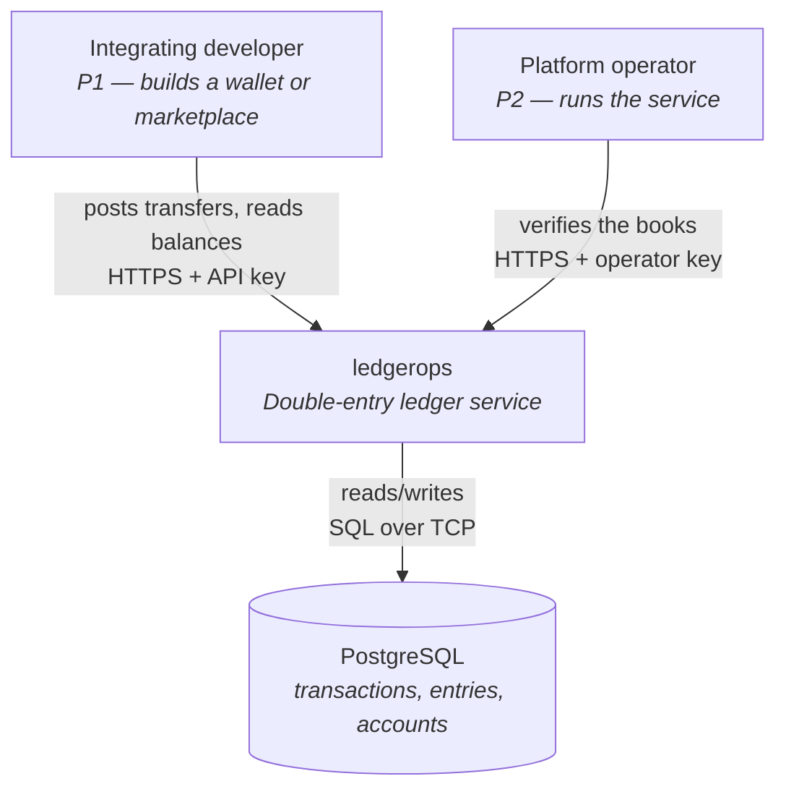
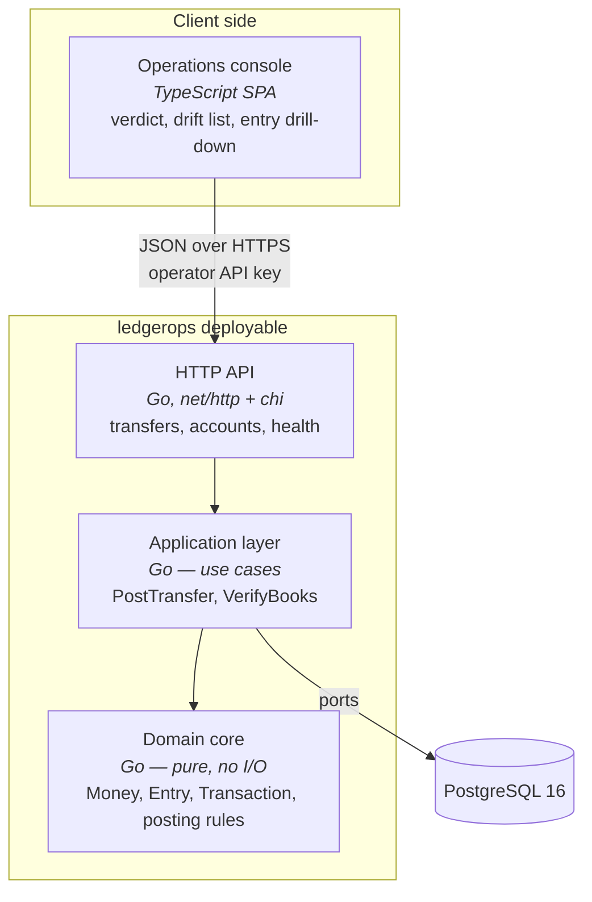
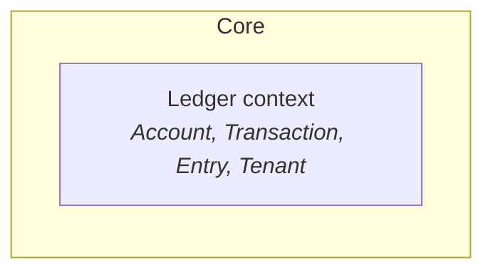
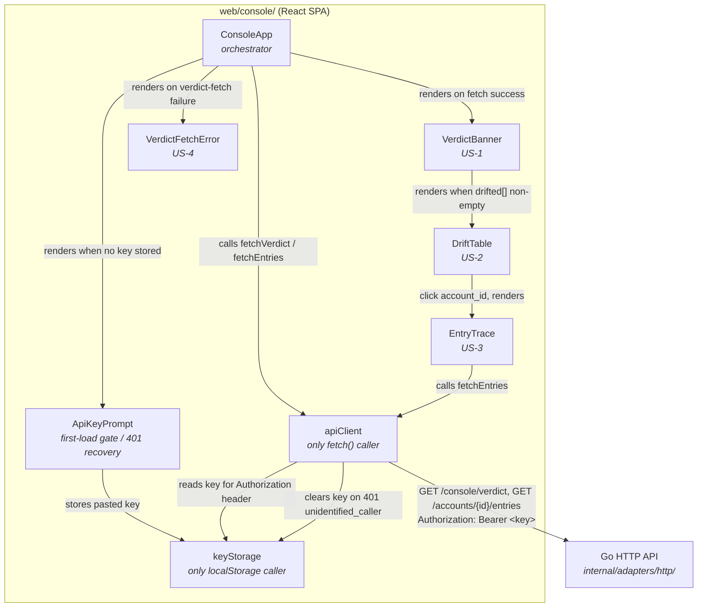
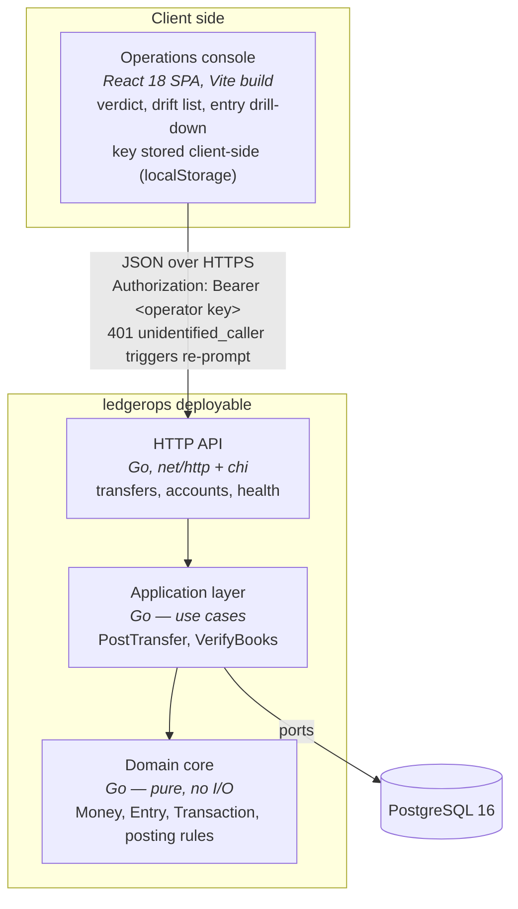

# Architecture Brief — ledgerops

SSOT for architecture. Each architect owns its section. Bootstrapped during the
DESIGN wave for `ledger-core`, 2026-08-18.

**Pattern**: modular monolith with ports-and-adapters
**Paradigm**: functional — pure core, effect shell, immutable domain types
**Stack**: Go · PostgreSQL · TypeScript SPA
**Quality attributes, ranked**: correctness · auditability · testability

---

## System Architecture

*Owner: nw-system-designer*

### Scope note

This is deliberately a thin section. `ledger-core` is a single service with one
database, no queues, no caches, and no distributed state. Checkpointed
verification was explicitly deferred (D9). There is no sharding, replication, or
partitioning to design at this stage. Designing for scale now would be
speculative — the KPIs measure correctness, not throughput.

### C4 — System Context



### C4 — Container



### Deployment shape

Single Go binary plus a static asset bundle for the SPA, plus one PostgreSQL
instance. `docker-compose` for local development so `make demo-01` runs on a
clean clone.

Deployment target, settled by DEVOPS (OPS-1): **there is no hosted environment**.
`clean` (developer machine) and `ci` (GitHub Actions, PostgreSQL 16 via
Testcontainers) are the entire environment matrix until one is needed. All
six outcome KPIs are CI assertions rather than production telemetry, so nothing
is currently learned by running the service anywhere else. When a hosted
environment appears, the recorded strategy is Recreate, with rollback by
redeploying the previous image tag.

Two database roles (OPS-10), not one:

| Role | Privileges | Used by |
|---|---|---|
| `ledgerops_app` | `SELECT`, `INSERT` on entries; `UPDATE`/`DELETE` **revoked** | The running service, and every test |
| `ledgerops_migrate` | DDL | `golang-migrate`, and the `corrupt-04` harness |

The service never connects as the migrate role. This is what makes D7
enforcement structural: a role that can `ALTER TABLE … DISABLE TRIGGER` can
rewrite history, so the application must not be that role.

Migrations are **expand-only**. No migration may `DELETE` from or drop the entry
table, and every schema change must leave the previous binary able to run
against the new schema — new columns nullable or defaulted, renames done as
add-backfill-retire across two releases. Rolling back code is therefore always
safe and never requires rolling back schema, which is the only rollback story
compatible with a ledger that cannot forget.

Infrastructure detail: `docs/feature/ledger-core/feature-delta.md` § Wave: DEVOPS.
Environment matrix: `docs/feature/ledger-core/devops/environments.yaml`.
KPI instrumentation: `docs/product/kpi-contracts.yaml`.

### Scaling escape hatches (documented, not built)

D7 append-only entries keep three future options open without rework:
checkpointed verification, period closing, and hash-chain tamper evidence. None
are built. `GET /health/trial-balance` reports `entry_count` and `elapsed_ms` so
degradation is measured rather than guessed.

### Console SPA (`ledger-core-console`, confirmed 2026-08-25)

Verified during `ledger-core-console`'s DESIGN wave, not assumed: the console
SPA introduces no new system-level architecture concern. It is one more client
of the existing single-service backend, already anticipated by the deployment
shape above ("a static asset bundle for the SPA") and the Container diagram's
`SPA` box — no new deployable, host, cache, queue, or scaling-ladder rung is
added. The one real system-adjacent item ADR-006 flags — a dev-time CORS/proxy
between the SPA dev server and the Go API — is build tooling, not
infrastructure, and stays with DELIVER. Full verification:
`docs/feature/ledger-core-console/feature-delta.md` § Wave: DESIGN /
System-Level Scope Confirmation.

### Multitenancy (`multitenancy`, confirmed 2026-09-03)

Verified during `multitenancy`'s DESIGN wave, not assumed: this feature
introduces no new system-level architecture concern. Checked against the
feature's own artifacts (`docs/feature/multitenancy/feature-delta.md`, its
three slice briefs, `onboard-and-isolate-a-tenant.yaml`) and the brownfield
code (`internal/adapters/postgres/migrations/`,
`internal/adapters/http/router.go`), not taken on the coordinator's word.

**Back-of-envelope (why this stays infra-neutral)**: tenant provisioning is
operator-driven only, no self-service (D7) — tenant count is bounded by
manual operator action, order of magnitude tens to low hundreds, not
thousands. At even 100 tenants x 100 accounts each, that is 10,000 account
rows and a proportionate entries volume — trivial for one PostgreSQL
instance. The existing k6 capacity profile (`tests/load/transfers.js`)
validated a 300 rps ceiling against this same schema shape on a single
instance (2026-09-02); multitenancy adds a `tenant_id` filter/key to the
same query shapes (`POST /transfers`, `GET /accounts/{id}`, entries,
trial-balance) without raising aggregate throughput — DISCUSS's own
Requirements Completeness section states performance/scale NFRs are "not
newly introduced" by this feature. No headroom concern at this scale.

**What stays unchanged**:
- **Deployment topology**: one Go binary, one PostgreSQL 16 instance, no
  hosted environment (`clean`/`ci` remain the entire matrix). `POST
  /tenants` is a new HTTP port on the existing service, not a new
  deployable.
- **Single-database assumption**: tenancy is a data-partitioning dimension
  (`tenant_id` as a scoping key within the existing schema), not sharding
  across databases or instances. The row-count estimate above is well
  short of where `tenant_id`-as-shard-key would become relevant.
- **OPS-10's two-role model**: the new `tenants` table and any `tenant_id`
  column/constraint get the same `GRANT` treatment already established —
  DDL stays `ledgerops_migrate`-only, the service connects as
  `ledgerops_app` with the same least-privilege shape. No third role is
  introduced by this feature. (The future platform-mediated settlement
  feature, `jobs.yaml` J8, is the one place a third, settlement-scoped
  credential is anticipated — explicitly deferred to that feature's own
  DESIGN, per this feature's § Changed Assumptions.)
- **Backup/restore boundary**: remains whole-instance, covering every
  tenant uniformly. No per-tenant backup/restore requirement was raised by
  any story (tenant offboarding and credential rotation are both
  out-of-scope).
- **Connection pooling / noisy-neighbor isolation**: not addressed by this
  feature, and correctly so — DISCUSS's Requirements Completeness section
  scopes I8 as a security/data-isolation property, not a
  performance-isolation (bulkhead) property. No per-tenant pool or bulkhead
  is introduced. Revisit only if a future feature adds a per-tenant
  throughput SLA.
- **Startup substrate probe**: the composition root's existing
  wire-then-probe sequence (`cmd/api/`, OPS-10 — refuses to start unless the
  app-role connection opens a transaction and `UPDATE` on entries is
  refused) already covers the substrate this feature's new table and
  tenant-scoped queries also depend on. No new substrate is introduced, so
  no new startup probe is required.

**Left to the next architects, not decided here**: whether `accounts`' bare
`PRIMARY KEY` becomes a composite `(tenant_id, account_id)` key, how
`entries` carries or derives `tenant_id`, and the expand-only migration
shape for both — these are schema/domain decisions for `nw-ddd-architect`
and `nw-solution-architect` (DDD-18 rescoping, feature-delta.md §
Pre-requisites #1 and #6). Flagged as an interface point, not designed
here.

**Escape hatch (documented, not built)**, consistent with the posture
above: if tenant count or per-tenant account/entry volume grows past the
low-hundreds/thousands range assumed above, a composite index on
`(tenant_id, account_id)` — on top of whatever primary-key shape
`nw-ddd-architect` chooses — is the first lever. Not needed now.

Full verification: `docs/feature/multitenancy/feature-delta.md` § Wave:
DESIGN / System Architecture.

---

## Domain Model

*Owner: nw-ddd-architect*

### Bounded context

One context: **Ledger**. No context mapping is required at this stage —
tenancy was originally deferred (`ledger-core` D8), and now that it is being
built (`multitenancy`, confirmed 2026-09-03), it remains a partition
dimension *within* this context, not a second context to integrate with —
see § Multitenancy below for the full confirmation.

### Ubiquitous language

| Term | Meaning |
|---|---|
| Account | A named holder of value. Typed `wallet` or `system` |
| Entry | One side of a movement: an account and a signed amount. Also called a *leg* |
| Transaction | An indivisible set of entries that sum to zero |
| Posting | The act of writing a transaction and updating balances |
| Trial balance | The sum of all entries across the ledger; must be zero |
| Drift | A stored balance that disagrees with the sum of its entries |
| Wallet account | May never go negative (I4) |
| System account | The counterparty value enters from. May go negative by design |
| Verdict | The YES/NO statement of whether the ledger balances: "Books balance: YES" when no account has drifted, "NO" when at least one has. Not a new concept — already load-bearing in `ledger-core`'s own domain modelling (DDD-21, "the verdict withholds; it never accuses") and its HTTP contract (`GET /console/verdict`), but never previously entered into this table. Added here, backfilling a glossary gap `ledger-core-console`'s DESIGN surfaced, not introducing a new domain concept |
| Tenant | An organization using ledgerops through its own scoped credential; owns a namespace of Accounts, Transactions, and Entries invisible to every other tenant (I8). Not ledgerops' own end-customer-facing concept — `vision.md` rules that out — a tenant is who an integrating developer represents, not a new persona (`multitenancy`, confirmed 2026-09-03) |
| Tenant key | The credential scoped to exactly one tenant, minted at provisioning; distinct from the platform-admin credential (`OperatorKey`), which continues to act unscoped (`multitenancy`, confirmed 2026-09-03) |

### Aggregates

Aggregates are consistency boundaries, not objects with behaviour. Each is an
immutable value type; the rules that govern it are pure functions in the same
module, not methods that mutate it.

**Transaction** *(aggregate root)* — owns its Entries. I1 (entries sum to zero
per currency) is a predicate over the entry list, checked before the value is
constructed. Immutable once written (D7), and immutable in memory besides.
Entries have no identity outside their transaction. Gains an implicit
`tenant_id` (`multitenancy`, confirmed 2026-09-03), equal to every touched
account's own `tenant_id` — checked alongside I1, before construction, not
after. See § Multitenancy below.

**Account** *(aggregate root)* — owns `balance` and `type`. Applying a debit
yields a *new* Account value; the I4 check for wallet accounts happens on the way
to constructing it, so an Account holding an illegal balance is never produced.
Gains a `tenant_id` field (`multitenancy`, confirmed 2026-09-03), immutable
once set — no tenant reassignment is possible or in scope. See § Multitenancy
below for the full rescoping.

### Functional modeling decisions

**Immutability is strict** (DDD-15). Domain types keep their fields unexported
and are built through smart constructors that validate on the way in. There are
no mutating methods and no value receivers that pretend to mutate — applying a
change returns a new value. The practical consequence: a zero-value Money or a
negative wallet Account cannot be constructed outside the domain package, so
invariants hold by construction rather than by discipline. The extra allocation
is irrelevant at this scale, where postings are bounded by database round-trips.

**Invariant violations are a sealed taxonomy** (DDD-12). Go has no sum types, so
the closed set is built by hand: a single domain violation type carrying a kind
discriminant — unbalanced (I1), insufficient funds (I4), unknown account — whose
interface can only be satisfied inside the domain package. Callers switch over
the kind. This keeps the idiomatic Go `(value, error)` shape, so violations
travel through `errors.As` and map cleanly onto HTTP 422, while the closed set
keeps the HTTP adapter from inventing its own error vocabulary. The cost is that
exhaustiveness is not compiler-checked — a linter over the switch sites is the
compensating control, and belongs to DEVOPS.

**Status: DISCHARGED, verified 2026-08-22.** This sentence twice read
"OUTSTANDING, not discharged" and, before that, a false "Discharged" claim
corrected on 2026-08-19 when neither `.github/workflows/` nor `.golangci.*`
existed. Both now exist and were built in DELIVER: `.golangci.yml` (step
05-02) enables `exhaustive` over both named surfaces, and
`.github/workflows/ci.yml` (step 05-03) runs `golangci-lint` in the `lint`
job, required on every push per trunk-based branch protection. The
compensating control DDD-12 depends on is in place, not merely designed.

**The obligation, stated so DEVOPS inherits a requirement rather than a
discovery.** `golangci-lint` must run the `exhaustive` linter over **two**
semantically distinct switch surfaces, and covering one does not cover the
other:

1. `switch` over `domain.ViolationKind` in `internal/domain/` — keeps the core's
   sealed set closed.
2. The **wire-mapping** `switch` in `internal/adapters/http/` that turns a
   violation into a status and an error name — keeps
   `feature-delta.md` § Refusal taxonomy and status mapping honest. DDD-17
   created this surface; before it, there was only one.

Surface 2 is the one that will be missed, because it is a mapping rather than a
rulebook and reads like adapter plumbing. A member added to the core with no
mapping added at the wire is precisely the defect the sealed set exists to make
impossible, and only surface 2 catches it. Owner: DEVOPS. Until both are wired
and required on every push, DDD-12 and DDD-17 rest on review discipline alone.

**The posting rulebook is one pure function** (DDD-14). `Post` takes the transfer
command, the already-locked account snapshots, the current time, and a
pre-generated transaction id, and returns the complete intended change: the
transaction, its entries, and the balance deltas to apply. It performs no I/O,
reads no clock, and generates no identifiers — every non-determinism is passed
in as a value. I1 and I4 are therefore decided in a single pure unit, which is
the natural target for the property-based tests that testability-ranked-second
demands. The application layer's remaining job is to lock, call it once, and
persist what it returns.

### Effect boundary

The Read → Decide → Write sandwich is the hexagonal boundary in this design:

| Step | Purity | Responsibility |
|---|---|---|
| Read | impure | Open the database transaction, lock the touched accounts in ascending id order (DDD-6), read the clock, generate the id |
| Decide | **pure** | `Post` — validate the command, check I1 and I4, produce the transaction, entries, and balance deltas |
| Write | impure | Persist the transaction, entries, balance deltas, and idempotency record; commit |

The dependency rule: the shell may call the core, the core never calls the
shell, and the core does not know the shell exists. Row locks are acquired
before the pure step, not inside it — locking is an effect, and the ordering
rule that makes it safe is the shell's responsibility.

### Deliberate deviation: one unit of work spans two aggregates

Classical DDD says one transaction should modify one aggregate. Posting
necessarily modifies a Transaction *and* the balances of the Accounts it touches,
atomically — that is the definition of double-entry bookkeeping.

Rejected alternatives:

- **Ledger-as-aggregate-root** — a single root owning all accounts would make
  every posting serialize against the whole ledger. Correct, and unusable.
- **Eventual consistency between Transaction and Account** — balances would lag
  entries, and I3 would be *expected* to be violated transiently. This destroys
  the slice-04 demo, whose whole value is that drift means something is wrong.

**Decision**: a `PostTransfer` domain service coordinates the Transaction and the
affected Accounts inside one database transaction, with row locks acquired in
deterministic account-id order (DDD-6). The consistency boundary is the posting,
not the individual aggregate. This is standard practice in ledger systems and is
recorded here so it reads as a decision rather than an oversight.

### Invariants and where they are enforced

| Invariant | Statement | Enforced |
|---|---|---|
| I1 | Entries of a transaction sum to zero, per currency | Domain core (pure), plus a database check |
| I3 | Stored balance equals the sum of its entries | Not enforced — *verified* by slice 04. Deliberate: it is the cross-check |
| I4 | No wallet account balance is negative | Domain core, under row locks held by the application layer |
| I7 | The same request applied twice changes state once | Application layer, via a unique constraint on the idempotency key |
| I8 | A tenant's credential can never read, write, or affect another tenant's account, transaction, or entry | Domain core, **by construction** (`multitenancy`, confirmed 2026-09-03) — see § Multitenancy below |
| D7 | Entries are never updated or deleted | Database: `UPDATE`/`DELETE` revoked from `ledgerops_app` (OPS-10), plus a rule/trigger. CI asserts the composite refusal |
| I9 (renumbered from DDD-18, 2026-09-03) | An account identifier identifies exactly one account **within a tenant** — rescoped from global uniqueness | Domain core (pure `OpenAccount` over the tenant-scoped read snapshot), plus a `(tenant_id, account_id)` composite unique constraint — physical migration shape is `nw-solution-architect`'s to design, expand-only discipline applies |
| I10 | A tenant name identifies exactly one tenant | Domain core (pure `ProvisionTenant` over the read snapshot of existing tenant names), plus a unique constraint on tenant name — structurally identical to I9's pattern, one aggregate level up |

The DDD-18 row was added 2026-08-19 by `nw-solution-architect`, a cross-section
edit into `nw-ddd-architect`'s territory. It records a decision already taken in
`adr-008-refusal-taxonomy-boundary.md` rather than making a new domain-modelling
one, and it is the enforcement half of a refusal that would otherwise have no
declared enforcement site. The narrower rule DESIGN is holding itself to: an
architect may record its own decisions and correct false claims in another's
section, with the edit annotated; it may not decide domain model there.

**Renumbered 2026-09-03 by `nw-ddd-architect`**, per `multitenancy`'s own DESIGN
pre-requisite (`feature-delta.md` § Pre-requisites #1) and the explicit
invitation left in § For Acceptance Designer above. DDD-18 is now **I9**: every
other occupant of this table is either a numbered invariant (I1/I3/I4/I7) or a
locked decision that reads like one (D7); DDD-18 was neither — it was a
decision-ID borrowed to label an invariant row, exactly the friction the
paragraph above already flags. Two siblings were added at the same time: **I8**
(tenant isolation — new, not a rescoping) and **I10** (tenant-name uniqueness —
new, at the Tenant aggregate, structurally identical to I9's pattern one level
up). Full rationale for all three: § Multitenancy below and
`adr-011-tenant-partition-not-context.md`.

Note on I3: it is the only invariant deliberately left unenforced. Enforcing it
would mean deriving balances, which removes the independent check that makes
slice 04 meaningful. Two representations that can disagree are the point.

### Event modeling

Not applied. Event sourcing was considered and rejected — see
`adr-003-stored-balances.md`. The entry table is already an append-only log of
facts, which delivers most of the auditability benefit without the projection
machinery.

### Console SPA (`ledger-core-console`, confirmed 2026-08-25)

Verified during `ledger-core-console`'s DESIGN wave, not rubber-stamped: the
console introduces no new bounded context, aggregate, or invariant. It is a
pure client of Account, Entry, Transaction, Trial balance, Drift, and Verdict
as already modelled above. Two console-only notions were checked explicitly
and found to be presentation state, not domain concepts:

- **`${fetched_at}`** — the client-observed browser-clock timestamp labelling
  verdict freshness (`discuss/shared-artifacts-registry.md`). Stays
  presentation state: it names no invariant, is never persisted or compared
  by the domain core, and is explicitly *not* a server field — the registry
  entry itself instructs that if a future backend timestamp appears, this
  artifact must be re-pointed there, not dual-sourced. Nothing to model.
- **The drift table row** (`account_id`, `stored`, `computed`, `delta`) — this
  is a rendering of the existing Drift concept and the `GET /console/verdict`
  `drifted` array field-for-field, not a new shape. No aggregate or value
  object is introduced by displaying it in a table.

No new invariant is introduced: the console never recomputes a balance
client-side (US-3 AC, "no client-side recomputation of balance"), so there is
nothing for the domain core to guard on the client. I3 stays the only
deliberately-unenforced invariant, and stays enforced (by not being enforced)
in exactly one place — the domain core / slice-04 verification — as before.

One glossary gap was found and closed, not introduced: **Verdict** was
already a load-bearing backend concept (DDD-21,
`docs/feature/ledger-core/feature-delta.md`) before this feature existed, but
had never been entered into the Ubiquitous language table above. Added as a
backfill, not a new domain-modelling decision — see table above.

**Conclusion: the user's answer is confirmed, not overridden.** No new
bounded context, aggregate, or invariant. Full verification:
`docs/feature/ledger-core-console/feature-delta.md` § Wave: DESIGN / Domain
Model Scope Confirmation.

### Multitenancy (`multitenancy`, confirmed 2026-09-03)

Domain-level leg of `multitenancy`'s DESIGN wave (system -> **domain** ->
application). System-level scope was already confirmed a no-op (§ System
Architecture above); this subsection is the real domain-modelling work that
confirmation unblocked. Full narrative:
`docs/feature/multitenancy/feature-delta.md` § Wave: DESIGN / Domain Model.

**Bounded context: confirmed, not asserted.** DISCUSS's own Scope Assessment
flagged "1 bounded context... tenant is a partition dimension within it, not
a new context" as tentative, for this review. Confirmed correct by the
primary discovery heuristic (language divergence): every existing term in
§ Ubiquitous language above — Account, Entry, Transaction, Posting, Trial
balance, Drift, Verdict — means exactly the same thing to every tenant's
integrating developer and to the platform operator. Nothing about *tenant*
introduces a second vocabulary or a second team boundary; it introduces a
scoping *dimension* orthogonal to what those words already mean. One
context, **Ledger**, unchanged.

**Tenant is a new aggregate root, not a value object, and not a new
context.** It has an identity (`tenant_id`) that persists across the one
lifecycle event this feature grants it (provisioning) — that is what makes
it an entity/aggregate root rather than a value type (identity assigned
once, tracked, never re-derived from attributes). It owns exactly two other
fields, both value-typed: `name` and `credential` (the `tenant_key`, opaque
to the domain beyond "exists, is distinct per tenant" — verification/hashing
mechanics belong to `nw-solution-architect`, per `feature-delta.md`
§ Pre-requisites #3). Root-only, value-typed properties — Vernon's rule 2
(small aggregates) is satisfied by inspection; there is no second entity to
promote or flatten.

Vernon's rule 1 (true invariants) draws Tenant's boundary at exactly "name
uniqueness" (I10, below) — nothing else about a tenant needs transactional
consistency with anything else in this feature, since renaming, rotation,
and offboarding are all out of scope. Rule 3 (reference by identity): Account
and Transaction hold a `tenant_id` value, never a `Tenant` object graph — this
is what keeps posting from becoming a three-aggregate unit of work. Rule 4
(eventual consistency across the boundary): not exercised — Tenant's own
lifecycle (provision-only) never needs to coordinate with Account/Transaction
in the same transaction; `ProvisionTenant` writes only the new Tenant record.

**Aggregate boundary = bounded-change contract, per aggregate touched by this
feature:**

*Tenant (new)*
- **Full observable state**: `{tenant_id, name, credential}`. No child
  entities, no event log (this context stays state-based — see ES/CQRS
  assessment below).
- **`ProvisionTenant(name)` declared delta**: exactly one new
  `{tenant_id, name, credential}` triple comes into existence. Nothing else
  in the Tenant collection changes.
- **Complement equality (the crafter-facing contract)**:
  `after.tenants.without(new_tenant_id) == before.tenants.without(new_tenant_id)`
  — this is US-1's own edge case ("the first tenant's calls are unaffected")
  made assertable. Additionally: no Account, Transaction, or Entry belonging
  to any existing tenant changes — `ProvisionTenant`'s declared delta touches
  only the Tenant collection, full stop.

*Account (existing, rescoped)*
- **Full observable state**: `{tenant_id (new field), id, kind, balance}`.
  `tenant_id` is set once at construction and immutable thereafter — mirrors
  `id` and `kind`'s existing immutability in `Apply`
  (`internal/domain/account.go:52-61` already reconstructs `id`/`kind`
  unchanged; `tenant_id` joins that set).
- **`NewAccount(tenant_id, id, kind, balance)` declared delta**: one new
  Account row-equivalent, scoped to `tenant_id`. **`Apply(delta)` declared
  delta**: `balance` only; `tenant_id`, `id`, `kind` are the complement.
- **Complement equality (I8, expressed at Account level)**: for a command
  scoped to `tenant_id = T`,
  `after.accounts.without(touched_ids) == before.accounts.without(touched_ids)`,
  **and** `touched_ids` is provably a same-tenant set *before* the command
  can be expressed at all — not merely checked against a wider candidate set
  after the fact. That "provably before" clause is the entire content of
  "construction-time," decided below.

*Transaction (existing, gains an implicit tenant scope)*
- **Full observable state**: `{id, recorded_at, tenant_id (new — equal to
  every touched account's tenant_id), entries[]}`.
- **`Post(...)` declared delta**: one new Transaction plus its Entries;
  append-only, so the declared delta is pure addition, never mutation of an
  existing row (mirrors D7's existing entries discipline).
- **Complement equality**: no existing Transaction or Entry, in this tenant
  or any other, changes. I1 already checks "entries sum to zero" as a
  predicate before construction; the tenant check below is a second
  predicate in the same pre-construction gate, not a separate later pass.

**I8 enforcement mechanism: construction-time, agreeing with D9's
recommendation.** D9 named the two options and recommended construction-time
without deciding it; evaluated here rather than rubber-stamped, because
"carries a tenant_id" needs a concrete meaning for `Post`'s signature to
actually be construction-time and not a repository query that merely happens
to filter correctly today. Concretely:

1. `tenant_id` becomes a required field on the `Account` value type (§
   above) — there is no smart-constructor path that produces an `Account`
   without one, exactly as there is no path that produces a
   negative-balance `Wallet` (DDD-15's own pattern, transplanted).
2. `AccountRepository`'s query and lock-acquisition ports
   (`internal/app/ports`) take `tenant_id` as a required parameter, not an
   optional filter — a call site cannot compile a query that omits it. This
   is the "impossible to express" half.
3. `Post` — already the single pure decide-function taking the transfer
   command and the *already-locked* account snapshots — cross-checks that
   every touched snapshot's `tenant_id` equals the command's own
   `tenant_id`, refusing **before** constructing the `Transaction` value,
   exactly where I1 checks the sum and I4 checks the balance floor. This is
   the "checked, not merely queried-around" half — even if a repository
   query were ever miswired to return a cross-tenant row (a bug, not a
   designed path), `Post` still refuses to build a `Transaction` out of it.

Rejected alternative — **verification-time (I3-style drift scan)**: I3 is
deliberately the *one* invariant this codebase leaves unenforced-by-
construction, precisely because deriving balances would remove the
independent cross-check that makes slice 04 meaningful (§ Invariants note on
I3, above). I8 has no such reason to stay soft — there is no independent
value in occasionally *discovering* that tenant B's data leaked into tenant
A's read, the way there is independent value in occasionally discovering a
stored balance drifted. A security property with a known, cheap
by-construction fix should not be given I3's treatment; that would be
borrowing I3's shape without inheriting its rationale.

**Refusal kind for a cross-tenant reference — a domain-modelling position,
not a punt.** `feature-delta.md` § Pre-requisites #4 frames "404 vs 403" as
an open DESIGN question. At the domain layer this collapses to a smaller
question DDD-12/DDD-17 already force to be explicit: which sealed
`ViolationKind` fires? Recommendation: **reuse `account_not_found`,
introduce no new taxonomy member.** From a `tenant_key` scoped to tenant A,
an account belonging to tenant B is not merely forbidden — it is not in A's
observable universe at all, which is exactly what `account_not_found`
already means (DDD-17: 404, minimal-information-leak posture, consistent
with `adr-009-unavailability-is-not-a-refusal.md`'s own restraint about not
over-claiming what the caller is told). Inventing a distinguishable
`cross_tenant_forbidden` kind would grow both `exhaustive`-linted switch
surfaces for zero behavioral gain, and would hand a tenant-existence oracle
to any caller willing to compare 403 against 404 — the opposite of what I8
exists to guarantee. This resolves the domain half of Pre-requisites #4
outright: reusing the sealed kind *forces* 404 as a matter of already-
committed taxonomy discipline, not a fresh wire-level style choice. Handed
to `nw-solution-architect` to confirm at the HTTP-adapter mapping layer (no
new work there — `account_not_found -> 404` is already the existing DDD-17
table row) and to close the loop on the credential-verification mechanism
itself (Pre-requisites #3), which is genuinely an application-layer concern
this architect does not own.

**Unscoped `GET /health/trial-balance` / `GET /console/verdict` semantics —
also a domain-modelling position.** Pre-requisites #5 asks whether the
unscoped call means "platform-wide aggregate" or "a designated default
tenant" now that Tenant exists. "Designated default tenant" is rejected
outright at the domain level: it would require inventing a distinguished
Tenant value with no provisioning story (D7 makes provisioning
operator-driven only; nothing provisions a "default" one), and it would make
an already-shipped, uninvolved concept (Trial balance) implicitly *about*
whichever tenant got the designation — a modelling accident, not a decision.
"Platform-wide aggregate" is the coherent reading: Trial balance was always
defined as "the sum of all entries across the ledger" (§ Ubiquitous
language, unchanged by this feature); scoping it to one tenant (US-3, new)
and leaving it unscoped (existing, unchanged) are the *same* computation
over two different entry sets — all entries, or entries filtered to one
`tenant_id` — not two different domain concepts requiring two definitions.
No new aggregate, no new invariant, one optional `tenant_id` scope parameter
on the existing verification computation. This satisfies the
console-compatibility hard constraint (`feature-delta.md` § Driving ports)
for free, since "all entries" is exactly what the unscoped call already
computes today. Wire-level mechanics (how an absent query parameter maps to
"all entries" at the HTTP boundary) are `nw-solution-architect`'s to finish.

**ES/CQRS: not warranted, reconfirmed rather than assumed.** Running the
four-question heuristic against Tenant specifically, not just re-citing
`adr-003-stored-balances.md`: audit trail — no new requirement beyond what
Account/Transaction already carry (entries stay the append-only log);
temporal queries — none named by any story; multiple views — none,
`ProvisionTenant` has exactly one shape and one consumer (the operator);
complex state transitions — Tenant's entire lifecycle in this feature is
"created," strictly simpler than Account's own (open -> apply -> apply ->
...). All four answers are "no," more decisively than they were for
Account/Transaction, which already didn't clear the bar. State-based
storage, unchanged.

**Context map**: still degenerate — one node, no edges, C4-compatible for
completeness:



**Handed to `nw-solution-architect`, not decided here**: credential
mechanism / `tenant_key` verification and its relationship to
`requireOperatorKey` (Pre-requisites #3); the HTTP-adapter wire mapping
confirming `account_not_found -> 404` for cross-tenant reads (mechanical,
given the domain position above); the query-parameter mechanics of unscoped
trial-balance meaning "all entries" (mechanical, given the domain position
above); the physical `(tenant_id, account_id)` migration shape and whether
`accounts.id` stays a bare column or becomes composite (schema/expand-only
mechanics, `feature-delta.md` § Pre-requisites #6, `slice-02`'s own
recommended pre-slice SPIKE).

Full rationale: `adr-011-tenant-partition-not-context.md`. DoD item 7
(`feature-delta.md`) — "DDD-18's rescoping explicitly confirmed by
`nw-ddd-architect`" — is satisfied by this subsection and the renumbered I9
row above.

---

## Application Architecture

*Owner: nw-solution-architect*

### Pattern

Modular monolith, ports-and-adapters, with a **pure domain core and all I/O at
the edges**. This follows directly from testability ranking second: invariant
tests and property-based tests run against the domain core with no database, and
only the adapter tests need PostgreSQL.

Under the functional paradigm the ports-and-adapters boundary and the
purity boundary are the same line — a port is the type of an effect the core
refuses to perform. The application layer is the effect shell: it sequences
read, decide, and write, and holds every ordering rule that the pure core cannot
express (lock acquisition order, transaction demarcation, idempotency-key
insertion).

### Component decomposition

| Component | Path | Responsibility | Change |
|---|---|---|---|
| Domain core | `internal/domain/` | Money, Account, Entry, Transaction, the `Post` decide function, violation taxonomy. Pure — no I/O, no clock, no randomness. Immutable types with unexported fields | CREATE NEW |
| Application | `internal/app/` | Effect shell. Use cases: PostTransfer, CreateAccount, GetBalance, GetEntries, VerifyBooks. Sequences read → decide → write | CREATE NEW |
| Ports | `internal/app/ports/` | Effect types the shell depends on: function types for single-operation ports, interfaces for transaction-scoped repositories | CREATE NEW |
| Postgres adapter | `internal/adapters/postgres/` | Repository implementations, migrations, row locking | CREATE NEW |
| HTTP adapter | `internal/adapters/http/` | Handlers, routing, API-key auth, JSON encoding | CREATE NEW |
| Entrypoint | `cmd/api/` | Wiring and configuration | CREATE NEW |
| Console SPA | `web/console/` | TypeScript SPA: verdict, drift list, entry drill-down | CREATE NEW |

**`multitenancy` (confirmed 2026-09-03)**: no new top-level component. Domain
core, Application, Ports, Postgres adapter, and HTTP adapter are each
**EXTEND**ed in place (new `ViolationKind` members and `Post` cross-check in
Domain core; `ProvisionTenant` use case in Application; `TenantRepository`/
`TenantKeyResolver`/`TenantScope` in Ports; a `tenants` table, migration, and
tenant-scoped queries in the Postgres adapter; three new/reused auth
middlewares and a new route in the HTTP adapter). Full detail: § Multitenancy
below.

### Driving ports (inbound)

| Port | Surface | Slice |
|---|---|---|
| `POST /accounts` | HTTP | 01 |
| `POST /transfers` | HTTP | 01, 02, 03 |
| `GET /accounts/{id}` | HTTP | 01 |
| `GET /accounts/{id}/entries` | HTTP | 05 |
| `GET /health/trial-balance` | HTTP | 04 |
| `GET /console`, `GET /console/*` | HTTP, static (unauthenticated) | `ledger-core-console` DEVOPS |
| Console SPA | Browser | 04, 05 |
| `POST /tenants` | HTTP (new) | `multitenancy` slice 01 |

**`multitenancy` (confirmed 2026-09-03)**: `POST /accounts`, `POST /transfers`,
`GET /accounts/{id}`, `GET /accounts/{id}/entries`, and `GET
/health/trial-balance` are all extended by `multitenancy` slices 02–03 —
tenant-scoped in addition to (not instead of) their behavior above. Full
credential-to-port mapping, the dual-mode design, and the new `POST /tenants`
port: § Multitenancy below.

`GET /console` and `GET /console/*` serve the built SPA shell and its assets
from `web/console/dist` (Vite's `build.outDir`), added by
`ledger-core-console`'s DEVOPS wave (`internal/adapters/http/console_static.go`,
feature-delta.md § Wave: DEVOPS / Build-output wiring). Deliberately outside
the operator-API-key middleware group — the shell has to load before any key
can be presented. `GET /console/verdict` (below) is unaffected: it stays a
separate, authenticated JSON port the SPA calls after the shell has loaded.

### Driven ports (outbound) and adapters

Ports are expressed **hybrid by arity** (DDD-13): a port with one operation is a
function type; a port whose operations must share a transaction handle stays an
interface.

| Port | Form | Adapter | Notes |
|---|---|---|---|
| `TransactionRepository` | interface | `postgres` | Writes transaction + entries + balance updates in one SQL transaction |
| `AccountRepository` | interface | `postgres` | `SELECT … FOR UPDATE` in deterministic id order; applies balance deltas |
| `IdempotencyStore` | interface | `postgres` | Unique constraint on key; stores request fingerprint + transaction_id |
| `Clock` | function type | `system` / `fake` | Injected so entry timestamps are deterministic in tests |
| `IDGenerator` | function type | `uuid` / `fake` | Injected for the same reason |
| `TenantRepository` | interface (`UnitOfWork`-scoped) | `postgres` | `multitenancy` — reads a tenant by name/id, creates a tenant row inside the same unit of work as the I10 courtesy check, mirroring `AccountRepository`'s existing read+write shape |
| `TenantKeyResolver` | function type | `postgres` / `fake` | `multitenancy` — the one-operation lookup from a presented bearer token's hash to a `tenant_id`, called directly by the HTTP auth middleware ahead of any `Ledger` use case. Hybrid-by-arity (DDD-13): single operation, so a function type, exactly like `Clock`/`IDGenerator` |

The split is not a compromise between paradigms — it follows the effect
structure. `Clock` and `IDGenerator` are single, independent effects, so as
function types their fakes are one-line literals and no test needs a stub type.
The three repositories each expose several operations that must run inside the
*same* database transaction; expressing them as loose function types would let a
caller wire two of them to different transactions, and nothing in the type
system would object. The interface keeps that cohesion visible.

`Clock` and `IDGenerator` exist as ports purely for testability. That is the
second quality attribute doing visible work.

### Refusal taxonomy: three decision sites, one wire vocabulary

DDD-12 sealed the set of ways the ledger says no. It sealed it at one site — the
pure core — and read as though it sealed all three: `unidentified_caller`,
`missing_idempotency_key` and `idempotency_key_conflict` were always decided
outside the core. DDD-17 states the whole set and names each member's site, so a
question landing between sites has somewhere to be answered. Rationale and
rejected alternatives: `adr-008-refusal-taxonomy-boundary.md`.

| Member | Decided at | Status |
|---|---|---|
| `malformed_request` | HTTP adapter | 400 |
| `missing_idempotency_key` | HTTP adapter | 400 |
| `unidentified_caller` | HTTP adapter (auth middleware) | 401 |
| `account_not_found` | Domain core — `Post` | 404 |
| `tenant_not_found` | Domain core — `VerifyBooks` tenant-scoped lookup (`multitenancy`, DDD-25) | 404 |
| `account_already_exists` | Domain core — `OpenAccount` | 409 |
| `tenant_already_exists` | Domain core — `ProvisionTenant` (`multitenancy`, DDD-25) | 409 |
| `idempotency_key_conflict` | Application shell | 409 |
| `invalid_amount` | Domain core — `NewMoney` / `Post` | 422 |
| `insufficient_funds` | Domain core — `Post` | 422 |
| `currency_mismatch` | Domain core — `Post` | 422 |

**Status follows the decision site**: 400 the request was not a command · 401
the caller was not identified · 404 the command named something absent · 409 the
identifier is already bound to something else · 422 the rules refuse it.

**`multitenancy` (confirmed 2026-09-03) — two new sealed members, one reused
member confirmed at the wire, `unidentified_caller` grows a second and third
decision site.** Full rationale: § Multitenancy below, DDD-25.

- `tenant_not_found` and `tenant_already_exists` are **new** `domain.ViolationKind`
  members — this is a distinct addition from ADR-011's own statement that "the
  sealed `ViolationKind` taxonomy does not grow a new member for cross-tenant
  access." That statement was scoped narrowly to the I8 cross-tenant-*read*
  case (resolved by reusing `account_not_found`, below); I10 (tenant identity
  uniqueness) needs its own pair, symmetric to how `account_not_found` /
  `account_already_exists` already exist for I9 one aggregate level down. Both
  grow the `exhaustive`-linted switch surfaces DDD-12's obligation already
  names (owner: DEVOPS).
- **Cross-tenant account reference (I8) reuses `account_not_found` at the wire,
  confirmed, not merely inherited**: a tenant-scoped query (`AccountRepository.Get`,
  `.LockForUpdate`) that cannot see another tenant's row returns nothing, which
  is exactly the shape `Post` and the existing handlers already treat as
  `account_not_found` → 404. No new HTTP-adapter mapping code path is added —
  this is the existing DDD-17 table row, unchanged, now also reached by a
  tenant-scoped query returning zero rows instead of only by a truly-unknown id.
- `unidentified_caller` (401) now has **three** decision sites instead of one:
  `requireOperatorKey` (unchanged), a new `requireTenantKey`, and a new
  dual-mode `requireTenantKeyOrOperatorKey` — all three answer the identical
  wire shape (`401 {"error":"unidentified_caller"}`), so the sealed member does
  not grow, only the number of places deciding it does. § Multitenancy below.

`unbalanced` stays a `domain.ViolationKind` member and is not a wire member — it
guards the Transaction smart constructor against a defect in the rulebook, and
no caller input reaches it. If it escapes, that is a bug, answered 500.

Two consequences for the boundary. `malformed_request` must **not** enter
`domain.ViolationKind`: a pure function over a typed command cannot represent
"the bytes were not JSON", and admitting it would put a transport concern inside
the purity boundary. And the `exhaustive` linter now covers two switch surfaces
rather than one — the core's kinds, and the adapter's wire mapping. The
adapter's switch is what keeps the status table honest.

`currency_mismatch` is a domain refusal because I1 is per-currency: two legs in
different currencies cannot sum to zero per currency for any amount. It is
declared and currently unreachable through the driving ports, since every
account is opened in the ledger's single configured currency — and that
unreachability is how "multi-currency transactions, out of scope" is enforced
rather than asserted.

### Unavailability is outside the sealed set

A refusal is a decision, and every refusal here carries the implicit assertion
that nothing moved. A connection lost after `COMMIT` was sent and before the
acknowledgement arrived may have mutated everything, so an unreachable store
cannot be a refusal without attaching a guarantee the system cannot make. It
answers **503 `service_unavailable`** with `Retry-After`, in the same error
envelope but in neither sealed set. Pool exhaustion answers 503 rather than 429 —
capacity is a property of the service, not the caller's rate.

`GET /health/trial-balance` against an unreachable store answers 503, never
`Books balance: NO`. `NO` means "I looked, and the books do not balance"; saying
it because the database is down is a false accusation of corruption and destroys
the KPI-4 signal slice 04 exists to produce. The 503 body is exactly
`{"error":"service_unavailable"}` — the `verdict` field is **omitted, not
`null`**, and so is the rest of the verdict envelope. On 200 `verdict` is always
present and never null, so its absence proves the ledger was not read; the
console branches on the status code, never on the field. Rationale:
`adr-009-unavailability-is-not-a-refusal.md`.

The composition root wires, then **probes**, then serves: `cmd/api/` refuses to
start unless the app-role connection can open a transaction *and* `UPDATE` on
the entry table is refused (OPS-10). CI job 6 proves the migration set is right;
it proves nothing about the database this binary is pointed at.

### Technology choices

| Choice | Pin | Rationale |
|---|---|---|
| Go | 1.23+ | Concurrency primitives make the I4/I7 race tests natural to write |
| PostgreSQL | 16 | Row locking, constraint triggers for D7, real transactional guarantees |
| `pgx` | v5 | Direct driver, no ORM — SQL stays visible, which matters for locking |
| HTTP router | `chi` v5 | Thin over `net/http`; no framework lock-in |
| Migrations | `golang-migrate` | Plain SQL migrations, reviewable |
| Property testing | `rapid` | Go's mature PBT library; invariant tests need generators |
| TypeScript | 5.x | Console SPA |
| SPA framework | **React 18** (`ledger-core-console`, confirmed 2026-08-25) | User's direct answer during `ledger-core-console` DESIGN (Guide mode). Largest OSS community/ecosystem of the multi-paradigm-TS options, no runtime license cost (MIT), team already has TypeScript+JSX familiarity from the domain-type work. No architectural weight beyond ADR-006's original framing — still one page with a verdict and two tables; framework choice does not change component boundaries |
| Build toolchain | **Vite 5** + `@vitejs/plugin-react` | CRA is deprecated (no longer maintained as of 2025) and was explicitly not defaulted to. Vite (OSS, MIT) is the de facto 2026 default for new React SPAs: native ESM dev server, sub-second HMR, minimal config, first-class React plugin. Rejected alternatives: **Next.js** — brings SSR/file-based routing/server runtime the console has no use for (DDR-2: zero backend changes, single client-rendered page — Next's server machinery would be unused complexity, violating simplest-solution-first); **Parcel** — viable OSS alternative but smaller React-specific plugin ecosystem and less battle-tested `proxy` config for the dev-server-to-Go-API use case this feature specifically needs (see § Console SPA below) |

### Reuse Analysis

| Existing Component | File | Overlap | Decision | Justification |
|---|---|---|---|---|
| *(none)* | — | — | CREATE NEW | Greenfield. `src/`, `lib/`, `app/` absent; no code exists to extend. Verified by filesystem search during Prior Wave Consultation |

This table is trivially satisfied for slice 01 and stops being trivial from
slice 02 onward, when the posting path already exists and must be extended
rather than duplicated.

**`multitenancy` reuse pass (confirmed 2026-09-03, DDD-26):**

| Existing Component | File | Overlap | Decision | Justification |
|---|---|---|---|---|
| `requireOperatorKey` middleware | `internal/adapters/http/router.go:144-158` | Exact admin-gate contract (`Authorization: Bearer <key>`, 401 `unidentified_caller`) that `POST /tenants` needs verbatim, and that `GET /console/verdict`/`GET /health/trial-balance` must keep using unchanged | **EXTEND (mount on an additional route, zero body changes)** | `POST /tenants` is admin-only per D7; mounting the existing, unmodified function onto one more route is the cleanest possible reuse — no new code, no new risk to the console-facing routes' byte-identical behavior |
| Bearer-token parsing (`presented := r.Header.Get("Authorization")`, `"Bearer "+expected` comparison) inside `requireOperatorKey` | `internal/adapters/http/router.go:146-148` | Identical header-parsing/compare primitive needed by the two new middlewares below | **EXTEND — factor out as a shared helper** (e.g. `bearerToken(r)`, `isOperatorKey(presented, expected)`), called by all three middlewares | Reuse at the right grain: the primitive (header parsing, constant-shape compare) is genuinely shared; the surrounding control flow is not (see next two rows). Rejected: copy-pasting the parse/compare into each new middleware — would let the three refusal shapes drift out of sync silently, the exact defect class DDD-17's "one wire vocabulary" section exists to prevent |
| `requireTenantKey` (new: verifies a `tenant_key` via `TenantKeyResolver`, injects `tenant_id` into context) | *(new file, `internal/adapters/http/` package — same component, not a new one)* | Shares the bearer-header contract with `requireOperatorKey` (above) | **CREATE NEW** | Not "the existing class has too many dependencies" (an invalid justification) — the reverse: `requireOperatorKey`'s entire value is being a zero-dependency closure over one static string; forcing it to also perform a keyed database lookup would hand it a dependency (`TenantKeyResolver`) its actual job never needs, breaking single-responsibility for both callers that still only need the static-secret check (`POST /tenants`, unscoped verdict/trial-balance). Static-secret comparison and keyed-identity resolution are different mechanisms that happen to share a header format — the header-parsing primitive is reused (row above); the mechanism is not |
| `requireTenantKeyOrOperatorKey` (new: dual-mode — tries the `requireOperatorKey` comparison first, falls back to `TenantKeyResolver`) | *(new file, same package)* | Composes the exact `isOperatorKey` primitive (row 2) plus `requireTenantKey`'s resolver call | **CREATE NEW**, composed from the two reused primitives above | The two-branch control flow (admin-check-then-tenant-check-then-refuse) exists nowhere today and is specific to `GET /accounts/{id}/entries`'s console-compatibility requirement only — DDD-23 (resolved 2026-09-03, Option C) confirmed `POST /accounts`/`POST /transfers`/`GET /accounts/{id}` stay single-mode (`requireTenantKey` only, no `OperatorKey` fallback), so this middleware is not reused a third time |
| `TenantRepository`, `ProvisionTenant` use case | *(none)* | No existing tenant persistence or provisioning code anywhere (confirmed by the DDD-architect's and system-designer's brownfield reads, and by this architect's own `Glob`/`Grep` over `internal/`) | **CREATE NEW** | Greenfield — mirrors `AccountRepository`/`CreateAccount`'s existing shape (read-then-decide-then-write inside one `UnitOfWork`, DDD-15/DDD-18 pattern) rather than inventing a new persistence idiom |
| `crypto/sha256` (credential hashing) | `internal/adapters/http/handlers.go:10` | Already imported and used in this exact package (idempotency-key fingerprinting) | **EXTEND (reuse the already-imported stdlib package, zero new dependency)** | Tenant credentials are high-entropy random tokens (below), not low-entropy user passwords — a fast cryptographic hash is the correct tool, and this package already imports it for the same class of problem (hashing a caller-presented secret for storage/lookup) |
| `IDGenerator` port (`uuid.NewString()`, `crypto/rand`-backed per `google/uuid`'s v4 implementation) | `cmd/api/main.go:58`, `internal/app/ports/ports.go` | Already a cryptographically-random, 122-bit string generator, wired as a driven port | **EXTEND (reuse for `tenant_id` and `tenant_key` generation, prefixed `tnt_`/`tk_` mirroring the existing `txn_` convention)** | No new randomness source or driven port is needed — `IDGenerator` already provides exactly the entropy a bearer credential requires (Earned Trust note: `crypto/rand`'s only failure mode is the OS CSPRNG being unavailable, which Go's own runtime treats as an unrecoverable panic rather than a silent weak fallback — this project's own fail-loud posture, e.g. the entries-append-only trigger raising rather than silently permitting, extends here without a bespoke probe) |

**Console SPA reuse pass** (`ledger-core-console`, confirmed 2026-08-25):

| Existing Component | File | Overlap | Decision | Justification |
|---|---|---|---|---|
| *(none — `web/` and `web/console/` verified absent)* | — | — | CREATE NEW | Filesystem search (`Glob web/**`) returned zero matches at DESIGN time. Genuinely greenfield: no prior frontend code, no build toolchain, no dev-server config exists anywhere in the repo. The Component decomposition table already anticipated this path (`web/console/`, CREATE NEW) during `ledger-core`'s own DESIGN — this pass confirms nothing was built against it yet |
| HTTP driving-adapter auth middleware (`requireOperatorKey`) | `internal/adapters/http/router.go:60-73` | Defines the exact contract the console's key-delivery mechanism must satisfy: `Authorization: Bearer <key>` header, `401 {"error":"unidentified_caller"}` on mismatch | EXTEND (contract reuse only — zero backend code touched, per DDR-2) | The console does not reimplement or bypass this; it is designed *against* it. Read directly from source rather than assumed, so the header name/scheme (`Authorization: Bearer`) and refusal shape (`unidentified_caller`, 401) driving the ApiKeyPrompt flow below are exact, not guessed |
| `GET /console/verdict`, `GET /accounts/{id}/entries`, `GET /health/trial-balance` wire shapes | `docs/product/outcomes/registry.yaml` OUT-4, OUT-5 | Console renders these JSON shapes verbatim, no new field, no client-side derivation | EXTEND (consumption only) | Matches US-1–US-3 AC ("no client-side recomputation of balance"); no new outcome candidate introduced — see § Outcome Collision Check below |

### Console SPA (`ledger-core-console`, confirmed 2026-08-25)

*Application-level design for `web/console/`, the third and final architect in
this feature's Full-stack DESIGN sequence (system → domain → application).
System-level and domain-level scope were both confirmed "no change" upstream
(see § System Architecture and § Domain Model, both dated 2026-08-25); this
subsection is the real design work those confirmations unblocked.*

#### Component decomposition (`web/console/`)

| Component | Responsibility | Traces to | Contract shape |
|---|---|---|---|
| `ConsoleApp` | Root orchestrator. Holds page-level state (authenticated? / loading / verdict / error), decides which of the components below to render, sequences the key-gate before any data fetch | US-1–US-4 (shell) | bounded-change (owns exactly the page-level UI state it declares; no other module mutates it) |
| `ApiKeyPrompt` | The paste-in UI (see § Key delivery flow). Renders when no key is stored, or when a stored key is rejected. On submit, hands the pasted string to `keyStorage` and signals `ConsoleApp` to retry | Pre-requisite (D10), cross-cutting AC | pure-function render; the one effect (`keyStorage.set`) is delegated, not inlined |
| `VerdictBanner` | Renders "Books balance: YES/NO" as the first sentence, the "Checking the books..." loading state, and the `${fetched_at}` freshness label | US-1 | pure-function render over `{verdict, loading, fetchedAt}` props |
| `DriftTable` | Renders one row per `drifted[]` entry (`account_id`, `stored`, `computed`, `delta`); renders nothing when the array is empty; each row is clickable | US-2 | pure-function render over `drifted: DriftRow[]` |
| `EntryTrace` | Fetches and renders `GET /accounts/{id}/entries` for a clicked `account_id`. Three states, mirroring `VerdictBanner`'s S1/S1a pattern rather than inventing a second design language: **loading** ("Loading entries for {account_id}...", same neutral-non-blank shape as US-1's "Checking the books..."), **loaded** (ordered rows: amount, counterparty, `recorded_at`, running balance), **error** (bounded-time error naming the exact failed `GET /accounts/{id}/entries` URL, per `journey-console-visual.md` S3a/S4a and slice-03's added AC) | US-3 | render is pure over fetched state; the fetch itself is delegated to `apiClient`, never inlined |
| `VerdictFetchError` | Renders when `GET /console/verdict` fails or times out; names `GET /health/trial-balance` explicitly as the fallback | US-4 | pure-function render |
| `apiClient` | The **only** module that calls `fetch()`. Attaches `Authorization: Bearer <key>` (read via `keyStorage.get()`) to every request; on any `401 unidentified_caller` response, calls `keyStorage.clear()` and surfaces an "auth rejected" signal to `ConsoleApp` rather than retrying silently; exposes `fetchVerdict()`, `fetchEntries(accountId)` — both GET-only, no write methods, matching Core Principle 12's read/write port-splitting rule even though there is nothing to write | Driven port for US-1–US-4 | unbounded-preservation is N/A (no mutation target exists); classified **bounded-change**: the only side effect is the outbound HTTP GET plus a possible `keyStorage.clear()` call, both declared, no hidden writes |
| `keyStorage` | The **only** module that touches `window.localStorage`. `get()`, `set(key)`, `clear()`. No other component imports `localStorage` directly (capability injection, Core Principle 12 — a restricted `KeyStorage` capability is passed to `apiClient` and `ApiKeyPrompt`, never the ambient `window.localStorage` object) | Key delivery flow (below) | bounded-change: the declared mutation set is exactly one browser storage key, `ledgerops_console_api_key` |

No component recomputes a balance or a verdict client-side (US-3 AC), which is
why every render-layer component above is classified pure-function or
bounded-change and never unbounded-preservation — there is no "plan" being
previewed here, only a read-only rendering of an already-decided server
answer.

#### Key delivery flow (ApiKeyPrompt / `keyStorage`)

Settled per the user's direct answer (Pre-requisites, DESIGN): the operator
pastes the key client-side; it is stored in `localStorage` and sent as a
header on every fetch. Exact header contract read from
`internal/adapters/http/router.go:60-73` (`requireOperatorKey`), not assumed:
`Authorization: Bearer <key>`, refused with `401 {"error":"unidentified_caller"}`
on mismatch or missing key.

- **Storage key name**: `ledgerops_console_api_key` (namespaced to avoid
  collision with any future `localStorage` use by this or another
  same-origin app served off the same Go binary).
- **On page load**: `ConsoleApp` calls `keyStorage.get()` before any data
  fetch.
  - **Key present** → proceed straight to `VerdictBanner`'s normal US-1 flow
    (`apiClient.fetchVerdict()` with the header attached).
  - **Key absent** → render `ApiKeyPrompt` full-page, *before* any fetch is
    attempted. This is a first-load gate, not an inline prompt reacting to a
    failed request, because there is no valid request to attempt yet — an
    unauthenticated fetch would only manufacture a 401 the UI would have to
    special-case anyway. `ApiKeyPrompt` is a single text input (`type="password"`
    so the pasted key is not shoulder-surfable) plus a submit button; on submit
    it calls `keyStorage.set(value)` then signals `ConsoleApp` to retry the
    normal load flow.
- **On a 401 `unidentified_caller` from any endpoint** (verdict, entries, or
  a re-check): `apiClient` calls `keyStorage.clear()` and surfaces a
  distinct "key rejected" signal — `ConsoleApp` re-renders `ApiKeyPrompt`
  with an inline message ("Key rejected — enter a valid operator API key")
  rather than the blank first-load prompt, so the operator knows *why* they
  are seeing the form again. The stored key is never silently retried or
  left in place after a 401 — a rejected key staying in `localStorage` would
  mean every subsequent fetch fails identically with no path to recovery
  short of the operator guessing to clear it manually.
- **This is the ApiKeyPrompt/ConfigPanel decision, resolved**: a dedicated
  settings view was considered and rejected in favor of the inline first-load
  gate — a separate settings route would require routing (React Router or
  equivalent) for a single operator who sets the key once per browser and
  rarely revisits it; the 401-triggered re-prompt already covers the
  rotation case without a persistent settings surface. If a future feature
  needs key rotation as a first-class action (not just recovery-from-401),
  promote `ApiKeyPrompt` to a reachable settings view then — not speculated
  on here.

#### UX note carried forward, not a design obligation (Trigger-B skepticism)

`discuss/journey-console-visual.md` flags that a YES verdict may not fully
resolve a Trigger-B (reactive/already-suspicious) operator's anxiety — the
sentence alone may read as insufficiently reassuring when the operator
already suspects a problem. The journey doc itself frames this as "a design
note for DESIGN, not a new story," and DDR-2 keeps it out of scope for
automated testing. No component or AC is added for it here — `VerdictBanner`
already states the verdict as the first sentence with a freshness label,
which is the full extent of what US-1's AC asks for. Recorded so a future
feature (e.g. showing *when* the last drift was found, not just *that*
none exists now) has a documented starting point rather than rediscovering
this nuance from scratch.

#### Fetch timeout (concrete value — DESIGN obligation per slice-04/slice-03 AC)

Both `slice-04-console-failure-does-not-strand-the-operator.md` and
`slice-03-console-traces-a-drifted-account.md` require a "bounded-time"
error state but explicitly leave the concrete number to DESIGN
("define a concrete timeout in DESIGN — this brief does not prescribe
one"). Settled here rather than left for DELIVER to invent ad hoc:

- **`apiClient` applies an 8-second timeout (`AbortController`) to every
  request** — `fetchVerdict()`, `fetchEntries(accountId)` alike, one
  constant, not per-call tuning. On expiry, `apiClient` treats it
  identically to a network failure (surfaces the same "fetch failed"
  signal `VerdictFetchError`/`EntryTrace`'s error branch already handles),
  not as a distinct error class — the operator does not need to know
  *why* the request didn't return, only that it didn't.
- **Rationale for 8s**: System-Level Scope Confirmation already established
  this is a single local operator hitting a co-located Go binary at
  single-digit requests/minute — the expected round-trip is milliseconds.
  8 seconds is generous enough to absorb a slow cold start or a momentary
  local hiccup without a false-positive error flash, while still reading
  as "immediate" against US-4's pitch ("sees an explicit error message"
  rather than an indefinite wait) — long unresponsiveness past 8s is
  itself useful signal that something is actually wrong, not development
  jitter.
- Not configurable in this release — a fixed constant is simplest-solution-first
  for a single-operator dogfood tool; revisit only if dogfood use surfaces
  a real need to tune it.

**Earned Trust note (Core Principle 13)**: `apiClient` is a driven adapter
over two external dependencies — the network (Go API reachability) and the
browser's `localStorage` (which can be disabled, full, or cleared out from
under the app by the operator or browser privacy settings). DDR-2 forbids
adding a new automated browser-level test to probe these mechanically. The
probe that exists instead is the manual dogfood demo already required by
US-4's UAT and this feature's Definition of Done item 4: deliberately
stopping the API mid-session and confirming the named fallback appears. That
scenario **is** the fault-injection probe for the network dependency,
executed manually per release rather than in CI, which is the correct
trade-off given DDR-2's explicit constraint rather than a silent omission of
Earned Trust. `localStorage`-unavailable is not separately probed — flagged
as an accepted gap, not a discovery: if it becomes a real dogfood failure
mode, `keyStorage` should degrade to an in-memory-only fallback with a
visible warning, not fail silently. Not built now; no evidence yet that it
is needed for a single operator on one machine.

#### Dev-time proxy (build tooling only — not a system/infra change)

Confirms and makes concrete what § System Architecture already flagged as
build tooling, not infrastructure (see that section's Console SPA
subsection). Vite's dev server proxies exactly the three API path prefixes
this feature consumes to the Go binary running locally — no catch-all
proxy, so a typo'd path fails fast instead of silently reaching the wrong
target:

```ts
// web/console/vite.config.ts (illustrative shape, not implementation)
server: {
  proxy: {
    "/console/verdict": "http://localhost:8080",
    "/accounts":        "http://localhost:8080",
    "/health":          "http://localhost:8080",
  },
},
```

**This affects local dev tooling only.** There is no hosted environment
(`clean`/`ci` are the entire matrix — § Deployment shape above); "production"
for this feature means the built static bundle (`web/console/dist/`) served
by the same Go binary that exposes the API, at the same origin. Same-origin
in the built-and-served case means CORS and the dev proxy both become
inapplicable outside `vite dev` — the proxy exists solely to make the *split*
dev-server-on-one-port / Go-API-on-another-port topology look same-origin to
the browser during development. This is exactly the item ADR-006 §
Consequences flagged ("CORS or a dev proxy is now a real concern in local
development") and the item the System-Level Scope Confirmation explicitly
declined to treat as infrastructure. No CORS headers are added to the Go
API — that was the rejected option, specifically to hold DDR-2's "zero
backend changes" line.

#### C4 — Component (`web/console/` internals)



#### Updated C4 — Container (reflects concrete framework + key flow)



This supersedes the framework-neutral Container diagram above only in the
`SPA` box's label and the auth-flow arrow annotation; no box, arrow, or
topology is added or removed — confirming § System-Level Scope Confirmation's
finding that this feature adds no new deployable.

#### Enforceable architecture rule

`apiClient` and `keyStorage` are the sole modules permitted to reference
`fetch` and `window.localStorage` respectively. Recommended enforcement:
`eslint-plugin-boundaries` (OSS, MIT) or a `no-restricted-globals` /
`no-restricted-imports` ESLint rule scoped by directory, wired into the same
CI lint job DEVOPS already runs for the Go side — so a component reaching
around `apiClient` to call `fetch` directly fails CI, not review. This is
the console-side equivalent of DDD-12/DDD-17's `exhaustive` linter
obligation: a rule without enforcement erodes.

#### External integration note

No third-party/external API is introduced by this feature — the console's
only integration point is the same-org Go API it has always been designed
against, already contract-tested (`milestone-04-proof-of-balance.feature`,
`milestone-05-entry-traceability.feature`). No contract-testing annotation
is added to the DEVOPS handoff for this reason.

### Test strategy (testability as ranked driver)

| Layer | Depends on | Speed |
|---|---|---|
| Domain core | nothing | microseconds — property tests live here |
| Application | fake ports | milliseconds |
| Adapters | real PostgreSQL | seconds — WS strategy C, per DISTILL Mandate 5 |

The pure `Post` function is the primary property-based-test target: I1 (entries
sum to zero) and I4 (no negative wallet balance) are properties over generated
commands and account snapshots, provable with no database and no mocks. Because
time and identity are passed in as values, every such test is deterministic and
reproducible by seed. What remains for the concurrency suite is narrower and
sharper — not "are the rules right", which the property tests already answer,
but "does the shell acquire locks correctly", which only real PostgreSQL can
show.

The concurrency tests for I4 and I7 must run against real PostgreSQL. A fake
would model the very behaviour under test, which is why WS strategy C was
selected in DISCUSS. PostgreSQL 16 is supplied per test package by
Testcontainers (OPS-11), so local and CI runs take the same code path.

---

## Multitenancy (`multitenancy`, confirmed 2026-09-03)

*Application-level leg of `multitenancy`'s DESIGN wave (system →
`nw-system-designer`, done → domain → `nw-ddd-architect`, done →
**application, this section** → `nw-solution-architect`). Full narrative:
`docs/feature/multitenancy/feature-delta.md` § Wave: DESIGN / Application
Architecture. ADRs: `adr-012-tenant-credential-mechanism.md`,
`adr-013-multitenancy-migration-shape.md`.*

### Credential mechanism (Pre-requisite #3)

**D8's provisional recommendation — reuse `OperatorKey` as platform-admin,
add `tenant_key` as a new type — is structurally sound, evaluated rather than
rubber-stamped, with one correction.** `router.go`'s current shape applies
*one* middleware uniformly to *one* `chi.Router` group containing every
protected route. That shape does not fit once different routes require
different credential sets — the fix is `chi`'s native nested-group support,
not a rework of `requireOperatorKey` itself.

**Confirmed credential-to-port mapping** (DISCUSS's own table flagged this as
"DESIGN confirmation, not a new decision" — confirmed as originally stated,
below; DDD-23 (resolved, see § Backward compatibility subsection below)
settled the one open question this table raised, in favor of the mapping
already shown here, not against it):

| Port | Valid credential(s) | Middleware |
|---|---|---|
| `POST /tenants` | `OperatorKey` only | `requireOperatorKey` (unchanged, mounted on a new route) |
| `GET /console/verdict` | `OperatorKey` only, unscoped | `requireOperatorKey` (unchanged) |
| `GET /health/trial-balance` | `OperatorKey` only; optional `?tenant_id=` scopes the *query*, not the credential | `requireOperatorKey` (unchanged) |
| `GET /accounts/{id}/entries` | `OperatorKey` (unscoped, existing) **or** `tenant_key` (scoped, new) — dual-mode | `requireTenantKeyOrOperatorKey` (new) |
| `POST /accounts`, `POST /transfers`, `GET /accounts/{id}` | `tenant_key` only — **confirmed by DDD-23** (resolved 2026-09-03): `OperatorKey` is never accepted here | `requireTenantKey` (new) |

**New middleware, composed not duplicated (DDD-22):**

- `bearerToken(r *http.Request) (string, bool)` — extracted from
  `requireOperatorKey`'s existing header-parsing line, shared by all three
  middlewares (Reuse Analysis above).
- `requireTenantKey(resolve ports.TenantKeyResolver) func(http.Handler) http.Handler`
  — looks up the presented bearer token's SHA-256 hash via `TenantKeyResolver`;
  not found → `401 {"error":"unidentified_caller"}` (identical wire shape to
  `requireOperatorKey`'s refusal); found → injects `tenant_id` into the request
  context (a typed context key, not a bare string, so a handler cannot
  accidentally read the wrong context value).
- `requireTenantKeyOrOperatorKey(operatorKey string, resolve ports.TenantKeyResolver) func(http.Handler) http.Handler`
  — tries the exact `isOperatorKey` comparison `requireOperatorKey` already
  performs *first* (cheap, no I/O, byte-identical to today's check); on match,
  injects the "unscoped/admin" context marker and proceeds — this is what
  makes the `OperatorKey` branch of this endpoint byte-identical to today,
  not merely similar. On no match, falls back to the `TenantKeyResolver`
  lookup exactly as `requireTenantKey` does. Refuses `401 unidentified_caller`
  only if both fail.

**`TenantScope` — a closed, two-constructor type, not a nullable string
(`internal/app/ports`):**

```
type TenantScope struct { /* unexported */ }
func ScopedToTenant(tenantID string) TenantScope
func Unscoped() TenantScope
func (s TenantScope) Resolve() (tenantID string, scoped bool)
```

Used *only* where DDD-architect's domain position already establishes
"unscoped" as a legitimate, intentional state (`EntriesFor`, `TrialBalance`,
`ComputedBalances` — read-only, platform-wide-aggregate is a real answer, not
a bug). Every write-path port (`AccountRepository.LockForUpdate` /`.Create`
/`.ApplyDeltas`/`.Get`/`.All`) keeps `tenant_id` as a **plain, required
`string`** parameter — never `TenantScope` — because there is no legitimate
unscoped state for a write or a single-tenant read; construction-time
enforcement (I8, DDD-architect's decision) means the type system should make
"forgot to scope" and "deliberately unscoped" impossible to confuse, not
paper over the difference with one nullable field.

**Credential format and storage (no new dependency — Reuse Analysis above):**
`tenant_id = "tnt_" + uuid.NewString()`, `tenant_key = "tk_" + uuid.NewString()`
— both via the existing `IDGenerator` port, prefixed to match the existing
`txn_` convention (`cmd/api/main.go`). The plaintext `tenant_key` is returned
to the caller exactly once, at provisioning, and never stored: `tenants.credential_hash`
holds `sha256(tenant_key)` (hex-encoded), using the `crypto/sha256` package
already imported by `internal/adapters/http/handlers.go`. Lookup hashes the
presented bearer token and queries by the hash — the plaintext key never
reaches a `WHERE` clause or a log line.

**Contract-shape classification (Core Principle 12), per new/changed component:**

| Component | Contract shape | Declared mutation set / universe | Assertion mechanism for the crafter |
|---|---|---|---|
| `ProvisionTenant` (app + domain) | bounded-change | Exactly one new Tenant row; Tenant collection only (DDD-architect's complement-equality contract, restated) | `after.tenants.without(new_id) == before.tenants.without(new_id)` **and** `after.accounts == before.accounts` **and** `after.transactions == before.transactions` |
| `TenantKeyResolver` | pure-function (return-only) | None — must never gain a write/touch method (e.g. no "update last-used-at") | Interface exposes exactly one method returning `(tenantID string, ok bool, err error)`; a lint/review check that no second method is ever added |
| `requireTenantKey` / `requireTenantKeyOrOperatorKey` | bounded-change | Request-context annotation only (`tenant_id` or "unscoped/admin" marker); touches no store | Assert the middleware calls no driven port with a Create/Apply/Append verb — it only calls `TenantKeyResolver` (a read) |
| `AccountRepository.{LockForUpdate,Create,ApplyDeltas,Get,All}` (tenant_id now required) | bounded-change (existing pattern, extended) | Declared delta scoped to the one `tenant_id`'s own account rows | Existing complement-equality contract, with the universe narrowed from "the whole table" to "this tenant's rows" |
| `TransactionRepository.EntriesFor(scope, accountID)`, `.TrialBalance(scope)`, `.ComputedBalances(scope)` | pure-function (return-only) | None (read-only); universe = `scope`'s declared entry set (one tenant's, or all) | A regression scenario asserting the *unscoped* call's result is byte-identical before/after this feature ships (DoD item 3a) |
| `Post` (existing, gains the I8 cross-check) | pure-function (return-only), unchanged shape | None — same as today; the cross-check is a new refusal branch inside the same pure decision, not a new effect | Existing PBT harness, extended with a tenant-mismatch generator |

**Read/write driving-port split (Core Principle 12) — already satisfied, not
newly built**: `GET /accounts/{id}/entries` (dual-mode) and `GET
/health/trial-balance` are read-only driving ports and expose no write
method; `POST /tenants` is a distinct, single-purpose write port. No driving
port mixes read and write. `TenantRepository` (a **driven** port) does mix
read (`Get`) and write (`Create`) inside one `UnitOfWork` — this is the same
accepted pattern `AccountRepository`/`TransactionRepository` already use for
the identical reason (an atomic check-then-create needs a shared transaction
handle); the read/write-split mandate targets driving ports, not
transaction-scoped driven repositories.

### Migration shape (Pre-requisite #6) — the pre-slice SPIKE question, answered

**Yes, `(tenant_id, account_id)` composite uniqueness is expressible as a
single expand-only migration against the current schema — with one
structural cascade the SPIKE question's framing did not anticipate.** Full
reasoning and the exact SQL shape: `adr-013-multitenancy-migration-shape.md`.
Summary:

1. **New `tenants` table** — `tenant_id text PRIMARY KEY, name text UNIQUE NOT NULL, credential_hash text UNIQUE NOT NULL` (I10, both halves: uniqueness and lookup-by-key). `GRANT SELECT, INSERT` only to `ledgerops_app` — no `UPDATE`/`DELETE`, a free consequence of renaming/rotation/offboarding being out of scope, not a deliberate D7-style control.
2. **`accounts.id`'s bare `PRIMARY KEY` cannot stay** — US-2's own AC requires two tenants to open an account named `wallet-1` independently, which a global primary key on `id` structurally forbids. `accounts` gains `tenant_id text NOT NULL DEFAULT 'tnt_legacy_seed' REFERENCES tenants(tenant_id)` and the primary key becomes `(tenant_id, id)`. The `DEFAULT` (not merely nullable) is what keeps a hypothetical still-running pre-multitenancy binary's `INSERT` (which never mentions `tenant_id`) succeeding against the new schema.
3. **Cascade the SPIKE didn't name**: once `accounts.id` is no longer independently unique, `entries.account_id REFERENCES accounts(id)` and `entries.counterparty_id REFERENCES accounts(id)` are no longer valid foreign keys — Postgres requires an FK target to be unique. `entries` gains `tenant_id text NOT NULL REFERENCES tenants(tenant_id)`, and both foreign keys become composite: `FOREIGN KEY (tenant_id, account_id) REFERENCES accounts (tenant_id, id)` (and the same shape for `counterparty_id`). `transactions` gains a plain (non-key) `tenant_id text NOT NULL REFERENCES tenants(tenant_id)` column — transaction ids stay globally unique (UUIDs, no rescoping need), so no PK change there.
4. **One migration, one file, migration-seeded sentinel tenant** (`tnt_legacy_seed`) backfills every pre-existing `accounts` row before the composite PK is applied — Postgres DDL is transactional, and there is no hosted environment (dev/CI only), so a single-transaction backfill carries none of the production-scale-migration risk the "two releases" add-backfill-retire pattern exists to manage. This is *not* the renaming pattern that clause governs; it is a bounded, one-time structural correction with no data at risk.
5. **Expand-only discipline, checked against its actual letter**: the literal ban ("no migration may `DELETE` from or drop **the entry table**") is not violated — no table is dropped, no entry row is deleted or rewritten in content, only a column is added and two FK constraints are widened from stricter to a tenant-scoped shape. The broader "previous binary keeps running" property holds up to (not through) the point a second tenant actually opens a duplicate-named account — an inherent, reasoned consequence of the feature's own purpose, not an oversight. Rejected alternative: a surrogate UUID row-identity with `id`/`tenant_id` demoted to a plain unique constraint — rejected as unnecessary indirection (the human-facing `{account_id}` path parameter already *is* `accounts.id`; introducing a second physical identity purely to avoid a constraint change duplicates identity concepts for no behavioral gain, against simplest-solution-first).

### Backward compatibility for already-shipped, `OperatorKey`-authenticated demo/chaos/race targets (DDD-23 — resolved 2026-09-03, was open)

Verified directly against `Makefile`: `demo-01`, `demo-02`, `demo-03`, and
`chaos-01` all call `POST /accounts`, `POST /transfers`, and `GET
/accounts/{id}` using the shared `AUTH := Authorization: Bearer
demo-operator-key` variable — the *same* three routes this feature's Driving
ports mapping above scopes to `tenant_key` only. This is exactly the risk
slice-01's own Learning Hypothesis named ("if issuing and verifying a second
credential type turns out to require restructuring the existing
`requireOperatorKey` middleware in ways that touch already-shipped,
non-tenant-scoped surfaces... that is signal the interim auth decision needs
revisiting before slice 02") — confirmed as real signal, not resolved
silently. Two structurally sound options were presented, with a genuine
product/security-posture trade-off between them:

- **Option A — `OperatorKey` implicitly resolves to a seeded legacy tenant**
  (`tnt_legacy_seed`, the same sentinel the migration backfills) for
  `POST /accounts`/`POST /transfers`/`GET /accounts/{id}` too (a third
  dual-mode route family, same `requireTenantKeyOrOperatorKey` primitive).
  Zero Makefile changes — literally byte-identical. Cost: `OperatorKey` gains
  tenant-*write* authority, not just admin/read authority, which is new
  capability beyond what US-1's own elevator pitch ("platform-admin
  credential" for provisioning) suggested.
- **Option C**: seed a second fixed dev/demo
  credential (`LEDGEROPS_DEMO_TENANT_KEY`, mirroring `LEDGEROPS_OPERATOR_KEY`'s
  existing pattern) bound to the same legacy tenant, and update the
  Makefile's `AUTH` variable's *value* only — every demo/chaos/race recipe
  body stays byte-for-byte unchanged, only the shared credential the variable
  holds changes from the admin secret to a seeded tenant secret. Keeps
  `OperatorKey`'s role conceptually pure (admin actions + unscoped reads,
  never a tenant's own write authority), consistent with I8's isolation
  ethos and this project's correctness/auditability-ranked-first quality
  attributes. Cost: touches `Makefile` (a DEVOPS/DELIVER-owned file, not
  touched by this architect), and requires the composition root to seed a
  second fixed secret at startup/migration time — a small, precedented
  addition (`demo-operator-key` is already a hardcoded dev secret).

Either option was implementable without wasted work: both reuse the
identical `requireTenantKeyOrOperatorKey` primitive and the identical
`tnt_legacy_seed` tenant already required by the migration (§ above) for
schema reasons independent of this question.

**Resolved 2026-09-03 (user decision, relayed by the coordinator; additive
note, not a rewrite of the analysis above, the same convention this
project's own DISCUSS-wave "Changed Assumptions" amendments use) — Option C.**
`OperatorKey` gains no tenant-write authority; `POST /accounts`/`POST
/transfers`/`GET /accounts/{id}` stay `tenant_key`-only, exactly as the
credential-to-port mapping table above already states. `demo-01`/`02`/`03`/
`chaos-01` are kept passing by seeding a second, fixed demo tenant credential
and re-pointing the `Makefile`'s shared `AUTH` variable's value to it. User's
stated rationale: preserves the admin/tenant-credential boundary this section
already draws; accepts the named cost (a DEVOPS-owned file touched, one more
seeded dev secret). **DEVOPS/DELIVER inheritance, stated explicitly so it is
a requirement inherited rather than a discovery** — mirrors how DDD-12's
`exhaustive`-linter obligation is handed to DEVOPS elsewhere in this brief:
DESIGN's job ends at this decision record; seeding
`LEDGEROPS_DEMO_TENANT_KEY` (or equivalent) and editing the `Makefile`'s
`AUTH` value is a DEVOPS/DELIVER implementation task, not built in this wave.
Full record: `docs/feature/multitenancy/feature-delta.md` § Wave: DESIGN /
Application Architecture, `docs/feature/multitenancy/design/wave-decisions.md`.

### Open questions for the user

**None.** DDD-22, DDD-24, and DDD-25 were confirmed, evidence-grounded
decisions from this leg's first pass. DDD-23 (above) was the one genuine
product/security trade-off left open at that point; it is now resolved
(Option C) by the user's direct decision.

---

## For Acceptance Designer

*Owner: nw-solution-architect · consumed by nw-acceptance-designer (DISTILL)*

**Driving ports** — the table above under § Driving ports (inbound) is
authoritative. Restated here because DISTILL's Prior Wave Reading looks for it
under this heading:

| Port | Surface | Slice |
|---|---|---|
| `POST /accounts` | HTTP | 01 |
| `POST /transfers` | HTTP | 01 · 02 (422) · 03 (`Idempotency-Key`) |
| `GET /accounts/{id}` | HTTP | 01 |
| `GET /accounts/{id}/entries` | HTTP | 05 |
| `GET /health/trial-balance` | HTTP | 04 |
| Console SPA | Browser | 04 · 05 |

All require the seeded operator API key.

**Walking skeleton**: slice 01, per D2. SPIKE was skipped and no probe exists,
so DISTILL authors the walking-skeleton scenario itself rather than promoting
one — one `@walking_skeleton @driving_port` scenario over `POST /transfers`,
real HTTP through the real domain to real PostgreSQL.

**Test infrastructure per port class**:

| Port class | Mechanism |
|---|---|
| HTTP driving adapter | Real server, real routes, real API-key middleware |
| `TransactionRepository` · `AccountRepository` · `IdempotencyStore` | Real PostgreSQL 16 via Testcontainers (OPS-11) — never faked; WS strategy C |
| `Clock` · `IDGenerator` | Fakes. Function types (DDD-13), so a fake is a one-line literal |

The `Clock`/`IDGenerator` split is the only place fakes are permitted, and it
exists so that assertions on entry timestamps and transaction ids are
deterministic. Every other port is exercised for real.

**Environment parametrization**: `docs/feature/ledger-core/devops/environments.yaml`
— `clean`, `ci`, `populated`, `contended`, `corrupted`. A `degraded` environment
is required by DDD-20 and does not exist yet; owner DEVOPS, preconditions named
in `feature-delta.md` § Store unavailability.

**Refusals**: § Refusal taxonomy above is authoritative for what a refusal is
called, where it is decided, and what status it answers. Every member is
reachable through a driving port except `currency_mismatch`, whose coverage
belongs at layer 1 with the `rapid` suite over `domain.Post`. `service_unavailable`
is **not** a refusal and must not enter `RefusalKind` — a scenario asserting it
asserts an availability outcome, which is what keeps `@error` a refusal taxonomy
rather than an outcome taxonomy.

**For nw-ddd-architect**: § Invariants and where they are enforced now carries
the account-name uniqueness rule DDD-18 depends on. The row was added by
`nw-solution-architect` and annotated as a cross-section edit; review it, and
renumber it if that table should use an `I`-series identifier rather than the
decision id.

**`multitenancy` (confirmed 2026-09-03)** — additions to this section, not a
replacement:

| Port | Surface | Slice (`multitenancy`) | Credential |
|---|---|---|---|
| `POST /tenants` | HTTP | 01 | `OperatorKey` only |
| `POST /accounts`, `POST /transfers`, `GET /accounts/{id}` | HTTP | 02 | `tenant_key` only — **confirmed by DDD-23** (resolved 2026-09-03): `OperatorKey` is never accepted here; `demo-01`/`02`/`03`/`chaos-01`'s continued use of `OperatorKey` is handled by seeding a second, `tenant_key`-shaped demo credential (DEVOPS/DELIVER task), not by this port accepting `OperatorKey` |
| `GET /accounts/{id}/entries` | HTTP — dual-mode | 02 | `tenant_key` (scoped) or `OperatorKey` (unscoped, must be byte-identical to today) |
| `GET /health/trial-balance?tenant_id=` | HTTP — optional query param | 03 | `OperatorKey` only |

New refusal-taxonomy members reachable through these ports: `tenant_already_exists`
(409, `POST /tenants` on a duplicate name) and `tenant_not_found` (404, `GET
/health/trial-balance?tenant_id=` naming an unprovisioned tenant). Both are
new `domain.ViolationKind` members — DISTILL should author scenarios that
reach both, and CI's `exhaustive` linter (DDD-12/DDD-17) will fail the build
if either is missed on the wire-mapping switch.

**Mandatory CI-gated byte-identical scenarios (DoD item 3a, hard constraint,
not optional coverage)**: an unscoped `OperatorKey` call to each of `GET
/accounts/{id}/entries`, `GET /health/trial-balance`, and `GET
/console/verdict` must be asserted byte-identical in shape and status to
today's contract, in the same slice that changes that endpoint's
tenant-scoping behavior (slice 02 for entries, slice 03 for
verdict/trial-balance) — see § Multitenancy above, Contract-shape table, row
`TransactionRepository.EntriesFor`/`.TrialBalance`.

**Test infrastructure, extended**: `TenantRepository` and `TenantKeyResolver`
join the "never faked, real PostgreSQL" row above (WS strategy C — isolation
is a property of the real store's constraint behavior, a fake would model the
very thing under test). `IDGenerator`'s existing fake is reused unchanged for
`tenant_id`/`tenant_key` generation in tests — no new fake type is needed.
