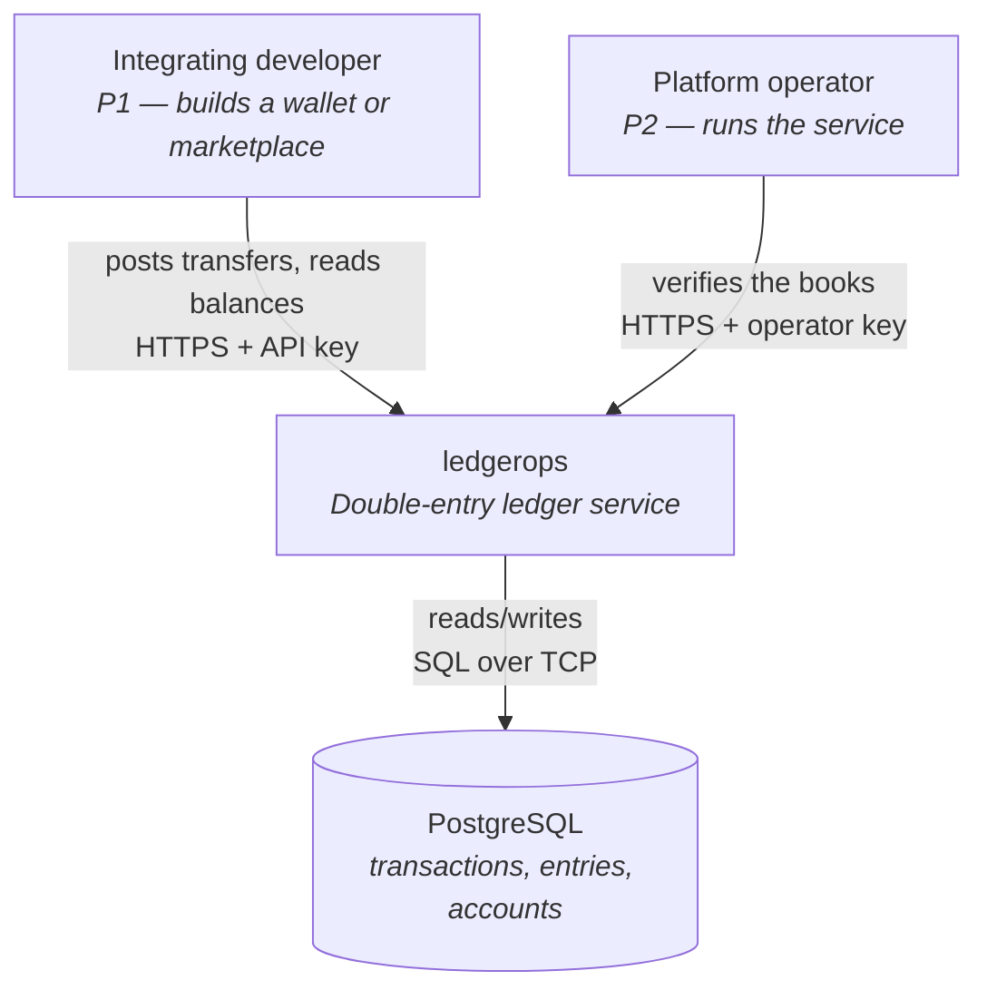
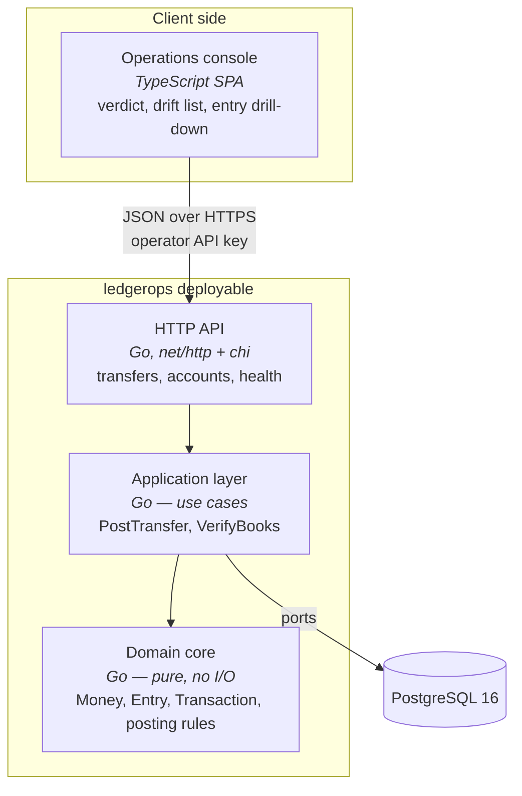

# Architecture Brief — ledgerops

SSOT for architecture. Each architect owns its section. Bootstrapped during the
DESIGN wave for `ledger-core`, 2026-08-18.

**Pattern**: modular monolith with ports-and-adapters
**Paradigm**: functional — pure core, effect shell, immutable domain types
**Stack**: Go · PostgreSQL · TypeScript SPA
**Quality attributes, ranked**: correctness · auditability · testability

---

## System Architecture

*Owner: nw-system-designer*

### Scope note

This is deliberately a thin section. `ledger-core` is a single service with one
database, no queues, no caches, and no distributed state. Checkpointed
verification was explicitly deferred (D9). There is no sharding, replication, or
partitioning to design at this stage. Designing for scale now would be
speculative — the KPIs measure correctness, not throughput.

### C4 — System Context

### C4 — Container

### Deployment shape

Single Go binary plus a static asset bundle for the SPA, plus one PostgreSQL
instance. `docker-compose` for local development so `make demo-01` runs on a
clean clone.

Deployment target, settled by DEVOPS (OPS-1): **there is no hosted environment**.
`clean` (developer machine) and `ci` (GitHub Actions, PostgreSQL 16 via
Testcontainers) are the entire environment matrix until one is needed. All
six outcome KPIs are CI assertions rather than production telemetry, so nothing
is currently learned by running the service anywhere else. When a hosted
environment appears, the recorded strategy is Recreate, with rollback by
redeploying the previous image tag.

Two database roles (OPS-10), not one:

| Role | Privileges | Used by |
|---|---|---|
| `ledgerops_app` | `SELECT`, `INSERT` on entries; `UPDATE`/`DELETE` **revoked** | The running service, and every test |
| `ledgerops_migrate` | DDL | `golang-migrate`, and the `corrupt-04` harness |

The service never connects as the migrate role. This is what makes D7
enforcement structural: a role that can `ALTER TABLE … DISABLE TRIGGER` can
rewrite history, so the application must not be that role.

Migrations are **expand-only**. No migration may `DELETE` from or drop the entry
table, and every schema change must leave the previous binary able to run
against the new schema — new columns nullable or defaulted, renames done as
add-backfill-retire across two releases. Rolling back code is therefore always
safe and never requires rolling back schema, which is the only rollback story
compatible with a ledger that cannot forget.

Infrastructure detail: `docs/feature/ledger-core/feature-delta.md` § Wave: DEVOPS.
Environment matrix: `docs/feature/ledger-core/devops/environments.yaml`.
KPI instrumentation: `docs/product/kpi-contracts.yaml`.

### Scaling escape hatches (documented, not built)

D7 append-only entries keep three future options open without rework:
checkpointed verification, period closing, and hash-chain tamper evidence. None
are built. `GET /health/trial-balance` reports `entry_count` and `elapsed_ms` so
degradation is measured rather than guessed.

---

## Domain Model

*Owner: nw-ddd-architect*

### Bounded context

One context: **Ledger**. No context mapping is required at this stage — tenancy
was deferred (D8), and there is no second context to integrate with.

### Ubiquitous language

| Term | Meaning |
|---|---|
| Account | A named holder of value. Typed `wallet` or `system` |
| Entry | One side of a movement: an account and a signed amount. Also called a *leg* |
| Transaction | An indivisible set of entries that sum to zero |
| Posting | The act of writing a transaction and updating balances |
| Trial balance | The sum of all entries across the ledger; must be zero |
| Drift | A stored balance that disagrees with the sum of its entries |
| Wallet account | May never go negative (I4) |
| System account | The counterparty value enters from. May go negative by design |

### Aggregates

Aggregates are consistency boundaries, not objects with behaviour. Each is an
immutable value type; the rules that govern it are pure functions in the same
module, not methods that mutate it.

**Transaction** *(aggregate root)* — owns its Entries. I1 (entries sum to zero
per currency) is a predicate over the entry list, checked before the value is
constructed. Immutable once written (D7), and immutable in memory besides.
Entries have no identity outside their transaction.

**Account** *(aggregate root)* — owns `balance` and `type`. Applying a debit
yields a *new* Account value; the I4 check for wallet accounts happens on the way
to constructing it, so an Account holding an illegal balance is never produced.

### Functional modeling decisions

**Immutability is strict** (DDD-15). Domain types keep their fields unexported
and are built through smart constructors that validate on the way in. There are
no mutating methods and no value receivers that pretend to mutate — applying a
change returns a new value. The practical consequence: a zero-value Money or a
negative wallet Account cannot be constructed outside the domain package, so
invariants hold by construction rather than by discipline. The extra allocation
is irrelevant at this scale, where postings are bounded by database round-trips.

**Invariant violations are a sealed taxonomy** (DDD-12). Go has no sum types, so
the closed set is built by hand: a single domain violation type carrying a kind
discriminant — unbalanced (I1), insufficient funds (I4), unknown account — whose
interface can only be satisfied inside the domain package. Callers switch over
the kind. This keeps the idiomatic Go `(value, error)` shape, so violations
travel through `errors.As` and map cleanly onto HTTP 422, while the closed set
keeps the HTTP adapter from inventing its own error vocabulary. The cost is that
exhaustiveness is not compiler-checked — a linter over the switch sites is the
compensating control, and belongs to DEVOPS.

**Status: DISCHARGED, verified 2026-08-22.** This sentence twice read
"OUTSTANDING, not discharged" and, before that, a false "Discharged" claim
corrected on 2026-08-19 when neither `.github/workflows/` nor `.golangci.*`
existed. Both now exist and were built in DELIVER: `.golangci.yml` (step
05-02) enables `exhaustive` over both named surfaces, and
`.github/workflows/ci.yml` (step 05-03) runs `golangci-lint` in the `lint`
job, required on every push per trunk-based branch protection. The
compensating control DDD-12 depends on is in place, not merely designed.

**The obligation, stated so DEVOPS inherits a requirement rather than a
discovery.** `golangci-lint` must run the `exhaustive` linter over **two**
semantically distinct switch surfaces, and covering one does not cover the
other:

1. `switch` over `domain.ViolationKind` in `internal/domain/` — keeps the core's
   sealed set closed.
2. The **wire-mapping** `switch` in `internal/adapters/http/` that turns a
   violation into a status and an error name — keeps
   `feature-delta.md` § Refusal taxonomy and status mapping honest. DDD-17
   created this surface; before it, there was only one.

Surface 2 is the one that will be missed, because it is a mapping rather than a
rulebook and reads like adapter plumbing. A member added to the core with no
mapping added at the wire is precisely the defect the sealed set exists to make
impossible, and only surface 2 catches it. Owner: DEVOPS. Until both are wired
and required on every push, DDD-12 and DDD-17 rest on review discipline alone.

**The posting rulebook is one pure function** (DDD-14). `Post` takes the transfer
command, the already-locked account snapshots, the current time, and a
pre-generated transaction id, and returns the complete intended change: the
transaction, its entries, and the balance deltas to apply. It performs no I/O,
reads no clock, and generates no identifiers — every non-determinism is passed
in as a value. I1 and I4 are therefore decided in a single pure unit, which is
the natural target for the property-based tests that testability-ranked-second
demands. The application layer's remaining job is to lock, call it once, and
persist what it returns.

### Effect boundary

The Read → Decide → Write sandwich is the hexagonal boundary in this design:

| Step | Purity | Responsibility |
|---|---|---|
| Read | impure | Open the database transaction, lock the touched accounts in ascending id order (DDD-6), read the clock, generate the id |
| Decide | **pure** | `Post` — validate the command, check I1 and I4, produce the transaction, entries, and balance deltas |
| Write | impure | Persist the transaction, entries, balance deltas, and idempotency record; commit |

The dependency rule: the shell may call the core, the core never calls the
shell, and the core does not know the shell exists. Row locks are acquired
before the pure step, not inside it — locking is an effect, and the ordering
rule that makes it safe is the shell's responsibility.

### Deliberate deviation: one unit of work spans two aggregates

Classical DDD says one transaction should modify one aggregate. Posting
necessarily modifies a Transaction *and* the balances of the Accounts it touches,
atomically — that is the definition of double-entry bookkeeping.

Rejected alternatives:

- **Ledger-as-aggregate-root** — a single root owning all accounts would make
  every posting serialize against the whole ledger. Correct, and unusable.
- **Eventual consistency between Transaction and Account** — balances would lag
  entries, and I3 would be *expected* to be violated transiently. This destroys
  the slice-04 demo, whose whole value is that drift means something is wrong.

**Decision**: a `PostTransfer` domain service coordinates the Transaction and the
affected Accounts inside one database transaction, with row locks acquired in
deterministic account-id order (DDD-6). The consistency boundary is the posting,
not the individual aggregate. This is standard practice in ledger systems and is
recorded here so it reads as a decision rather than an oversight.

### Invariants and where they are enforced

| Invariant | Statement | Enforced |
|---|---|---|
| I1 | Entries of a transaction sum to zero, per currency | Domain core (pure), plus a database check |
| I3 | Stored balance equals the sum of its entries | Not enforced — *verified* by slice 04. Deliberate: it is the cross-check |
| I4 | No wallet account balance is negative | Domain core, under row locks held by the application layer |
| I7 | The same request applied twice changes state once | Application layer, via a unique constraint on the idempotency key |
| D7 | Entries are never updated or deleted | Database: `UPDATE`/`DELETE` revoked from `ledgerops_app` (OPS-10), plus a rule/trigger. CI asserts the composite refusal |
| DDD-18 | An account name identifies exactly one account | Domain core (pure `OpenAccount` over the read snapshot), plus a unique constraint on the account name created **with** the table — migrations are expand-only, so adding it later against history containing duplicates would fail |

The DDD-18 row was added 2026-08-19 by `nw-solution-architect`, a cross-section
edit into `nw-ddd-architect`'s territory. It records a decision already taken in
`adr-008-refusal-taxonomy-boundary.md` rather than making a new domain-modelling
one, and it is the enforcement half of a refusal that would otherwise have no
declared enforcement site. The narrower rule DESIGN is holding itself to: an
architect may record its own decisions and correct false claims in another's
section, with the edit annotated; it may not decide domain model there.

Note on I3: it is the only invariant deliberately left unenforced. Enforcing it
would mean deriving balances, which removes the independent check that makes
slice 04 meaningful. Two representations that can disagree are the point.

### Event modeling

Not applied. Event sourcing was considered and rejected — see
`adr-003-stored-balances.md`. The entry table is already an append-only log of
facts, which delivers most of the auditability benefit without the projection
machinery.

---

## Application Architecture

*Owner: nw-solution-architect*

### Pattern

Modular monolith, ports-and-adapters, with a **pure domain core and all I/O at
the edges**. This follows directly from testability ranking second: invariant
tests and property-based tests run against the domain core with no database, and
only the adapter tests need PostgreSQL.

Under the functional paradigm the ports-and-adapters boundary and the
purity boundary are the same line — a port is the type of an effect the core
refuses to perform. The application layer is the effect shell: it sequences
read, decide, and write, and holds every ordering rule that the pure core cannot
express (lock acquisition order, transaction demarcation, idempotency-key
insertion).

### Component decomposition

| Component | Path | Responsibility | Change |
|---|---|---|---|
| Domain core | `internal/domain/` | Money, Account, Entry, Transaction, the `Post` decide function, violation taxonomy. Pure — no I/O, no clock, no randomness. Immutable types with unexported fields | CREATE NEW |
| Application | `internal/app/` | Effect shell. Use cases: PostTransfer, CreateAccount, GetBalance, GetEntries, VerifyBooks. Sequences read → decide → write | CREATE NEW |
| Ports | `internal/app/ports/` | Effect types the shell depends on: function types for single-operation ports, interfaces for transaction-scoped repositories | CREATE NEW |
| Postgres adapter | `internal/adapters/postgres/` | Repository implementations, migrations, row locking | CREATE NEW |
| HTTP adapter | `internal/adapters/http/` | Handlers, routing, API-key auth, JSON encoding | CREATE NEW |
| Entrypoint | `cmd/api/` | Wiring and configuration | CREATE NEW |
| Console SPA | `web/console/` | TypeScript SPA: verdict, drift list, entry drill-down | CREATE NEW |

### Driving ports (inbound)

| Port | Surface | Slice |
|---|---|---|
| `POST /accounts` | HTTP | 01 |
| `POST /transfers` | HTTP | 01, 02, 03 |
| `GET /accounts/{id}` | HTTP | 01 |
| `GET /accounts/{id}/entries` | HTTP | 05 |
| `GET /health/trial-balance` | HTTP | 04 |
| Console SPA | Browser | 04, 05 |

### Driven ports (outbound) and adapters

Ports are expressed **hybrid by arity** (DDD-13): a port with one operation is a
function type; a port whose operations must share a transaction handle stays an
interface.

| Port | Form | Adapter | Notes |
|---|---|---|---|
| `TransactionRepository` | interface | `postgres` | Writes transaction + entries + balance updates in one SQL transaction |
| `AccountRepository` | interface | `postgres` | `SELECT … FOR UPDATE` in deterministic id order; applies balance deltas |
| `IdempotencyStore` | interface | `postgres` | Unique constraint on key; stores request fingerprint + transaction_id |
| `Clock` | function type | `system` / `fake` | Injected so entry timestamps are deterministic in tests |
| `IDGenerator` | function type | `uuid` / `fake` | Injected for the same reason |

The split is not a compromise between paradigms — it follows the effect
structure. `Clock` and `IDGenerator` are single, independent effects, so as
function types their fakes are one-line literals and no test needs a stub type.
The three repositories each expose several operations that must run inside the
*same* database transaction; expressing them as loose function types would let a
caller wire two of them to different transactions, and nothing in the type
system would object. The interface keeps that cohesion visible.

`Clock` and `IDGenerator` exist as ports purely for testability. That is the
second quality attribute doing visible work.

### Refusal taxonomy: three decision sites, one wire vocabulary

DDD-12 sealed the set of ways the ledger says no. It sealed it at one site — the
pure core — and read as though it sealed all three: `unidentified_caller`,
`missing_idempotency_key` and `idempotency_key_conflict` were always decided
outside the core. DDD-17 states the whole set and names each member's site, so a
question landing between sites has somewhere to be answered. Rationale and
rejected alternatives: `adr-008-refusal-taxonomy-boundary.md`.

| Member | Decided at | Status |
|---|---|---|
| `malformed_request` | HTTP adapter | 400 |
| `missing_idempotency_key` | HTTP adapter | 400 |
| `unidentified_caller` | HTTP adapter (auth middleware) | 401 |
| `account_not_found` | Domain core — `Post` | 404 |
| `account_already_exists` | Domain core — `OpenAccount` | 409 |
| `idempotency_key_conflict` | Application shell | 409 |
| `invalid_amount` | Domain core — `NewMoney` / `Post` | 422 |
| `insufficient_funds` | Domain core — `Post` | 422 |
| `currency_mismatch` | Domain core — `Post` | 422 |

**Status follows the decision site**: 400 the request was not a command · 401
the caller was not identified · 404 the command named something absent · 409 the
identifier is already bound to something else · 422 the rules refuse it.

`unbalanced` stays a `domain.ViolationKind` member and is not a wire member — it
guards the Transaction smart constructor against a defect in the rulebook, and
no caller input reaches it. If it escapes, that is a bug, answered 500.

Two consequences for the boundary. `malformed_request` must **not** enter
`domain.ViolationKind`: a pure function over a typed command cannot represent
"the bytes were not JSON", and admitting it would put a transport concern inside
the purity boundary. And the `exhaustive` linter now covers two switch surfaces
rather than one — the core's kinds, and the adapter's wire mapping. The
adapter's switch is what keeps the status table honest.

`currency_mismatch` is a domain refusal because I1 is per-currency: two legs in
different currencies cannot sum to zero per currency for any amount. It is
declared and currently unreachable through the driving ports, since every
account is opened in the ledger's single configured currency — and that
unreachability is how "multi-currency transactions, out of scope" is enforced
rather than asserted.

### Unavailability is outside the sealed set

A refusal is a decision, and every refusal here carries the implicit assertion
that nothing moved. A connection lost after `COMMIT` was sent and before the
acknowledgement arrived may have mutated everything, so an unreachable store
cannot be a refusal without attaching a guarantee the system cannot make. It
answers **503 `service_unavailable`** with `Retry-After`, in the same error
envelope but in neither sealed set. Pool exhaustion answers 503 rather than 429 —
capacity is a property of the service, not the caller's rate.

`GET /health/trial-balance` against an unreachable store answers 503, never
`Books balance: NO`. `NO` means "I looked, and the books do not balance"; saying
it because the database is down is a false accusation of corruption and destroys
the KPI-4 signal slice 04 exists to produce. The 503 body is exactly
`{"error":"service_unavailable"}` — the `verdict` field is **omitted, not
`null`**, and so is the rest of the verdict envelope. On 200 `verdict` is always
present and never null, so its absence proves the ledger was not read; the
console branches on the status code, never on the field. Rationale:
`adr-009-unavailability-is-not-a-refusal.md`.

The composition root wires, then **probes**, then serves: `cmd/api/` refuses to
start unless the app-role connection can open a transaction *and* `UPDATE` on
the entry table is refused (OPS-10). CI job 6 proves the migration set is right;
it proves nothing about the database this binary is pointed at.

### Technology choices

| Choice | Pin | Rationale |
|---|---|---|
| Go | 1.23+ | Concurrency primitives make the I4/I7 race tests natural to write |
| PostgreSQL | 16 | Row locking, constraint triggers for D7, real transactional guarantees |
| `pgx` | v5 | Direct driver, no ORM — SQL stays visible, which matters for locking |
| HTTP router | `chi` v5 | Thin over `net/http`; no framework lock-in |
| Migrations | `golang-migrate` | Plain SQL migrations, reviewable |
| Property testing | `rapid` | Go's mature PBT library; invariant tests need generators |
| TypeScript | 5.x | Console SPA |
| SPA framework | *deferred to DELIVER* | Not architecturally significant; one page with a verdict |

### Reuse Analysis

| Existing Component | File | Overlap | Decision | Justification |
|---|---|---|---|---|
| *(none)* | — | — | CREATE NEW | Greenfield. `src/`, `lib/`, `app/` absent; no code exists to extend. Verified by filesystem search during Prior Wave Consultation |

This table is trivially satisfied for slice 01 and stops being trivial from
slice 02 onward, when the posting path already exists and must be extended
rather than duplicated.

### Test strategy (testability as ranked driver)

| Layer | Depends on | Speed |
|---|---|---|
| Domain core | nothing | microseconds — property tests live here |
| Application | fake ports | milliseconds |
| Adapters | real PostgreSQL | seconds — WS strategy C, per DISTILL Mandate 5 |

The pure `Post` function is the primary property-based-test target: I1 (entries
sum to zero) and I4 (no negative wallet balance) are properties over generated
commands and account snapshots, provable with no database and no mocks. Because
time and identity are passed in as values, every such test is deterministic and
reproducible by seed. What remains for the concurrency suite is narrower and
sharper — not "are the rules right", which the property tests already answer,
but "does the shell acquire locks correctly", which only real PostgreSQL can
show.

The concurrency tests for I4 and I7 must run against real PostgreSQL. A fake
would model the very behaviour under test, which is why WS strategy C was
selected in DISCUSS. PostgreSQL 16 is supplied per test package by
Testcontainers (OPS-11), so local and CI runs take the same code path.

---

## For Acceptance Designer

*Owner: nw-solution-architect · consumed by nw-acceptance-designer (DISTILL)*

**Driving ports** — the table above under § Driving ports (inbound) is
authoritative. Restated here because DISTILL's Prior Wave Reading looks for it
under this heading:

| Port | Surface | Slice |
|---|---|---|
| `POST /accounts` | HTTP | 01 |
| `POST /transfers` | HTTP | 01 · 02 (422) · 03 (`Idempotency-Key`) |
| `GET /accounts/{id}` | HTTP | 01 |
| `GET /accounts/{id}/entries` | HTTP | 05 |
| `GET /health/trial-balance` | HTTP | 04 |
| Console SPA | Browser | 04 · 05 |

All require the seeded operator API key.

**Walking skeleton**: slice 01, per D2. SPIKE was skipped and no probe exists,
so DISTILL authors the walking-skeleton scenario itself rather than promoting
one — one `@walking_skeleton @driving_port` scenario over `POST /transfers`,
real HTTP through the real domain to real PostgreSQL.

**Test infrastructure per port class**:

| Port class | Mechanism |
|---|---|
| HTTP driving adapter | Real server, real routes, real API-key middleware |
| `TransactionRepository` · `AccountRepository` · `IdempotencyStore` | Real PostgreSQL 16 via Testcontainers (OPS-11) — never faked; WS strategy C |
| `Clock` · `IDGenerator` | Fakes. Function types (DDD-13), so a fake is a one-line literal |

The `Clock`/`IDGenerator` split is the only place fakes are permitted, and it
exists so that assertions on entry timestamps and transaction ids are
deterministic. Every other port is exercised for real.

**Environment parametrization**: `docs/feature/ledger-core/devops/environments.yaml`
— `clean`, `ci`, `populated`, `contended`, `corrupted`. A `degraded` environment
is required by DDD-20 and does not exist yet; owner DEVOPS, preconditions named
in `feature-delta.md` § Store unavailability.

**Refusals**: § Refusal taxonomy above is authoritative for what a refusal is
called, where it is decided, and what status it answers. Every member is
reachable through a driving port except `currency_mismatch`, whose coverage
belongs at layer 1 with the `rapid` suite over `domain.Post`. `service_unavailable`
is **not** a refusal and must not enter `RefusalKind` — a scenario asserting it
asserts an availability outcome, which is what keeps `@error` a refusal taxonomy
rather than an outcome taxonomy.

**For nw-ddd-architect**: § Invariants and where they are enforced now carries
the account-name uniqueness rule DDD-18 depends on. The row was added by
`nw-solution-architect` and annotated as a cross-section edit; review it, and
renumber it if that table should use an `I`-series identifier rather than the
decision id.
